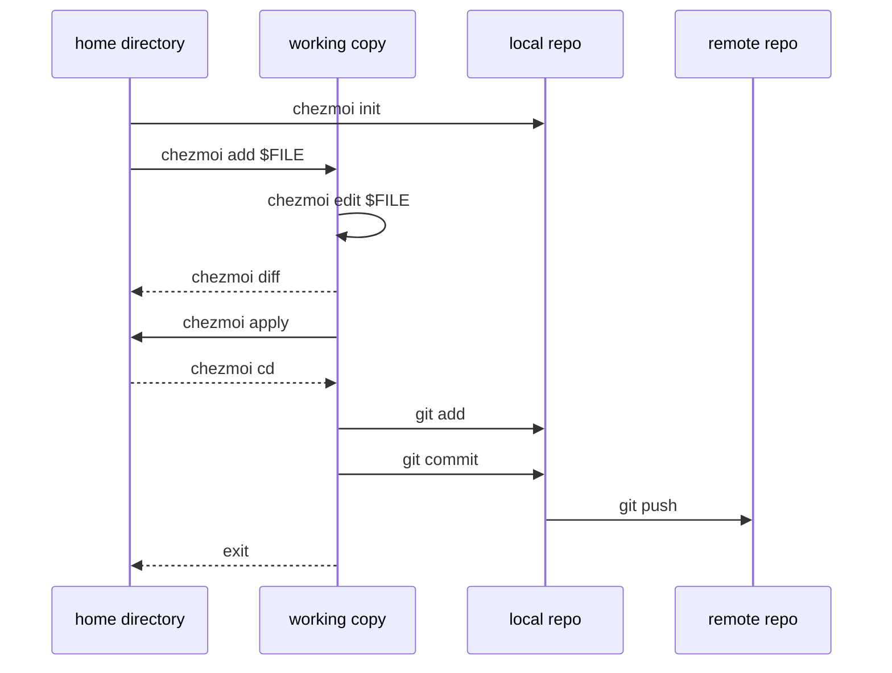

不想每次到新机器都要重新配置所有工具的 `~/.config`. 因此使用 Chezmoi.

Roughly speaking, chezmoi stores the desired state of your dotfiles in the directory `~/.local/share/chezmoi`. When you run `chezmoi apply`, chezmoi calculates the desired contents for each of your dotfiles and then makes the minimum changes required to make your dotfiles match your desired state.

## Installation

[chezmoi - Install](https://www.chezmoi.io/install/)

## Quick Start

[chezmoi - Quick Start](https://www.chezmoi.io/quick-start/)

首先初始化 chezmoi

```zsh
chezmoi init
```

将 macOS 的 `.zshrc` 加入管理.

```zsh
chezmoi add ~/.zshrc
```

这将复制 `~/.zshrc` 到 `~/.local/share/chezmoi/dot_zshrc`:

```zsh
tree ~/.local/share/chezmoi/
# /Users/veno/.local/share/chezmoi/
# └── private_dot_zshrc
```

发现设置成了 `private_dot_zshrc`, 意味着后续 `chezmoi apply` 的时候 `~/.zshrc` 会被设置成 600. 可能 macOS 导致了特殊性?

没必要私有, 于是可以设置属性:

```zsh
chezmoi chattr noprivate ~/.zshrc
ls -la $(chezmoi source-path)

# total 16
# drwxr-xr-x@  4 veno  staff   128 Jan 24 13:43 .
# drwx------  10 veno  staff   320 Jan 24 13:30 ..
# drwxr-xr-x@  9 veno  staff   288 Jan 24 13:41 .git
# -rw-r--r--@  1 veno  staff  8118 Jan 24 13:33 dot_zshrc
```

如果要修改, 要么手动修改 `nvim ~/.zshrc` 然后重新 `chezmoi add ~/.zshrc`, 要么 `chezmoi edit ~/.zshrc` 然后 `chezmoi apply`. 推荐后者.

### chezmoi edit

`chezmoi edit ~/.zshrc` 修改的并不是 `~/.zshrc` 而是 `~/.local/share/chezmoi/dot_zshrc`, 因此更改并不会立即被应用. 如果要将更改应用到机器,运行 `chezmoi apply`.

`chezmoi edit` 并不会自动创建新的 git 提交, 必须要手动提交.

`chezmoi edit` 会使用 `$EDITOR` 编辑配置文件.

### chezmoi cd

除了 `cd $(chezmoi source-path)`, 事实上可以 `chezmoi cd`

```zsh
chezmoi cd && pwd
# /Users/veno/.local/share/chezmoi
```

此时实际上 `chezmoi cd` 做的事情类似于是:

```zsh
$SHELL && cd $(chezmoi source-path)
```

因此当你完成了修改之后, 运行 `exit` 回到你刚才的目录.

### git

这是 chezmoi 的爽点.

在 github 创建一个名为 dotfiles 的仓库.

```zsh
chezmoi cd
git add .
git commit -m "Initial commit"

git remote add origin git@github.com:$GITHUB_USERNAME/dotfiles.git
git branch -M main
git push -u origin main
```

在其他机器上, 安装 chezmoi 之后, 可以直接:

```zsh
chezmoi init git@github.com:$GITHUB_USERNAME/dotfiles.git
```

非常方便.

当我在机器 A 更新了配置, 回到机器 B 时, 只需要:

```zsh
chezmoi update
```

[chezmoi - commands - update](https://www.chezmoi.io/reference/commands/update/)

### chezmoi git

chezmoi 封装了 git 用于便捷管理. 需要添加 `--` 来区分 chezmoi 和 git 的参数.

例如:

```zsh
chezmoi git -- add . && chezmoi git -- commit -m "Update dotfiles" && chezmoi git -- push
```

一键创建提交并推送.

### 添加其他 git 仓库

[Include a subdirectory from a git repository](https://www.chezmoi.io/user-guide/include-files-from-elsewhere/#include-a-subdirectory-from-a-git-repository)

处理先前已经使用 git 管理但并未纳入 chezmoi 管理的仓库, 可以添加配置.

例如, 我之前已经管理了 [nvim.git](https://github.com/U1traVeno/nvim.git), 现在想将它列入 chezmoi 管理中.

```zsh
chezmoi cd
nvim .chezmoiexternal.toml
```

添加配置:

```toml
[".config/nvim"]
    type = "git-repo"
    url = "git@github.com:U1traVeno/nvim.git"
    refreshPeriod = "168h"
```

然后:

```zsh
exit
chezmoi apply -v
```

在机器 A 修改：`cd ~/.config/nvim` -> `git push`

在机器 B 同步：只需运行 `chezmoi apply`。它发现距离上次刷新超过 168 小时（或你强制执行 `--refresh-externals`），就会自动帮你 `git pull` 最新的配置. 或者, 你当然也可以直接在 `~/.config/nvim` 下手动拉取更新.

#### git submodule

[chezmoi - Include dotfiles from elsewhere](https://www.chezmoi.io/user-guide/include-files-from-elsewhere/#use-git-submodules-in-your-source-directory)

如果不使用配置文件, 可以使用 `git submodule` 处理先前已经使用 git 管理但并未纳入 chezmoi 管理的仓库, 但是似乎有点麻烦, 因为每次都要在 chezmoi 里进行修改.

例如, 我之前已经管理了 [nvim.git](https://github.com/U1traVeno/nvim.git), 现在想将它列入 chezmoi 管理中.

```zsh
# 假设你想把配置放在 ~/.config/nvim
chezmoi cd
mkdir -p dot_config
git submodule add git@github.com:$GITHUB_USERNAME/nvim.git dot_config/external_nvim
```

> If you use git submodules, then you should set the `external_` attribute on the subdirectory containing the submodule.

根据文档, chezmoi 默认会尝试解析源目录下的所有文件。如果 nvim 仓库里有类似 `run_test.sh` 的文件，chezmoi 会误把它当成自己的脚本执行.

加上 `external_` 前缀后，chezmoi 会知道这个目录的内容不需要按照它的规则解析，只需原样同步即可

`chezmoi update` 的 `--recurse-submodules` 参数默认为 true.

后续更新 nvim 仓库时, 可以:

```zsh
chezmoi cd
cd dot_config/external_nvim
# 进行修改...
nvim lua/init.lua
```

在同一个目录下直接提交 nvim 的更改：

```zsh
git add .
git commit -m "feat: add new plugin"
git push  # 推送到你的 nvim.git 仓库
```

退回到 chezmoi 根目录，更新主仓库对子模块的引用：

```zsh
cd ../.. # 回到 chezmoi 根目录
git add dot_config/external_nvim
git commit -m "chore: update nvim submodule reference"
git push  # 推送到你的 dotfiles 仓库
```

最后 apply

```zsh
chezmoi apply
```

### chezmoi diff

用于记录一下 `chezmoi diff` 令人困惑的地方.

举例, 现在向 `~/.zshrc` 中的 `alias t=tmux` 一行的下一行加一个 `alias tai=tmuxai`

```zsh
perl -i -pe 's/^alias t=tmux$/$&\nalias tai=tmuxai/' ~/.zshrc && chezmoi diff

# diff --git a/.zshrc b/.zshrc
# index 37c0ed56fd522ca98688e20412030d8c10be6ddc..593a83770b2b2ee4b61de92b517cc12a02c1f0e0 100600
# --- a/.zshrc
# +++ b/.zshrc
# @@ -151,7 +151,6 @@
#  # alias
#  alias lg=lazygit
#  alias t=tmux
# -alias tai=tmuxai

#  # exports
#  export PATH="/opt/homebrew/opt/zip/bin:/opt/homebrew/bin:/opt/homebrew/sbin:$PATH"
```

`chezmoi diff` 返回的结果语义其实很不清晰. 可以理解为: “如果我运行 apply，会对家目录的配置产生什么影响？”

`a/.zshrc` 是源目录(`~/.local/share/chezmoi`), `b/.zshrc` 是家目录 `~/.zshrc`, 即: 如果运行 apply, 会删除 `alias tai=tmuxai` 这一行.

再次运行 `chezmoi add ~/.zshrc`, 此时 `chezmoi diff` 不会再有输出.


