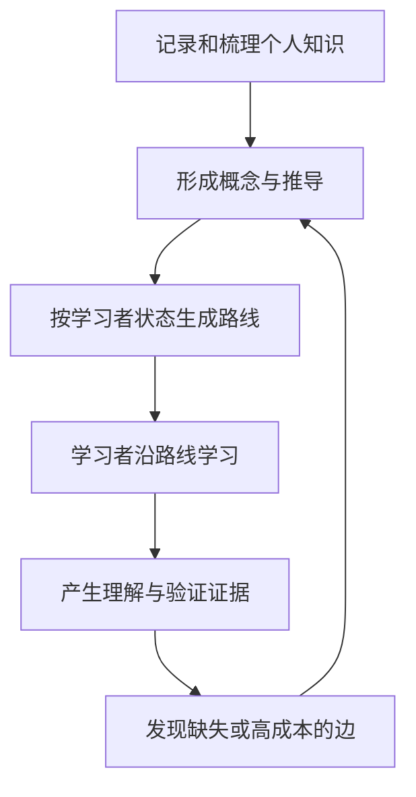
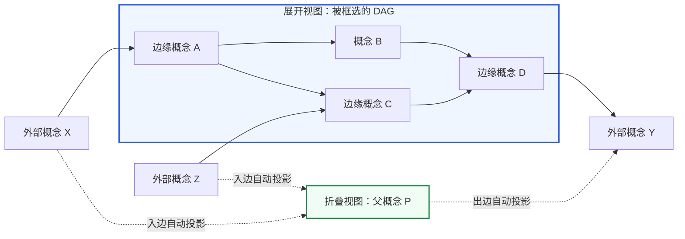
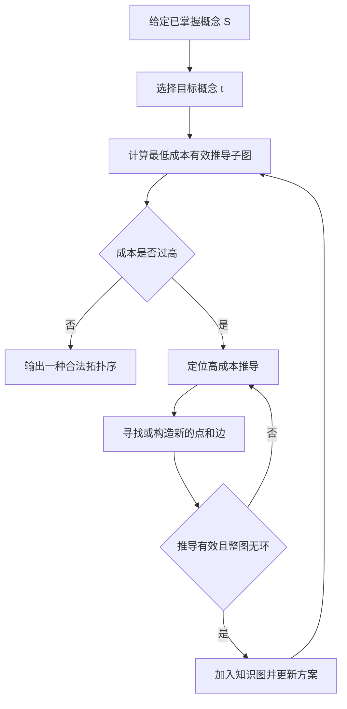
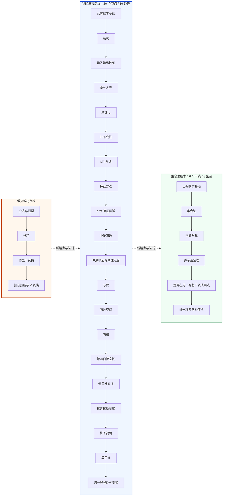
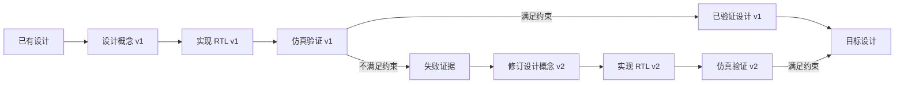

我们怎样才能最大化学习速度？

我最初对这个问题产生兴趣，源于我做后端启蒙直播课的经历。在教学过程中，我发现自己对于不管是对于自身的学习，还是对于教学，都乐在其中。后来，在跟随我的导师学习“信号与系统”这门通常被认为难度较高的工科基础课时，我的一些观察得到了进一步印证。

我在学校基本不上课，期末才速通，但信号与系统是真的黔驴技穷。我的导师通过引入算子理论和希尔伯特空间，以通过考试为目标，重新构造了给我定制的教学路径，教学顺序和学校课程有非常大差异。结果，一门通常需要学习一学期还不一定能过的课程，在这一教学路径下我只用了 3 天的学习时间，从什么是信号都不知道的程度，最后实现了在期末考试中考到了 60 分的水平，最终成绩 71 分。

记忆犹新的是，我甚至拿到试卷才知道信号与系统用英语考，最后五分钟才发现试卷有一整面没被我搓开，那两道大题只写了五分钟，几乎只拿了前几步的分。

更令人惊讶的是，在他进一步改进教学线路，以集合论为起点之后，另一位有一定数学和理论物理基础的同学仅用半天就建立了对这门课主干理论的整体理解，并能够进入后续实践。这套“集合论版本”的教程实实在在地以集合论为起点，逐步推演到算子谱定理，再把卷积、微分等运算理解为在另一组基下的乘法，由此统一理解信号与系统中的各种变换。他并不以通过考试为目标，短短时间后已经能够在团队中编写高效的硬件优化算法。

这些经历让我得出一个暂时性的结论：**学习路径才是学习速度的关键因素。它的影响可能远大于个人能力、同一学习路径上的教师教学能力、或其他的什么因素。学习路径才是学习过程中的主要矛盾。**

我在上一篇相关文章[《逃离应试教育，重新学会怎么思考》](https://v3n0.top/post/2026/learning-method/)里提出，学习一个知识体系，本质上是在寻找它的“最小生成元 + 生成规则”。但那个说法仍然停留在方法论层面。这篇文章想再向前走一步：能否把学习路径变成一个可以被建模、计算和优化的问题？

基于这一观察，我最终构思了一个核心问题：

> 我们如何从学习者已经掌握的概念出发，找到能够推出目标概念定义的最低成本学习路线？

如果将概念视为点、概念之间的推导视为边，那么：

1. 给定学习者已掌握的概念和目标概念，可以计算一张满足全部必要条件的最低成本推导子图。
2. 当知识图中加入新的概念和有效推导时，可以重新计算可选路线，进一步压缩学习成本。

这篇文章将围绕这一核心逻辑展开，尝试讨论如何通过数据建模和路径优化，实现学习效率的飞跃。

目前它仍处于理论思考阶段，本人也并非有专业的数学素养，有许多定义尚不严密，也有待读者批评。下面我们进入正文。

## 我想做的产品

上面提出的问题并不只是这篇文章中的理论假设。我正在尝试把这套思路做成一个产品，目前仍处于开发初期。后文从 v0 到 v5 的模型演进，正是这个产品核心数据模型的演进。

我想做的是一套让知识能够被共同建模、共同教学、共同验证的基础设施。它首先要同时降低三件事的成本：

1. **帮助有教学意愿的人，用更低的成本写出更好的教程。** 教程作者不必从一页空白文档开始线性写作，而可以复用已有概念，以及推导边所携带的理解材料，把精力放在真正缺失或高成本的推导上。
2. **帮助学习者用更低的成本学习一个目标概念。** 系统根据学习者已经掌握的概念，即时生成通向目标概念的最低成本学习路线，而不是让所有人从同一份固定教程的第一页开始。
3. **帮助任何人在记录和梳理知识时，同时创作教程。** 一个人写下概念的定义、它解决的问题以及自己如何从旧概念抵达它时，实际上已经在贡献教程节点和推导边，而不只是在保存一份私人笔记。

这三件事可以形成一个闭环：



如果这个闭环能够实现，学习者面对的教程就不再是传统教学方式中写死的教纲内容。我们可以随时根据整个知识体系，针对学生的当前理解状态以及学习目标，生成一条定制化的路线。学习者的卡点、回答和实践结果会成为反馈，系统需要据此识别哪些边经常失败、哪些概念缺少前置条件、哪些新路线确实降低了学习成本，再让作者、学习者或 Agent 继续补充和优化。

在我最终的愿景中，它能形成一种新一代的教育体系：教程的生产能力不再被少数教育机构垄断，而是分布给社会中所有愿意学习、解释、记录和验证知识的人。群众消费教程的同时，也在使用教程的过程中共同生产和改进教程。

要让这个闭环成立，个人的笔记、知识导图，和教程所使用的学习路线、章节划分，就不能继续使用彼此割裂的数据结构。它们必须能够被同一个模型表达。这是我最近总结出的模型的出发点。

## 万物皆概念

### 只有一种对象：概念

要计算学习路径，首先必须回答什么是知识体系里的“点”。

我最初仍然沿用了课程、章节、概念、问题等传统层级。但继续推演后会发现，这种分层并不自洽：

- 一门课程可以被拆成若干章节；
- 一个章节可以被拆成若干概念；
- 一个足够大的概念同样需要一整套教程；
- 一门课程本身也可以被视作一个更大的概念。

既然“课程”“章节”和“概念”都可以继续拆分，也都可以作为更大讨论对象的一部分，那么它们在数据结构上并没有本质区别。因此，与其维护一套固定层级，不如只保留一种对象：**概念**。

这里的概念不是一个术语或标签，而是一条客观的、默认成立的定义或陈述。例如“傅里叶变换”是一个概念，“信号与系统”也是一个概念；后者可以继续展开为由多个子概念组成的知识图。

任何概念都同时具有两种性质：

1. 它可以和其他概念组合，封装成一个更大的概念。
2. 它可以被继续拆分，展开为一个由子概念构成的有向无环图。

因此，“万物皆概念”并不是说所有东西都要被塞进同一个扁平列表，而是说：**知识体系中的每一层都使用同一种递归结构。**

```text
Concept
├── definition          # 这个概念最终应当能够被重新推导出的定义
├── children[]          # 直接子概念的引用
├── derivations[]       # 子概念之间的推导边
└── derivation_plans[]  # 由若干入边组成的推导方案

Derivation
├── source
├── target
├── question            # 为什么需要从 source 推进到 target
├── answer              # 完成这一步的推导和论证
└── materials[]         # 帮助学习者完成这条推导的材料
```

这里唯一的知识节点类型仍然是概念。`Derivation` 是概念之间的关系，`derivation_plans` 则是对若干条边的组合，不是另一种知识节点。

子概念应当使用引用，而不是直接内嵌，以保证每个概念在所属知识体系中只有一个确定位置。同一知识体系内，递归概念之间禁止部分交集：除父概念完整包含子概念的情况外，不同递归分支必须彼此分离。如果两个递归结构必须发生交集，那么它们应当属于不同的知识体系，而不是同一知识体系中的两个重叠子图。

理解材料明确属于推导边，而不属于概念节点。概念陈述“是什么”，材料则服务于“如何从一个概念推导到另一个概念”；同一个目标概念可以由不同路线抵达，每条路线需要的解释和证据也可能不同。

### 每个概念内部都是一张 DAG

设全体概念构成集合 $C$。对任意概念 $c \in C$，它拥有一个直接子概念集合：

$$
\operatorname{children}(c) \subseteq C
$$

这些子概念、目标概念本身以及它们之间的推导关系，构成概念 $c$ 的内部图：

$$
G_c = (V_c, E_c), \qquad V_c = \operatorname{children}(c) \cup \{c\}
$$

这里的 $c$ 是整张内部图最终要推出的目标，而不是它自己的子概念。我暂时要求 $G_c$ 是一张**有向无环图**，也就是 DAG。

有向，意味着推导有方向：“已知 A，如何得到 B”和“已知 B，如何得到 A”不是同一个过程。

无环，意味着不能用待学习的概念反过来证明它自己的前提。一个环通常代表循环论证，或者说明当前概念边界划分得不合理。

DAG 至少存在一个入度为 0 的节点，因此每个知识图都存在学习入口。但“存在一条指向目标的边”还不足以描述真实推导，因为一个概念可能需要多个前置条件共同推出。

对任意目标节点 $v$，记它的入边集合为 $\operatorname{In}(v)$。概念 v 的推导方案集合，是它所有非空入边组合中的一部分。因此再定义推导方案集合：

$$
\mathcal{P}(v) \subseteq 2^{\operatorname{In}(v)} \setminus \{\varnothing\}
$$

每个 $P \in \mathcal{P}(v)$ 都是一套能够推出 $v$ 的完整方案：

- 同一个 $P$ 内的所有边是 AND，必须全部完成；
- 不同的 $P$ 之间是 OR，只需完成其中一套；
- 一条边可以同时属于多套方案，因此推导方案与边是多对多关系；
- 不需要合取条件的单条入边，可以自然地构成一个只包含自身的方案。

例如，若 $v$ 可以由“$A$ 与 $B$ 共同推出”，也可以单独由 $C$ 推出，那么：

$$
P_1 = \lbrace A \to v, B \to v \rbrace, \qquad
P_2 = \lbrace C \to v \rbrace
$$

$$
\mathcal{P}(v) = \lbrace P_1, P_2 \rbrace
$$

这对应 $(A \land B) \lor C \Rightarrow v$。AND 和 OR 不需要变成新的概念类型，它们只是推导边之间的组合语义。

当学习者选择一个 AND 方案时，方案内各个前置分支的先后顺序没有语义上的影响。只要各分支分别满足自身依赖，先理解 $A$ 再理解 $B$，或者先理解 $B$ 再理解 $A$，最终都完成同一套推导方案。DAG 的拓扑序只给出合法顺序，不规定独立前置条件之间唯一的学习次序。

因此，从已有概念到目标概念的一条有效学习路线，在一般情况下并不是图论中的单条简单路径，而是一张递归选择 OR 方案、同时展开其中全部 AND 条件的推导子图。它可以存在多种等价的拓扑排序，并被线性地讲述，但其底层结构仍然可能分叉。

这里也不再需要预先固定一份教程。给定学习者已掌握的概念和目标概念之后，才从完整知识图中选择一张有效推导子图。真正理解目标概念的判据，是学习者完成其中的必要推导，并最终能够重新推出 $\operatorname{definition}(c)$。

### 把一段 DAG 封装成更大的概念

前文说概念既可以被继续拆分，也可以和其他概念组合。这两个性质结合起来还有一个重要好处：我可以随时框选一段 DAG，把它封装成一个新的父概念。原来从外部指向子图边缘节点的关系，会投影为指向父概念的关系；原来从边缘节点指向外部的关系，也会投影为从父概念出发的关系。父概念展开时仍然保留原来的内部推导，折叠时则成为一个可以继续参与更大 DAG 的普通节点。



这种边界投影使知识图可以在不同抽象尺度之间切换：封装一个子图时，不需要手工重新建立它与外部概念的关系；这个新父概念还可以继续和其他概念组合，递归形成更大的 DAG。

### 边是概念之间的推导

如果节点是概念，那么边是什么？

我最初把边称为 Prompt，也就是“进入下一个概念的问题引入”。但这一定义并不完整。如果边只提出问题，却不包含如何回答问题，那么它仍然没有说明两个概念之间为什么能够连接。

因此，一条从 $a$ 指向 $b$ 的边，应当表示**概念 $a$ 对推导概念 $b$ 所作的贡献**。当它单独构成一套推导方案时，这条边承载从 $a$ 到 $b$ 的完整过程；当它属于一个 AND 方案时，多条边共同构成推出 $b$ 的完整过程。每条边至少包含三部分：

1. **问题引入**：旧概念遇到了什么局限，或者现实中出现了什么新问题？
2. **问题解答**：通过什么论证、构造或抽象，可以从旧概念得到新概念？
3. **理解材料**：为了完成这一步推导，可以阅读、观察、操作或验证什么？

例如，“行列式”不应该通过“把这一串运算命名为什么”来引入。这只是在复述定义，没有推进认识。更合理的边可能是：

> 我们需要判断一个线性变换是否把空间压扁，也就是它是否可逆。能否构造一个在行变换下行为明确、又能表示有向体积缩放的标量？由这一需求构造出行列式。

一条合理的边通常至少满足以下一种条件：

- 解决前一个概念的局限；
- 触碰前一个概念的表达边界；
- 回答现实中遇到的具体问题；
- 将若干重复出现的推理压缩为一个可复用概念。

这也为“新增边”设置了约束。我们不能为了让图上的距离变短，就画一条没有论证的直线。**边的长度可以短，但边所承载的推导不能被省略。**

### 把学习成本写成有效推导子图的成本

设学习者已经掌握的概念集合为 $S$，目标概念为 $t$。记 $\mathcal{R}(S,t)$ 为所有能够从 $S$ 推出 $t$ 的有效推导子图集合。每个 $R \in \mathcal{R}(S,t)$ 都必须递归选择一套 OR 方案，并完整包含该方案内的全部 AND 边；递归遇到 $S$ 中已经掌握的概念时停止。

在无权模型中，可以先把一条路线的结构成本定义为其中包含的推导边数：

$$
C_0(R) = |E_R|
$$

于是当前知识图中的最低结构成本为：

$$
C_0^*(S,t) = \min_{R \in \mathcal{R}(S,t)} |E_R|
$$

若每条边有不同成本，则可以把边权定义为完成该推导所需的时间、认知负荷或材料长度：

$$
C_u^*(S,t) = \min_{R \in \mathcal{R}(S,t)} \sum_{e \in E_R} w_u(e)
$$

这里的 $w_u(e)$ 是学习者 $u$ 完成推导边 $e$ 的成本，共享的前置推导在同一子图中只计算一次。当所有推导方案都只有一条边时，有效推导子图退化成普通路径，这个公式也就退化成通常的最短路径问题。

因此，本文继续使用“最短学习路径”这个直观说法，但严格的求解对象应当是**最低成本有效推导子图**。它的任意拓扑序都可以形成一种合法讲述顺序；尤其对于同一个 AND 方案中的独立前置分支，先学习哪一个不会改变路线的成立性和总成本。

### 一个概念可以被理解多次

同一个定义可能由多条不同路线推出，理解并不必在第一次抵达后停止。

本文把理解的最终判据定义为：**学习者完成一张有效推导子图后，能够重新推出目标概念的定义**。但“能够推出”仍然需要证据，不能由图上的可达性直接替代。对知识的深度理解，是解决真实问题的前提；而能否解决真实问题，才是本文所讨论的学习路径最终要优化的目标。

一个可能的处理方式，是为每个概念维护置信度 $m_u(c) \in [0,1]$，并根据回答、实践、遗忘和迁移表现不断更新。已掌握集合 $S$ 不再是固定集合，而是从连续状态中按当前任务要求投影出来的结果。

在理论模型之外，或许可以把每完成一条不同的有效路线视为增加 $100\\%$ 的理解倍率；如果学习者完整掌握两条路线，又完成第三条路线的一半，就可以记作 $250\\%$。这里的百分比不是概念本体的一部分，也不是传统意义上封顶于 $100\\%$ 的完成度，只是对“能够从多少条路线重新生成同一概念”的一种投影。这样可能看起来会更有成就感(x

存在 AND 条件时，这里说的“一条路线”指一张完整的有效推导子图，而不是任取一条忽略其他必要前提的简单路径。同一张推导子图的不同拓扑序只改变一个概念的独立前置条件学习先后顺序，不会增加理解倍率。

此外，两张有效推导子图可能只相差一条边，也可能使用完全不同的生成规则。前者是否足以在现实意义上算作一条新的理解路线，不能只靠“边集合不相等”来判断。

这也会影响前文的理解倍率：如果对知识图中的每条简单路径机械计数，少量分支就可能组合出指数级路线，重复或近似相同的推导也会虚增理解程度。这实际上是知识图谱的构建存在问题，最终可能只能靠真正理解知识的人类来评估实际知识图谱的质量如何。更合理的如何判定两条路线的重合度，可能需要进一步讨论。

### 通过新增点和边压缩学习路径

在已有图中寻找最低成本有效路线，解决的是“如何使用现有知识结构”。更重要的问题是：**能不能改造知识图本身？**

新的路线不一定来自一条直连目标的边。我们也可以引入一个压缩率更高的中间概念，再建立它与已有概念和目标概念之间的推导边。只要所有路线的并集仍然无环，旧路线和新路线就可以同时保留，成为可随时选择的不同 OR 方案。

一个高度抽象的统一理论确实能缩短后续路线，但学习这个统一理论本身也需要成本。如果为了少学五条边，先引入一个成本相当于二十条边的新概念，整体上反而更慢。

因此增加新的点和边时必须计算整张有效推导子图的总成本，而不能只比较边数。所谓“更短路线”必须经过实际学习结果验证，而不能只在图形上看起来更短。

假设当前最低成本路线包含 18 条边。加入新的概念和推导方案后，另一张有效推导子图只包含 3 条边。现实中的意义就是：学习者不必再依次记忆 18 个彼此松散的终态，而可以通过 3 个高压缩率的生成规则推出同一目标。

优化过程可以写成一个循环：

1. 根据学习者已掌握的概念集合 $S$ 和目标 $t$，计算当前最低成本有效推导子图。
2. 检查其中成本最高、跳跃最大或重复推理最多的位置。
3. 尝试寻找或构造新的中间概念，并补充相应的推导边与推导方案。
4. 验证新增推导包含完整论证，AND/OR 关系明确，并且整张图仍然无环。
5. 将新的点和边加入知识图，重新计算 $C_u^*(S,t)$。
6. 比较优化前后的学习成本，并通过实际学习结果修正边权。



这也证明了**一条优秀的学习路线用更少的生成规则覆盖更多结论**。它减少的是重复、悬空和无法复用的认知工作。

## 用信号与系统验证路径优化

有了上面的模型之后，我们再回头看开头的信号与系统案例。这里把三条教学路线视为三张近似线性的有效推导子图，观察新增概念和推导如何改变路线成本。x

传统教学很容易把学习速度归因于某种固定的个人属性：聪明、记忆力好、数学基础强，或者足够努力。这些因素当然存在，但它们并不能解释一个现象：**同一个人面对同一个知识体系，仅仅更换概念的引入顺序和推导方式，学习速度就可能发生数量级的变化。**

我学习信号与系统的经历就是如此。我把三天内形成的理解记录在尚未完成的[《信号与系统速通：现代视角下的信号与系统理论体系》](/post/2026/signals_and_systems/)中。它并不是一份严格完成的教材，但可以还原当时实际走过的学习线路。

学校课程往往按照公式和题型平铺展开：先给出若干信号，再介绍系统性质，然后依次学习卷积、傅里叶变换、拉普拉斯变换和 Z 变换。每一种变换看起来都像一套新的公式，需要分别记忆。学校教纲本身并不涉及函数空间、内积或算子理论。

我最初三天走过的路线从系统与微分方程逐步向上抽象：

- 先把系统理解成从输入信号到输出信号的映射；
- 追问为什么微分方程适合描述一类连续时间系统，并把问题限制到 LTI 系统；
- 从常系数微分方程中发现 $e^{st}$ 是微分算子的特征函数；
- 用冲激响应与冲激分解理解卷积为什么能够描述 LTI 系统；
- 再引入函数空间、内积和希尔伯特空间的视角，把信号理解成函数空间中的向量；
- 最后回到傅里叶、拉普拉斯和 Z 变换，理解它们如何在各自适用的条件下，把卷积、微分或差分等运算转化为更容易处理的代数运算。

导师后来构造的“集合论版本”并不是我三天内实际走过的路线。它从集合论出发，建立集合、映射、空间与基，再推演到算子谱定理；得到谱与特征方向的视角后，把原本复杂的卷积、微分等运算理解为在另一组基下的乘法，最后将各种变换放回同一个模型中。

因此，从学校教纲到我的三天路线，就已经不是单纯调整顺序，而是为知识图引入函数空间、内积、希尔伯特空间和算子理论等新点，并建立它们与原有内容之间的新边。后来的集合论版本又在这张图上继续引入“集合论”“空间与基”“算子谱定理”等高压缩率中间节点；从这些节点建立到各种变换的新推导边后，原本需要逐个抵达的结论可以从统一结构中生成。

这样一来，许多原本彼此孤立的公式，变成了同一个生成规则在不同条件下的结果。需要记忆的终态变少了，可以从已有概念重新生成的内容变多了。

### 三条学习路线的长度对比



这三条线路展示了两次连续发生的学习路线优化，也就是两次对图结构本身的改造。图中只保留了各条线性路线主干上的概念和推导边。

需要说明的是，这仍然是一张示意图。尤其是集合论版本，我没有亲自沿这条路线学习，节点可能存在遗漏或表述偏差；这里能够确定的是，它事实上使用了比我的路线更短的主干路径。

第一次改造从学校教纲出发，引入函数空间、内积、希尔伯特空间和算子理论，并建立这些新概念与微分方程、LTI、冲激、卷积和各种变换之间的推导边。这次改造形成了我的三天路线。

为了让两条路线能够直接比较，图中为它们设置了相同的起点“已有数学基础”和相同的目标“统一理解各种变换”。按照当前的抽象粒度，我的路线包含 20 个节点和 19 条推导边；集合论版本由 6 个高压缩率节点和 5 条推导边组成。由于两者在示意图中都是线性特例，所以结构成本与路径距离相同：

$$
C_0(R_{\text{我的路线}}) = d_{\text{我的路线}} = 19
$$

$$
C_0(R_{\text{集合论版本}}) = d_{\text{集合论版本}} = 5
$$

$$
\Delta C_0 = 5 - 19 = -14
$$

也就是说，在这张无权示意图上，重构后的路线减少了 14 条边，结构成本约为原路线的 $26\%$。另一位同学半天内建立整体理解，可以被看作第二次图结构改造的一次实际教学结果。

这里比较的是当前建模粒度下的无权结构成本，并不意味着学习时间一定与边数线性对应。每条边的真实成本仍可能不同，因此上文进一步给出了加权模型。但如果不把节点和推导边拆开，连结构成本的变化都无法被观察，更不可能进一步估计边权。

在不改变图时，模型仍然可以从现有 OR 方案中寻找最低成本有效路线；但这里的两次教学改进都不是单纯换一个拓扑顺序，而是同时引入了新的点、边和推导方案。

这并不意味着微分方程、卷积等概念不再需要学习，而是它们不再作为互不相干的终点被依次灌输。统一模型提供了更高压缩率的索引，使具体结论能够在需要时被推导出来。

## 这个模型是怎样演进出来的

上文先给出了当前的 v5 模型，但“万物皆概念”并不是它的起点。它是我在不断尝试定义课程、章节、概念和问题时，被前一版模型的矛盾逐步逼出来的结果。

这里回过头保留从 v0 到 v5 的推理链。每一版都不是简单增加字段，而是在回答上一版无法回答的问题。


### v0：把所有东西列成词条

最初的模型只是在罗列产品里可能存在的对象：Course、Chapter、Concept、Prompt、Misconception、Interaction、Evidence 和 UserWikiGraph。每个对象都有一张字段表，但对象之间没有统一结构。

在这个版本中，Course 拥有 Chapter，Chapter 拥有一个线性的 `problem_chain`，Concept 则是另一种独立对象。教程知识和用户自己的 Wiki 甚至使用两套模型。

v0 解决的是“系统里有什么”，却没有回答“这些东西为什么以这种方式连接”。概念与章节是什么关系、问题怎样推进概念、不同知识之间如何复用，都还是空白。

### v1：从字段表进入分层对象

v1 开始为对象补充业务语义和生命周期。章节被定义为围绕目标概念形成过程的学习单元；概念被定义为对一类问题解决路径的封装；Prompt 也被区分为诊断、推进、纠偏、检验和总结等教学意图。

这一步让模型从“有什么字段”进入“对象是什么、如何流转”，但整体仍然是 Course → Chapter → Concept 的固定层级，学习过程仍被默认成章节内部的线性流程。

问题随之暴露出来：概念学习并没有唯一顺序。学习信号与系统时，欧拉公式只需要在第一次使用前掌握，并不天然属于某一章的固定位置。同时，Prompt 被分成过多类型，各类型边界模糊，因为我还没有回答 Prompt 的本质是什么。

### v2：全局概念、章节子图与三类边

为了解决“概念是否属于章节”，v2 把 Concept 提升为全局实体：同一个概念可以被多个章节引用，Chapter 则被改写为整张教程图谱中的一个子图。`problem_chain` 也从列表变成了允许分支和跳转的图。

这一版第一次明确引入三类边：

- `requires`：依赖关系，有向；
- `contains`：包含关系，有向；
- `relates`：相关关系，无向。

v2 的进步是终于开始用图表达知识，但三种边并不属于同一种语义：依赖、包含和相关无法用统一规则解释，也很难回答一条边究竟承载了什么教学内容。图虽然出现了，边的本质仍然没有被找到。

### v3：Prompt 成为唯一的有向边

v3 的关键收敛是：**概念之间真正值得存储的关系只有推导问题本身，Prompt 就是有向边。**

一条边从 source concept 指向 target concept，表达“A 遇到了什么局限，为什么需要 B”。`requires` 不再作为独立边存储：如果存在从 A 到 B 的有向路径，就可以推导出 B 依赖 A；`relates` 同样可以由可达性投影出来。

Chapter 此时被定义为概念图中的连通子图，教程与用户 Wiki 也开始使用同一模型。这一步用“一种基础关系 + 图算法推导”取代了边类型枚举。

但新的问题也出现了：如果 Chapter 仍要保存一条显式教学路径，那么它和图本身给出的顺序是什么关系？既然已经有一张有向图，为什么还需要另一份容易冲突的 `problem_chain`？

### v4：顺序完全由 DAG 推导

v4 删除了 Chapter 中显式保存的教学路径。概念的先后顺序不再由作者手写，而由 DAG 的拓扑序给出。只要一个概念所需的前置条件已经满足，它就可以被学习，不需要所有人走同一条线性目录。

无环也在这一版成为强制约束：环意味着循环论证。v4 只确定了依赖关系应当组成 DAG，并由拓扑序给出合法学习顺序；多条入边究竟是必须同时满足的前置条件，还是可以任选的不同推导，当时还没有被区分。直到 v5，我才通过推导方案补全这层语义：同一方案内是 AND，不同方案之间是 OR。

为了继续保留传统教学结构，v4 曾把 Chapter 定义成概念集合的划分：每个概念属于且仅属于一章，章节之间不重叠。但这恰好暴露了最后一个根本矛盾：如果一个章节可以被封装成一个节点，它本身就是概念；如果一个概念足够复杂，需要单独展开成教程，它又和章节没有区别。

Chapter 的“划分”只是人为施加的语义，并不是知识结构本身的要求。

### v5：取消层级，万物皆概念

因此，我进一步演进出了上文我提出的模型。

## 不只优化学习路径

这个模型最初来自学习方式问题，但它真正描述的对象也许更一般：**从已有状态出发，通过一系列需要付出成本并接受验证的推导，到达目标状态**。只要一个领域能够被近似表示成这样的有向图，路径优化就可能有意义。

硬件设计是一个对路径长度尤其敏感的例子。假设我们把一次设计过程抽象成一张迭代 DAG：

- 节点是已经被明确提出并实现的设计概念，例如一种数据通路、缓存结构或时钟方案；
- 边是从当前设计到下一设计的工程推导，包括为什么要修改、修改了什么，以及预期解决什么约束；
- 验证结果是边成立的证据，包括功能仿真、时序分析、功耗评估，乃至上板和流片结果；
- 边权是完成实现、仿真、定位失败和返工所需的综合成本。



为了达到目标设计，每提出一个新的设计概念，通常都需要至少一次实现与仿真验证。路径越长，需要经历的迭代和验证通常越多，工程成本也越高。若一条设计路径为 $p$，可以先把它的成本粗略写成：

$$
C(p) = \sum_{e \in p} \left(C_{\mathrm{design}}(e) + C_{\mathrm{simulation}}(e) + C_{\mathrm{rework}}(e)\right)
$$

此时，优化设计路径并不是跳过验证，而是寻找或构造更高价值的中间设计概念，让更少的有效迭代排除更大的设计空间。工程师或 Agent 可以优先选择信息增益更高、验证成本更低、通向目标约束概率更大的下一条边，并把每次仿真的结果反过来更新图和边权。

当然，真实硬件研发不总是一张预先已知的 DAG。目标可能变化，失败分支会大量出现，不同方案也可能并行收敛。因此更完整的模型可能是一张随验证结果动态生长的设计图，甚至需要概率图、决策过程或搜索树。但核心问题没有改变：**不要只优化单次设计，而要优化从当前设计抵达目标设计的整条验证路径。**

同样的抽象也可能进入软件架构、科学研究、药物筛选等领域。它们的共同点不是“都有概念”，而是中间步骤昂贵、每次推进都需要证据，并且路径选择会显著改变到达目标的总成本。

## 尚未解决的问题

目前至少还有这些问题需要继续回答：

1. 什么才是稳定、可判定的“概念边界”？
2. 如何判断一条新边或一套新方案是真正的推导，还是省略了关键步骤？
3. 什么证据足以说明学习者能够重新推导出概念定义？
4. 如何处理学习后的遗忘、复习和概念之间的迁移？

如果我们能够把概念、推导方案、验证证据和主体状态放进同一个可计算模型，那么“怎样更快地学习”，或者说，“怎样更快认知到目标概念”就不必永远停留在经验和方法论口号上。我们可以寻找现有的最低成本有效推导子图，也可以构造新的概念、边和方案，再用真实结果检验它是否真的降低了成本。

最后还有一件很有意思的事：**如果把 v0 到 v5 的每一个版本都视为一个概念，那么这篇文章本身也在使用它所描述的理论组织我的认知。**

v0 暴露“对象之间没有结构”的局限，于是推导出 v1；v1 暴露“固定层级和线性流程”的局限，于是推导出 v2。此后的每一次演进也都由一个明确问题引入，并由对这个问题的回答抵达下一个版本。每一版是节点，版本之间“问题 + 解答”的演进过程是边，整条建模史就是一张认知 DAG。

而写下这篇博客，又是在把这张图递归地封装成一个更大的概念。它既记录模型的结论，也记录结论如何从旧模型中生长出来；既在解释“万物皆概念”，又把自己作为这个理论的一个实例。

这也许才是“万物皆概念”最终有价值的地方：它不仅试图描述知识是什么，也试图描述认知如何演进，以及我们应该怎样以更低成本抵达下一个可验证的概念。
