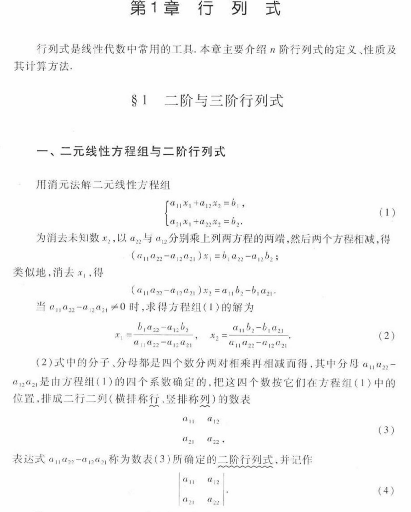

应试教育是一个只奖励记忆力的教育系统。

本文由上一篇[关于大二上的随笔 - 2](https://v3n0.top/post/2026/third-term-of-college-2/#关于如何学习)分离出。

到大学之后才发现，经历了几年应试教育的荼毒之后，自己已经忘记了怎么像正常人一样说话，像正常人一样思考了。因此不得不思考这样一个问题：

## 怎样才是正常人的学习思路？

直到现在，才能阶段性给出一个自己满意的答案。

### 不使用任何未被动机化的概念

关于这一句，一开始我总结成两点：

**_不引入任何未被定义的变量，任何时候都能用自然语言表达当前目的_**。

写博客时发现其实可以被压缩成标题的这样一句。因为把**未定义**升级为**未动机化**时，第一点自然可以坍缩为第二点的一部分。一个概念之所以“被动机化”，恰恰是因为它服务于一个可以被说清楚的目的。

反过来说，如果我用自然语言说不清“我现在要干什么”，那我引入的任何新概念，在思维上必然是悬空的，即使它在符号层面被严格定义了。

并且需要否定的观点是，“只要能用自然语言把符号念一遍，就算理解了”。比如：对信号做拉普拉斯变换，在线性空间中定义加法，等等。这种自然语言本质上只是换了一套符号系统，并没有增加任何语义密度。这里的自然语言，必须是已经完成一次抽象与压缩后的表达。

至少需要满足这样的条件：

1. 不依赖当前引入的符号本身，用“因为定义如此”来解释定义。
2. 保留因果和目的，必须回答：为什么要这么做，而不是别的做法。
3. 可以脱离具体形式存在

因此可以用这样的办法检验：**如果暂时忘掉所有公式和符号，仍然能够说明自己正在解决什么问题，以及为什么当前引入的概念是必要的。**

但这是中国非常多的教材做的事。举一个绝对反例：



第一章标题是行列式。但行列式在整个线性代数体系里是一个高度派生的对象。要出现行列式，至少先得出现：线性映射，线性方程组的结构性问题，可逆性的判定需求，体积/定向/行变换不变量的概念之一。但这本书在干什么？直接从“解二元线性方程组的消元计算”中，硬抠出一个代数表达式，然后给它命名。

我们说，不使用任何未被动机化的概念，这里恰好满足所有未被动机化的判据。当前的目标根本不需要它。此时的目标是解一个二元线性方程组。用消元法已经解完了。到这里为止，一切都是自然的。但接下来发生了什么？它在“本该停下”的地方强行引入新对象。

书说：“这个表达式我们把它叫做二阶行列式”。但问题是：为什么要叫？

没有任何新的问题要解决，没有在比较不同方程组，没有在讨论解是否稳定，没有在讨论结构不变性

于是这个“命名”是无动机的。

行列式真正合理的生成路径是这样的：

我们想知道一个线性变换是否压扁了空间 -> 是否把体积压成 0 -> 是否不可逆 -> 是否存在非零解 -> 需要一个对行变换行为可控的标量不变量 -> 行列式

而教材给的是：

四个数两两相乘再相减 -> 记住这个公式，它很重要

### 由目的和公理出发形成递归式思路

这一点事实上应当可以被上一点引出。

为什么说上面的教学方式严重污染学习者的认知？因为这一步在做的事是：“重要的东西 = 一串复杂公式”，而不是：“重要的东西 = 解决一个已经感到棘手的问题的必要结构”

这种教学方式的问题不在于我的个人偏好或者什么教学风格，而是这样的教学是客观有害的。

**它破坏了信息压缩的可能性**！长此以往，学生会形成一种注定不可拓展的认知编码模式。

复杂被灌输为深刻，公式多而难记被灌输为核心重点，能背下来被当成是学会了。这简直是种认知污染。

什么叫信息压缩？我们在学习任何学科时，实际上真正想做的事情就是信息压缩：

**把一个知识体系压缩成：最小生成元 + 生成规则**。

这是唯一一种可以拓展的学习方式。否则每个公式都是一个终态，终态之间没有生成关系，无法合并复用，整个体系是一堆互不相干的字符串，从信息论上就是不可压缩的输入。

我们学习概念的过程应当是这样的：我们遇到了一个反复出现的很麻烦的问题，现在已经有的工具解决不了，因此我们抽象出这样一个操作，简化我们的描述。此时我们记住的不是具体形式，而是在什么条件下，自然演变出这样的形式。存在硬盘里的是 when, how, where, 形式细节可以被重新生成。

这就是为什么说递归式思路是可拓展的。用这样的思路学习，才会是快速，思路清晰，并且可以被长期记忆的。

## 为什么应试教育导致了这种结局？

应试教育的根本原因是官本位，官本位导致的教育就是应试教育。为什么这么说？

谁是客户决定了一切。任何系统都会优化它真正被考核的对象，这就像强化学习，模型会最大化奖励函数的期望值，而不一定是真正目标。

市场教育，客户是企业。官僚教育，客户是上级领导的指标。没错，客户并不是学生本身，教育系统并不为“学生是否变成完整的人”负责，只为是否合格完成交付负责。

在官本位的情况下，教育不需要向市场负责，而是需要向官员负责。因此每一层只需要让自己的上一层满意，不需要对下负责。一旦教育不需要为学生能不能干活负责，而只需要为**指标是否完成**负责，结局是必然的。

这样来看，应试教育并不是失败，而是极端高效的成功，在当前的约束条件下，应试教育是最优策略。因为向上负责的系统，只能选择“可量化、可汇报、可比较”的东西。

考试，可以量化，可以排名，可以用一页 PPT 汇报，可以跨地区标准化对齐。

**官僚教育经过几十年的在固定奖励函数下的长期强化学习，同样完成了一次信息压缩**。

这个系统的奖励函数非常清晰：

```text
+1：分数提升

+1：升学率提高

+1：指标完成

0：学生是否理解

0：是否具备生成和转化能力

0：是否能应对真实问题
```

于是经过几十年的“训练”，系统自然学会了：最大化可压缩信息（公式，套路），最小化不可验证变量（理解，动机），把高度抽象的对象当作高价值的符号（分数，升学率）。

应试教育不是失败，而是在“向上负责”的奖励函数下，成功训练出的最优模型。如果继续推，会得到一个让人伤感的事实：

**真正以学生为目标的教育，在大规模系统中几乎不可实现**。

因为动机不可量化，理解没法标准化，生成规则无法汇报，个体差异无法收敛。

因此真正以学生为目标的的教育，只能存在于师徒制，小规模实践，或者与真实问题强绑定的问题。
