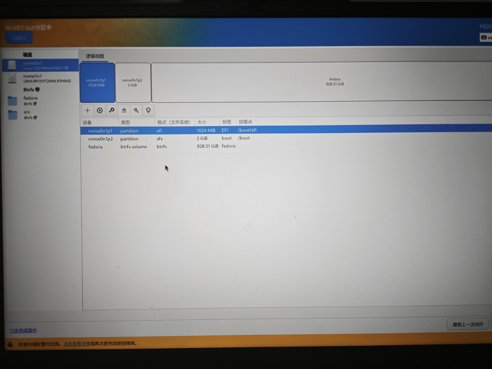
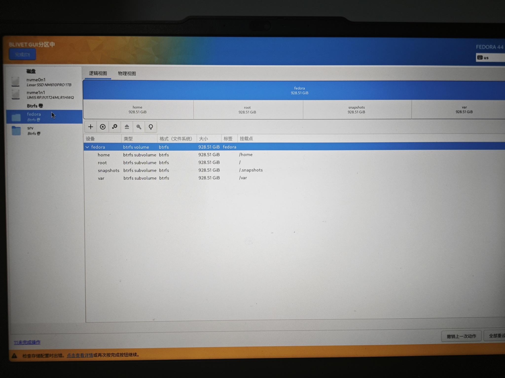
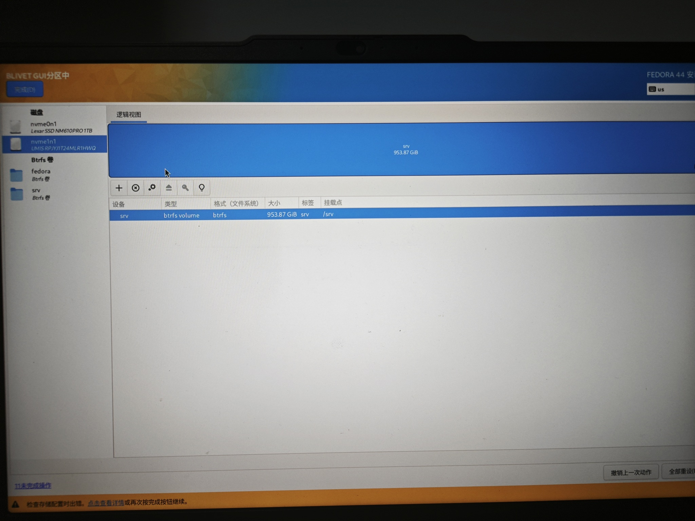
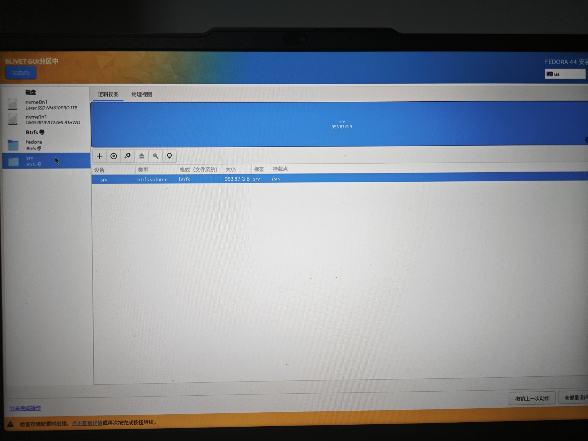
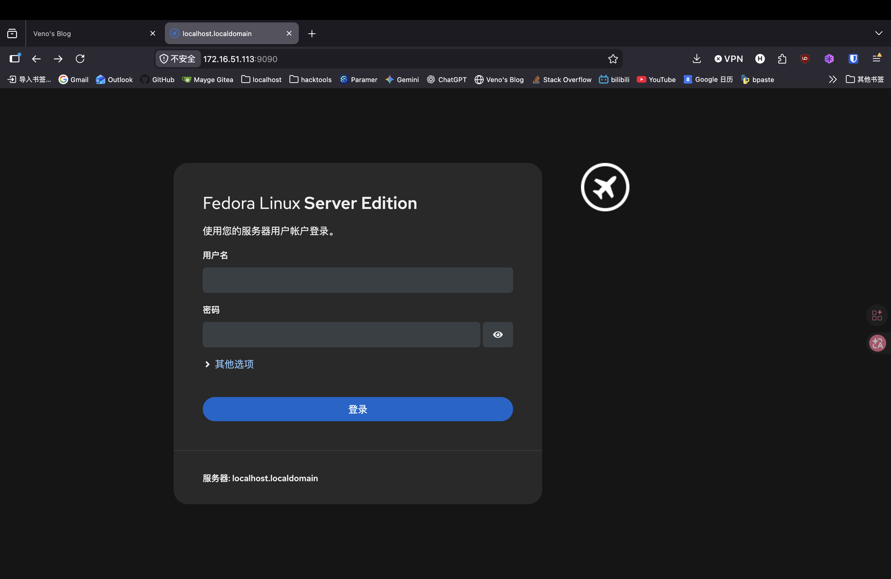
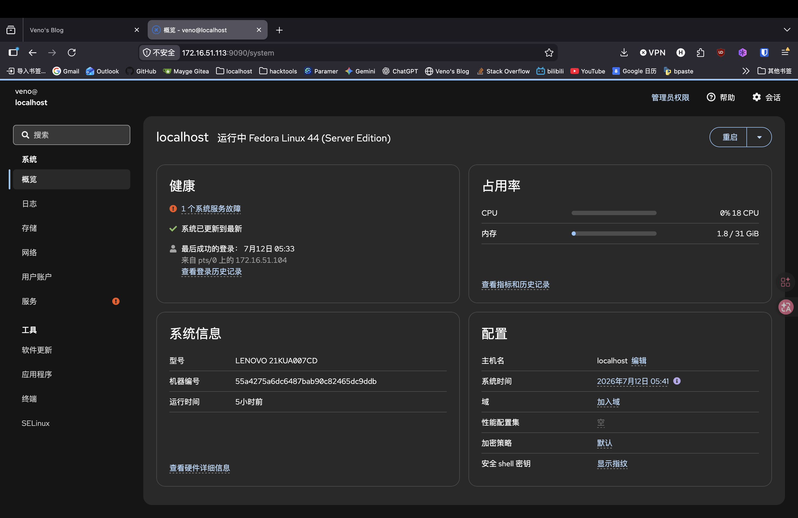
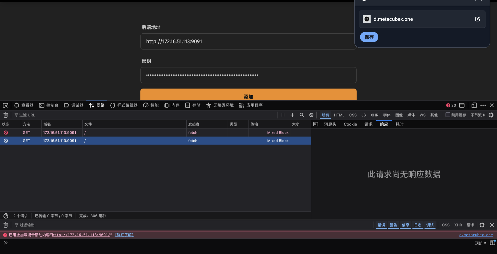

最近，我准备把一台装有两块 1 TB SSD 的 ThinkPad 改造成 Homelab。

这是一份运维记录。本篇不会试图把它写成一篇面面俱到的 Fedora 教程，而是按实际进度持续补完，记下操作，原因，问题。

整体上，我准备采用这样的分工：

- Fedora 管理内核、驱动、服务等系统级组件；
- Nix 管理开发工具链和用户环境；
- Btrfs 快照负责系统回滚；
- 第二块硬盘单独挂载到 `/srv`，存放 Homelab 的服务数据。

## 安装 Fedora Server 44

Fedora 的 Anaconda 安装器已经相当自动化，界面也很好理解。除了磁盘分区之外，其余设置没有太多值得展开的地方：

- 创建了 `root` 和 `veno` 用户；
- 系统语言选择了 `en_US` 和 `zh_CN`；
- 键盘布局使用 `en_US`；
- 在安装器里提前连接了 Wi-Fi，免得重启后再面对纯命令行配置无线网络。

真正需要认真规划的是两块硬盘。

### 为什么不用自动分区

我先尝试了一次 Fedora Server 的自动分区。它大致把系统盘安排成这样：

```text
nvme1n1
├─nvme1n1p1  vfat          /boot/efi
├─nvme1n1p2  xfs           /boot
└─nvme1n1p3  LVM2_member
  └─fedora-root  xfs       /
```

另一块盘则是：

```text
nvme0n1
└─nvme0n1p1  LVM2_member
```

安装器直接把两块硬盘加入了同一个 LVM Volume Group。这个布局当然能用，但它把系统盘和数据盘绑在了一起，不符合我希望两块磁盘职责清晰、可以独立维护的想法。

所以最后还是选择了自定义分区。不得不说，在“我想清楚地知道每一块盘上有什么”这件事上，我反而开始怀念 Arch Linux 的安装过程了。不过 Homelab 的宿主系统，我确实不打算用 Arch。

### 我的磁盘布局

第一块硬盘作为系统盘。它包含一个 1 GiB 的 EFI 分区、一个 2 GiB 的 `/boot` 分区，剩余空间全部交给一个 Btrfs 文件系统。



```text
system disk
├─EFI System Partition    1 GiB    vfat    /boot/efi
├─boot                    2 GiB    xfs     /boot
└─fedora                  剩余空间  btrfs
```

在 `fedora` Btrfs 文件系统中，我创建了四个子卷：

```text
fedora
├─root       /
├─home       /home
├─var        /var
└─snapshots  /.snapshots
```



这些子卷共享同一个 Btrfs 文件系统的空间，并不是各自预先切走四分之一容量。把 `/var` 独立出来，可以避免日志、容器数据等频繁变化的内容混进根子卷快照；独立的 `/.snapshots` 则为后续配置快照工具留出位置。

第二块 1 TB 硬盘不加入系统盘的 Btrfs 文件系统，也不和它组成跨盘卷。我把整块盘创建为一个独立的 Btrfs 文件系统，并挂载到 `/srv`。





```text
data disk
└─srv    btrfs    /srv
```

`/srv` 会作为服务数据的主要落点。这样既能让系统和数据的边界保持清楚，也方便以后分别制定快照、备份和重装策略。需要强调的是，Btrfs 快照并不等于备份；真正的备份仍然需要落到另一块独立介质或另一台机器上。

至此，Fedora Server 44 已经可以启动，磁盘布局也符合预期。这台机器现在还只是一套刚装好的操作系统。下面的内容会从第一次登录开始，随着实际配置进度继续补完。

## Fedora 安装后的配置

### 第一次更新

`sudo dnf update` 就行，fedora 会自动选择合适的镜像源。省心。

### 初始化 ssh

用 macbook 连机器去配置。要不然复制太麻烦。

不需要 `sudo dnf install -y openssh-server curl`, Fedora Server 44 实际上已经预装了

```bash
mkdir -p ~/.ssh
chmod 700 ~/.ssh
curl -fsSL https://github.com/U1traVeno.keys | tee -a ~/.ssh/authorized_keys >/dev/null
chmod 600 ~/.ssh/authorized_keys
```

`ip a` 一下，ssh 过去之后竟然发现有些好玩的东西：

```text
❯ ssh veno@172.16.51.113
The authenticity of host '172.16.51.113 (172.16.51.113)' can't be established.
ED25519 key fingerprint is: SHA256:9MUAqqdnnh1f6+/G4hzJsSruQbmPGwLBcumd6ToOU0w
This key is not known by any other names.
Are you sure you want to continue connecting (yes/no/[fingerprint])? yes
Warning: Permanently added '172.16.51.113' (ED25519) to the list of known hosts.

4 个设备有可升级的固件。
运行 `fwupdmgr get-upgrades` 获取更多信息。

Web console: https://localhost:9090/ or https://172.16.51.113:9090/

veno@localhost:~$
```

Fedora Server 竟然自带 Web console。用的是 Cockpit



里面东西还挺多的。以后再来探索一下



现在就可以做骚操作，下面我的配置均由 Codex gpt-5.6-sol 从 macbook ssh 过去进行配置，并填充博客内容。反正是完全新装的机器，也不怕搞坏，大不了重装。

### 启用 RPM Fusion

Fedora 官方仓库不会收录所有我可能用到的软件，所以先启用 RPM Fusion 的 Free 和 Nonfree 仓库。安装命令来自 [RPM Fusion 官方配置文档](https://rpmfusion.org/Configuration)，而不是从第三方博客复制。

安装地址中的 `$(rpm -E %fedora)` 会读取当前 Fedora 的版本号：

```bash
rpm -E %fedora
```

实际输出：

```text
44
```

先按官方文档给出的镜像跳转地址安装两个 release package：

```bash
sudo dnf install \
  "https://mirrors.rpmfusion.org/free/fedora/rpmfusion-free-release-$(rpm -E %fedora).noarch.rpm" \
  "https://mirrors.rpmfusion.org/nonfree/fedora/rpmfusion-nonfree-release-$(rpm -E %fedora).noarch.rpm"
```

但是这次跳转到了上海交大镜像，而该镜像上的 Fedora 44 路径返回了 HTTP 400：

```text
Status code: 400 for https://mirror.sjtu.edu.cn/rpmfusion/free/fedora/rpmfusion-free-release-44.noarch.rpm
Status code: 400 for https://mirror.sjtu.edu.cn/rpmfusion/nonfree/fedora/rpmfusion-nonfree-release-44.noarch.rpm
Not finished - interrupted by error
下载文件失败
```

先用 HEAD 请求确认 RPM Fusion 自己的 `download1.rpmfusion.org` 上确实有这两个文件：

```bash
curl -I --connect-timeout 10 \
  https://download1.rpmfusion.org/free/fedora/rpmfusion-free-release-44.noarch.rpm
curl -I --connect-timeout 10 \
  https://download1.rpmfusion.org/nonfree/fedora/rpmfusion-nonfree-release-44.noarch.rpm
```

两次请求都返回了 `HTTP/1.1 200 OK`，于是绕过镜像跳转，改用直连地址安装：

```bash
sudo dnf install \
  "https://download1.rpmfusion.org/free/fedora/rpmfusion-free-release-$(rpm -E %fedora).noarch.rpm" \
  "https://download1.rpmfusion.org/nonfree/fedora/rpmfusion-nonfree-release-$(rpm -E %fedora).noarch.rpm"
```

DNF 列出的实际安装版本是：

```text
软件包                      架构    版本
rpmfusion-free-release      noarch  44-3
rpmfusion-nonfree-release   noarch  44-3

事务摘要：
 正在安装：   2 个软件包

完成！
```

RPM Fusion 的配置文档还建议启用 Fedora 自带的 `fedora-cisco-openh264` 仓库：

```bash
sudo dnf config-manager setopt fedora-cisco-openh264.enabled=1
```

安装完成后直接列出全部启用的仓库：

```bash
dnf repolist --enabled
```

重启后再次执行，实际输出为：

```text
repo id                   repo name
fedora                    Fedora 44 - x86_64
fedora-cisco-openh264     Fedora 44 openh264 (From Cisco) - x86_64
rpmfusion-free            RPM Fusion for Fedora 44 - Free
rpmfusion-free-updates    RPM Fusion for Fedora 44 - Free - Updates
rpmfusion-nonfree         RPM Fusion for Fedora 44 - Nonfree
rpmfusion-nonfree-updates RPM Fusion for Fedora 44 - Nonfree - Updates
updates                   Fedora 44 - x86_64 - Updates
```

再确认 release package 的版本：

```bash
rpm -q rpmfusion-free-release rpmfusion-nonfree-release
```

```text
rpmfusion-free-release-44-3.noarch
rpmfusion-nonfree-release-44-3.noarch
```

这里只启用软件源，不为了“配齐 RPM Fusion”提前安装一堆软件。后面真正需要某个包时再用 DNF 安装。

参考：

- [RPM Fusion - Configuration](https://rpmfusion.org/Configuration)

### 设置笔记本合盖不休眠

这台 ThinkPad 要作为长期运行的服务器，盖上屏幕后不能跟着休眠。这个行为由 `systemd-logind` 管理。根据 [systemd 的 `logind.conf` 手册](https://www.freedesktop.org/software/systemd/man/latest/logind.conf.html)，`HandleLidSwitch=`、`HandleLidSwitchExternalPower=` 和 `HandleLidSwitchDocked=` 分别控制不同状态下的合盖行为；值为 `ignore` 时，`systemd-logind` 不处理该事件。

不直接修改 `/etc/systemd/logind.conf`，而是单独创建一个 drop-in 配置。以后要恢复默认行为时，只需要删除这个文件。先创建配置目录：

```bash
sudo install -d -m 0755 /etc/systemd/logind.conf.d
```

然后写入配置。这里使用 `printf | sudo tee`，可以直接粘贴进远程终端：

```bash
printf '%s\n' \
  '[Login]' \
  'HandleLidSwitch=ignore' \
  'HandleLidSwitchExternalPower=ignore' \
  'HandleLidSwitchDocked=ignore' \
  | sudo tee /etc/systemd/logind.conf.d/10-ignore-lid.conf
```

`tee` 原样输出了写入的内容：

```text
[Login]
HandleLidSwitch=ignore
HandleLidSwitchExternalPower=ignore
HandleLidSwitchDocked=ignore
```

三个配置分别覆盖普通状态、连接外部电源和 docked 状态。展开主配置和所有 drop-in，只查看末尾几行：

```bash
systemd-analyze cat-config systemd/logind.conf | tail -n 8
```

实际输出：

```text
#DesignatedMaintenanceTime=
#WallMessages=yes

# /etc/systemd/logind.conf.d/10-ignore-lid.conf
[Login]
HandleLidSwitch=ignore
HandleLidSwitchExternalPower=ignore
HandleLidSwitchDocked=ignore
```

`systemd-logind` 需要重新加载配置。直接重启它可能影响当前登录会话，所以完成这一轮配置后直接重启了整台机器：

```bash
sudo systemctl reboot
```

重启后重新连接，再次展开配置，仍然得到上面相同的结果，说明 drop-in 已经跨重启加载。配置侧的验证已经完成；是否真的能在物理合盖后继续通过 SSH 连接，还需要实际合盖测试，不能仅凭配置文件下结论。

参考：

- [systemd - logind.conf](https://www.freedesktop.org/software/systemd/man/latest/logind.conf.html)
- [systemd - logind](https://www.freedesktop.org/wiki/Software/systemd/logind/)

### 设置 Hostname

设置为 ThinkPad。

根据 [Fedora 官方的 Changing Hostname 文档](https://docs.fedoraproject.org/en-US/quick-docs/changing-hostname/)，可以使用 `hostnamectl set-hostname` 设置主机名。静态 hostname 会用于网络解析，按照惯例使用全小写的 `thinkpad`；另外把给人看的 pretty hostname 设置成 `ThinkPad`。

```bash
sudo hostnamectl set-hostname --static thinkpad
sudo hostnamectl set-hostname --pretty ThinkPad
```

设置后查看结果：

```bash
hostnamectl status
```

实际输出的开头是：

```text
Static hostname: thinkpad
Pretty hostname: ThinkPad
```

重启后重新连接，再单独确认静态 hostname：

```bash
hostname
```

实际输出：

```text
thinkpad
```

设置已经写入 `/etc/hostname`。重启后的新 SSH 会话可以正常连接，`hostnamectl` 和 `hostname` 都保留了新名称。

参考：

- [Fedora Docs - Changing Hostname](https://docs.fedoraproject.org/en-US/quick-docs/changing-hostname/)
- [hostnamectl(1)](https://www.freedesktop.org/software/systemd/man/latest/hostnamectl.html)

## 中国大陆网络环境与代理

我使用机场提供的 Clash 配置，并用 [Mihomo](https://github.com/MetaCubeX/mihomo) 内核接管这台机器的网络。目标是：

- 使用订阅中确切名称为 `🇯🇵 日本 03` 的节点；
- 使用 `rule` 模式，不把所有流量无条件送进代理；
- 开启 TUN，让没有单独配置代理环境变量的程序也能按规则联网；
- 由 systemd 管理并开机启动；
- 允许局域网设备通过外部控制器管理，但避开 Cockpit 使用的 `9090`；
- 控制器必须使用随机密钥，订阅和密钥均不写入博客或 Git。

配置字段以 Mihomo 官方 Wiki 为依据：

- [常规配置：运行模式、外部控制器、secret 与 profile](https://wiki.metacubex.one/config/general/)
- [TUN 配置](https://wiki.metacubex.one/config/inbound/tun/)
- [Select 策略组](https://wiki.metacubex.one/config/proxy-groups/select/)
- [DNS 配置](https://wiki.metacubex.one/config/dns/)

### 传输并检查订阅

先从 MacBook 用 `rsync` 把订阅传到 ThinkPad 的家目录：

```bash
rsync -av --progress \
  /Users/veno/Documents/AmyTelecom_Clash.yaml \
  veno@172.16.51.113:/home/veno/AmyTelecom_Clash.yaml
```

实际传输了 `371525` 字节：

```text
sending incremental file list
AmyTelecom_Clash.yaml
        371,525 100%  323.06MB/s  0:00:00 (xfr#1, to-chk=0/1)

sent 371,729 bytes  received 35 bytes
total size is 371,525  speedup is 1.00
```

在本地只解析配置结构，不打印节点服务器、端口、UUID、DNS token 等敏感字段。得到的信息是：配置本身已经启用 DNS，模式为 `Rule`，包含 58 个节点、22 个 `select` 策略组和 7529 条规则。目标节点在文件中的确切名称不是简单的“日本03”，而是：

```text
🇯🇵 日本 03
```

主策略组名为 `Proxies`，它包含这个节点。其他流媒体和服务策略组大多先引用 `Proxies`，而 Bilibili、Microsoft、Apple 等组原本把直连放在第一位。为了保留机场规则原本表达的意图，我只把 `Proxies` 的默认选择改为日本节点，不强行覆盖所有专用策略组。

### 安装 Mihomo

Fedora 和已经启用的 RPM Fusion 中没有找到 `mihomo` 软件包，于是从 [MetaCubeX 官方 GitHub Releases](https://github.com/MetaCubeX/mihomo/releases) 获取 RPM。查询时的最新版本是 `v1.19.28`。

第一次直接用 DNF 安装：

```bash
sudo dnf install \
  https://github.com/MetaCubeX/mihomo/releases/download/v1.19.28/mihomo-linux-amd64-v1.19.28.rpm
```

DNF 又在刷新 RPM Fusion 元数据时被坏镜像拖住了：SJTU 持续返回 HTTP 400，美国备用镜像随后超时。这个错误与 Mihomo 的 GitHub RPM 本身无关。中断后，在本次安装中临时禁用 RPM Fusion 仓库：

```bash
sudo dnf install --disablerepo='rpmfusion-*' \
  https://github.com/MetaCubeX/mihomo/releases/download/v1.19.28/mihomo-linux-amd64-v1.19.28.rpm
```

实际安装的软件包是：

```text
mihomo  x86_64  1.19.28-1  @commandline
完成！
```

查看内核版本：

```bash
mihomo -v
```

```text
Mihomo Meta v1.19.28 linux amd64 with go1.26.5 Wed Jul  8 00:20:38 UTC 2026
Use tags: with_gvisor
```

官方 RPM 已经提供了 `/usr/bin/mihomo`、`/etc/mihomo/config.yaml`、`mihomo.service` 和 `mihomo@.service`。其中 `mihomo.service` 的启动命令是：

```ini
ExecStart=/usr/bin/mihomo -d /etc/mihomo
```

unit 还预先限制并授予了 `CAP_NET_ADMIN`、`CAP_NET_RAW` 等 capability，足够创建 TUN 和配置路由，不需要自己再写一个权限边界更宽的 root service。

### 生成实际配置

控制器使用 `9091/tcp`。执行前用下面的命令确认端口没有被占用：

```bash
ss -ltn '( sport = :9091 )'
```

输出只有表头，没有监听项。

先生成一个 256-bit 随机控制器密钥。密钥保存在用户目录中，权限为 `0600`；博客只记录路径，不记录内容：

```bash
mkdir -p -m 700 ~/.config/mihomo
secret=$(openssl rand -hex 32)
printf '%s\n' "$secret" > ~/.config/mihomo/controller-secret
chmod 600 ~/.config/mihomo/controller-secret
```

然后把订阅安装到 `/etc/mihomo/config.yaml`，权限同样设为 `0600`，并去掉原文件混用的 CRLF 行尾：

```bash
sudo install -d -m 700 /etc/mihomo
sudo install -m 600 ~/AmyTelecom_Clash.yaml /etc/mihomo/config.yaml
sudo sed -i 's/\r$//' /etc/mihomo/config.yaml
```

最后对配置做了最小修改：

```yaml
mode: rule
external-controller: 0.0.0.0:9091
secret: "<随机生成，不公开>"

profile:
  store-selected: true
  store-fake-ip: true

tun:
  enable: true
  stack: mixed
  auto-route: true
  auto-redirect: true
  auto-detect-interface: true
  dns-hijack:
    - any:53
    - tcp://any:53

proxy-groups:
  - name: Proxies
    type: select
    default-selected: "🇯🇵 日本 03"
```

这里没有把订阅全文放进博客，因为里面包含代理节点凭据和带 token 的 DNS 地址。

### 校验配置

先把家目录中的原始订阅权限也收紧，再检查三个敏感位置：

```bash
chmod 600 ~/AmyTelecom_Clash.yaml

stat -c '%a %U:%G %n' \
  ~/AmyTelecom_Clash.yaml \
  ~/.config/mihomo/controller-secret

sudo stat -c '%a %U:%G %n' \
  /etc/mihomo \
  /etc/mihomo/config.yaml
```

实际结果：

```text
600 veno:veno /home/veno/AmyTelecom_Clash.yaml
600 veno:veno /home/veno/.config/mihomo/controller-secret
700 root:root /etc/mihomo
600 root:root /etc/mihomo/config.yaml
```

然后运行 Mihomo 自带的配置校验：

```bash
sudo mihomo -t -d /etc/mihomo
```

第一次校验时 Mihomo 发现缺少 MMDB，自动完成了下载。最终输出：

```text
INFO Start initial configuration in progress
INFO Geodata Loader mode: memconservative
INFO Geosite Matcher implementation: succinct
INFO Can't find MMDB, start download
INFO Initial configuration complete, total time: 1474ms
configuration file /etc/mihomo/config.yaml test is successful
```

到这里配置文件已经通过 Mihomo `v1.19.28` 的真实解析和初始化，不再只是看起来像合法 YAML。

### 启动 systemd 服务

配置校验通过后，启动服务并设为开机启动：

```bash
sudo systemctl enable --now mihomo
```

```text
Created symlink '/etc/systemd/system/multi-user.target.wants/mihomo.service'
→ '/usr/lib/systemd/system/mihomo.service'.
```

检查服务状态：

```bash
systemctl is-enabled mihomo
systemctl is-active mihomo
systemctl status mihomo --no-pager -l
```

```text
enabled
active
Active: active (running)
Main PID: 2338 (mihomo)
CGroup: /system.slice/mihomo.service
        └─2338 /usr/bin/mihomo -d /etc/mihomo
```

启动 TUN 后当前 SSH 会话没有断开。创建出的接口名为 `Meta`：

```bash
ip -brief address show Meta
```

```text
Meta  UNKNOWN  198.18.0.1/30  fdfe:dcba:9876::1/126
```

Mihomo 也自动建立了从 `9000` 开始的 ip rule 和路由表 `2022`：

```bash
ip rule show | grep -E '900[0-9]|2022'
ip route show table 2022
```

路由表中的默认路由为：

```text
default via 198.18.0.2 dev Meta
```

控制器与 Cockpit 同时监听，端口没有冲突：

```bash
ss -ltnp | grep -E ':9091|:9090'
```

```text
LISTEN 0 4096 *:9091 *:*
LISTEN 0 4096 *:9090 *:*
```

### 验证控制器、模式与默认节点

先不带 secret 请求控制器：

```bash
curl -sS -o /dev/null -w '%{http_code}\n' \
  http://127.0.0.1:9091/version
```

实际返回 `401`，说明控制器并不是匿名开放。

再从权限为 `0600` 的文件读取 secret，请求 API。命令只把 secret 放进当前 shell 变量，不把内容打印到终端：

```bash
secret=$(cat ~/.config/mihomo/controller-secret)

curl -sS -H "Authorization: Bearer $secret" \
  http://127.0.0.1:9091/configs \
  | python3 -c 'import json,sys; d=json.load(sys.stdin); print("mode:", d["mode"]); print("tun.enable:", d["tun"]["enable"])'

curl -sS -H "Authorization: Bearer $secret" \
  http://127.0.0.1:9091/proxies/Proxies \
  | python3 -c 'import json,sys; print("Proxies:", json.load(sys.stdin)["now"])'

unset secret
```

实际结果：

```text
mode: rule
tun.enable: True
Proxies: 🇯🇵 日本 03
```

服务刚启动时的真实日志已经同时出现了两种流向：

```text
dnf5 --> mirror.sjtu.edu.cn:443
match GeoIP(cn) using 🎯Direct[DIRECT]

dnf5 --> rpmfusion.ip-connect.info:443
match Match using ✈️Final[🇯🇵 日本 03]
```

这证明国内地址确实可以直连，未命中前面规则的境外连接则交给 `✈️Final`，最终使用日本 03，而不是把规则模式写进配置后就想当然地宣布完成。

再主动请求一个国内站点和一个境外站点：

```bash
curl -4 -sS -o /dev/null -w 'baidu: %{http_code}\n' \
  https://www.baidu.com/

curl -4 -sS -o /dev/null -w 'google: %{http_code}\n' \
  https://www.google.com/generate_204
```

```text
baidu: 200
google: 204
```

然后从 Mihomo journal 中查找这两个请求：

```bash
sudo journalctl -u mihomo --since '2 minutes ago' --no-pager \
  | grep -E 'baidu.com|google.com' \
  | tail -n 6
```

实际日志：

```text
[TCP] 198.18.0.1:54192(curl, uid=1000) --> www.baidu.com:443
match DomainSuffix(baidu.com) using 🎯Direct[DIRECT]

[TCP] 198.18.0.1:39388(curl, uid=1000) --> www.google.com:443
match DomainSuffix(google.com) using Google[🇯🇵 日本 03]
```

这组测试把“规则模式”验证到了具体请求：同一台机器、同一个 TUN，Baidu 直连，Google 经日本 03 代理，两边都成功返回。

### 放行外部控制器

只在无线网卡所在的 `FedoraServer` zone 放行控制器端口。DNS 的 `1053`、HTTP 代理的 `7890` 和 SOCKS 的 `7891` 都没有添加到 firewalld：

```bash
sudo firewall-cmd --permanent \
  --zone=FedoraServer \
  --add-port=9091/tcp

sudo firewall-cmd --reload
sudo firewall-cmd --zone=FedoraServer --query-port=9091/tcp
```

三条命令依次输出：

```text
success
success
yes
```

查看该 zone 直接开放的端口：

```bash
sudo firewall-cmd --zone=FedoraServer --list-ports
```

```text
9091/tcp
```

然后从 MacBook 访问 `172.16.51.113:9091`。不带 secret 时仍然返回 401；从 ThinkPad 上权限受限的文件临时读取 secret 后，认证请求成功：

```text
unauthenticated: 401
authenticated: {"meta":true,"version":"v1.19.28"}
```

这说明控制器已经能够从局域网访问，但不是裸奔。之后可以在 MetaCubeX Dashboard 等客户端中填写：

```text
Controller: http://172.16.51.113:9091
Secret:     ~/.config/mihomo/controller-secret 中保存的值
```

这里的 `~` 指 ThinkPad 上 `veno` 用户的家目录。控制器 secret 不会出现在文章、Git 仓库或 shell 输出中。

控制器目前是普通 HTTP，Bearer secret 在局域网内传输时没有 TLS 加密，所以只适合可信内网。以后如果要跨不可信网络管理，应该使用 SSH tunnel、VPN，或者按照 Mihomo 文档配置 `external-controller-tls`，不能直接把 `9091` 映射到公网。

### Firefox 拦截 Mixed Content

我原本准备直接使用官方托管的 [MetaCubeXD](https://d.metacubex.one/#/) 面板，填写：

```text
Backend: http://172.16.51.113:9091
Secret:  <controller secret>
```

但是 Firefox 开发者工具显示请求被标记为 `Mixed Block`：



用 `curl` 携带相同的 Origin 和 Authorization 请求控制器却能得到：

```json
{"hello":"mihomo"}
```

这两个结果并不矛盾。`curl` 不执行浏览器的 Mixed Content 安全策略；Firefox 则在真正发出请求之前，就阻止了 HTTPS 页面访问 HTTP API。因此这不是 Mihomo、secret、CORS 或 firewalld 的错误。

尝试访问 `http://d.metacubex.one` 也不能解决，因为 GitHub Pages 会返回：

```text
HTTP/1.1 301 Moved Permanently
Location: https://d.metacubex.one/
```

Mihomo 官方文档提供了更干净的解决方法：使用 `external-ui` 把静态面板直接托管在 Clash API 的 `/ui` 路径。这样面板和 API 都来自 `http://172.16.51.113:9091`，浏览器不会产生 Mixed Content，而且 secret 不需要交给第三方托管页面。

官方完整配置示例给出的 MetaCubeXD 配置为：

```yaml
external-ui: ui
external-ui-name: xd
external-ui-url: "https://github.com/MetaCubeX/metacubexd/archive/refs/heads/gh-pages.zip"
```

参考：

- [Mihomo 常规配置 - 外部用户界面](https://wiki.metacubex.one/config/general/)
- [Mihomo 官方完整配置示例](https://github.com/MetaCubeX/mihomo/blob/Meta/docs/config.yaml)

在继续操作前还有一件更要紧的事：用于测试的真实 controller secret 曾经出现在聊天内容和 shell 命令中，应当视为已经泄露，不能继续使用。

先在远程 shell 中保留旧 secret 以便稍后验证，然后生成新 secret。命令不会打印二者的内容：

```bash
old_secret=$(cat ~/.config/mihomo/controller-secret)
new_secret=$(openssl rand -hex 32)

printf '%s\n' "$new_secret" > ~/.config/mihomo/controller-secret
chmod 600 ~/.config/mihomo/controller-secret

sudo sed -i \
  "s/^secret:.*/secret: \"$new_secret\"/" \
  /etc/mihomo/config.yaml
```

然后删除可能存在的旧 UI 字段，再追加经过官方文档确认的配置：

```bash
sudo sed -i \
  '/^external-ui:/d; /^external-ui-name:/d; /^external-ui-url:/d' \
  /etc/mihomo/config.yaml

printf '%s\n' \
  'external-ui: ui' \
  'external-ui-name: xd' \
  'external-ui-url: "https://github.com/MetaCubeX/metacubexd/archive/refs/heads/gh-pages.zip"' \
  | sudo tee -a /etc/mihomo/config.yaml >/dev/null
```

两个密钥文件没有打印内容，仍保持 `0600` 权限。修改后的配置再次通过校验：

```text
INFO Start initial configuration in progress
INFO Geodata Loader mode: memconservative
INFO Geosite Matcher implementation: succinct
INFO Initial configuration complete, total time: 5ms
configuration file /etc/mihomo/config.yaml test is successful
```

校验通过后重启服务：

```bash
sudo systemctl restart mihomo
systemctl is-active mihomo
```

实际输出为 `active`。Mihomo 自动下载并解压了 MetaCubeXD。由于设置了 `external-ui-name: xd`，访问 `/ui/` 看到的是目录：

```html
<a href="xd/">xd/</a>
```

真正的入口是：

```text
http://172.16.51.113:9091/ui/xd/
```

用 `curl` 检查该地址，返回 HTTP 200、2429 字节，HTML 标题为：

```html
<title>MetaCubeXD</title>
```

最后确认密钥轮换确实生效：

```bash
curl -sS -o /dev/null -w 'old secret: %{http_code}\n' \
  -H "Authorization: Bearer $old_secret" \
  http://127.0.0.1:9091/version

curl -sS -o /dev/null -w 'new secret: %{http_code}\n' \
  -H "Authorization: Bearer $new_secret" \
  http://127.0.0.1:9091/version

unset old_secret new_secret
```

```text
old secret: 401
new secret: 200
```

从浏览器打开自托管入口，后端填写 `http://172.16.51.113:9091`，密钥填写轮换后的值。连接成功后进入 `#/overview`，面板显示：

```text
已连接到: http://172.16.51.113:9091
运行模式: 规则
热门代理: 🇯🇵 日本 03
UI v1.267.2 · Core v1.19.28
当前出口: Japan, Tokyo
```

至此不再需要 `https://d.metacubex.one`。仍然使用同一个 MetaCubeXD，只是静态资源由自己的 Mihomo 托管；没有 Mixed Content，也不需要把 controller secret 交给第三方页面。

### 重启验证

最后重启 ThinkPad，验证这套配置不是只能在当前会话里工作：

```bash
sudo systemctl reboot
```

第一次重连时网络还没恢复，SSH 超时。再次连接成功后，boot ID 已经变化，并得到：

```text
enabled
active
Meta  UNKNOWN  198.18.0.1/30
default via 198.18.0.2 dev Meta
```

这说明 systemd 在新一次启动中自动拉起了 Mihomo，TUN 接口和路由表也重新创建成功。

再次通过本机 API 检查运行状态，并重复国内外连通性测试：

```text
mode: rule
tun.enable: True
Proxies: 🇯🇵 日本 03
baidu: 200
google: 204
```

`profile.store-selected: true` 让日本 03 的选择跨重启保留。最后从 MacBook 再访问一次外部控制器：

```text
unauthenticated: 401
authenticated: {"meta":true,"version":"v1.19.28"}
```

至此，Mihomo 已经作为开机服务运行，以 TUN 接管 ThinkPad 的网络，按照订阅规则区分直连和代理流量，默认代理节点为 `🇯🇵 日本 03`，局域网控制器监听 `9091` 并要求 secret。SSH 在启动前后均可正常使用。

## 配置 Btrfs 快照与恢复

我使用 [Snapper](http://snapper.io/) 管理 Btrfs 快照。这里的目标不是“尽可能多地拍快照”，而是建立一套规模有上限、能自动清理、发生问题时确实知道怎样恢复的方案。

先只读检查实际布局：

```bash
findmnt -t btrfs -o TARGET,SOURCE,FSTYPE,OPTIONS
```

得到：

```text
/             /dev/nvme1n1p3[/root]       subvolid=259,subvol=/root
/home         /dev/nvme1n1p3[/home]       subvolid=258,subvol=/home
/.snapshots   /dev/nvme1n1p3[/snapshots]  subvolid=256,subvol=/snapshots
/var          /dev/nvme1n1p3[/var]        subvolid=257,subvol=/var
/srv          /dev/nvme0n1p1              subvolid=5,subvol=/
```

系统盘 Btrfs UUID 是 `94c4f2ec-17aa-420f-a87a-6bbec3f57ad9`。`/etc/fstab` 已经把 `snapshots` 子卷单独挂载到 `/.snapshots`。

### 快照边界

只为根子卷 `/root` 创建名为 `root` 的 Snapper 配置。

因为 Btrfs 快照不会跨越子卷边界，根快照会包含：

- `/etc` 中的系统配置；
- `/usr` 中由 Fedora 管理的系统程序；
- Fedora 当前位于 `/usr/lib/sysimage/rpm` 的 RPM 数据库；
- 根子卷中的其他系统状态。

它不会包含：

- `/home`：用户文件和 Nix 用户环境不跟着系统根回滚；
- `/var`：日志、缓存、容器和其他高频写入数据不进入根快照；
- `/.snapshots`：快照仓库自身不会被递归快照；
- `/srv`：服务数据位于另一块 Btrfs 硬盘，需要单独制定快照和备份策略；
- `/boot` 与 `/boot/efi`：它们分别是 XFS 和 VFAT，不受 Btrfs 快照保护。

这个边界正是安装时拆分子卷的意义。它让根快照保持相对小而稳定，但也意味着“恢复根快照”等于恢复系统配置和软件状态，不等于让整台机器的每一份数据一起穿越回过去。

### 安装 Snapper 与 DNF5 actions 插件

Fedora 44 仓库当前提供：

```text
snapper                  0.13.0-3.fc44
libdnf5-plugin-actions   5.4.2.1-1.fc44
```

实际安装。RPM Fusion 镜像此前不稳定，而这两个包都来自 Fedora 官方仓库，所以本次临时禁用 RPM Fusion：

```bash
sudo dnf install --disablerepo='rpmfusion-*' \
  snapper libdnf5-plugin-actions
```

DNF 安装了 10 个软件包，事务中的两个目标包为：

```text
libdnf5-plugin-actions  x86_64  5.4.2.1-1.fc44  updates
snapper                 x86_64  0.13.0-3.fc44   fedora
完成！
```

不安装 `python3-dnf-plugin-snapper`。Fedora 44 默认使用 DNF5，旧 Python 插件属于 DNF4 插件体系，安装后不会自动接入 DNF5 事务。这里使用 Fedora 官方提供的 `libdnf5-plugin-actions`，通过 DNF5 hook 调用 Snapper。

参考：

- [DNF5 Actions Plugin](https://dnf5.readthedocs.io/en/latest/libdnf5_plugins/actions.8.html)
- [Fedora BTRFS+Snapper - The Fedora 41 Edition](https://dustymabe.com/2025/01/07/fedora-btrfs-snapper-the-fedora-41-edition/)

### 让 Snapper 接管现有 snapshots 子卷

`snapper --config root create-config /` 默认会自己创建 `/.snapshots` 子卷。但这台机器已经由 Anaconda 创建并挂载了独立的 `/snapshots` 子卷，直接运行会因为路径已存在而失败。

实际按照下面的顺序处理：临时卸载现有子卷，让 Snapper 创建配置；删除 Snapper 临时创建的 `.snapshots`；最后把原来的独立子卷挂回来。

```bash
sudo umount /.snapshots
sudo rmdir /.snapshots

sudo snapper --config root create-config /

sudo btrfs subvolume delete /.snapshots
sudo mkdir /.snapshots
sudo mount /.snapshots
```

`create-config` 创建的临时子卷确实位于根子卷内部：

```text
Name:          .snapshots
Subvolume ID:  261
Parent ID:     259
Top level ID:  259
```

删除时输出：

```text
Delete subvolume 261 (no-commit): '//.snapshots'
```

这里没有修改 `/etc/fstab`。最后一条 `mount /.snapshots` 会直接使用安装时已经写好的条目：

```text
UUID=94c4f2ec-17aa-420f-a87a-6bbec3f57ad9 /.snapshots btrfs subvol=snapshots,compress=zstd:1 0 0
```

创建完成后立即验证：

```bash
sudo snapper list-configs
sudo snapper --config root get-config
findmnt /.snapshots
sudo btrfs subvolume list /
```

实际结果：

```text
配置 │ 子卷
─────┼─────
root │ /

/.snapshots  /dev/nvme1n1p3[/snapshots]  btrfs

Name:          snapshots
Subvolume ID:  256
Parent ID:     5
Top level ID:  5
```

`root` 配置指向 `/`，`/.snapshots` 仍然来自顶层 `/snapshots`，没有误用根子卷内部的临时 subvolid 261。第一阶段验收通过。

这套处理方法参考 [ArchWiki - Snapper: Configuration of snapper and mount point](https://wiki.archlinux.org/title/Snapper#Configuration_of_snapper_and_mount_point)。虽然文章针对 Arch，但这里解决的是 Snapper 与“已经存在的独立 `.snapshots` 子卷”之间的通用冲突。

### 保留策略

使用两套 cleanup：

- `timeline`：按小时创建，保留近期密集、远期稀疏的时间点；
- `number`：管理手工快照和 DNF5 的 pre/post 快照对。

实际配置为：

```text
TIMELINE_CREATE=yes
TIMELINE_CLEANUP=yes
TIMELINE_LIMIT_HOURLY=10
TIMELINE_LIMIT_DAILY=7
TIMELINE_LIMIT_WEEKLY=4
TIMELINE_LIMIT_MONTHLY=6
TIMELINE_LIMIT_QUARTERLY=0
TIMELINE_LIMIT_YEARLY=0

NUMBER_CLEANUP=yes
NUMBER_LIMIT=20
NUMBER_LIMIT_IMPORTANT=10
EMPTY_PRE_POST_CLEANUP=yes
```

也就是最多保留大约：

- 最近 10 个小时的小时快照；
- 最近 7 天每天一个；
- 最近 4 周每周一个；
- 最近 6 个月每月一个；
- 20 个普通 number 快照；
- 额外保留 10 个标记为 `important=yes` 的重要快照。

timeline 理论上约 27 个时间点。Snapper 会按小时生成快照，再由 timeline cleanup 从中挑出需要长期保留的日、周、月快照，并不是另外运行日任务、周任务和月任务。

使用 Snapper 自己的 `set-config`，避免手工替换配置文件中的相似字段：

```bash
sudo snapper --config root set-config \
  'TIMELINE_CREATE=yes' \
  'TIMELINE_CLEANUP=yes' \
  'TIMELINE_LIMIT_HOURLY=10' \
  'TIMELINE_LIMIT_DAILY=7' \
  'TIMELINE_LIMIT_WEEKLY=4' \
  'TIMELINE_LIMIT_MONTHLY=6' \
  'TIMELINE_LIMIT_QUARTERLY=0' \
  'TIMELINE_LIMIT_YEARLY=0' \
  'NUMBER_CLEANUP=yes' \
  'NUMBER_LIMIT=20' \
  'NUMBER_LIMIT_IMPORTANT=10' \
  'EMPTY_PRE_POST_CLEANUP=yes'
```

检查实际配置：

```bash
sudo snapper --config root get-config \
  | grep -E 'TIMELINE_|NUMBER_|EMPTY_PRE_POST|QGROUP|SPACE_LIMIT|FREE_LIMIT'
```

关键结果：

```text
EMPTY_PRE_POST_CLEANUP   │ yes
NUMBER_CLEANUP           │ yes
NUMBER_LIMIT             │ 20
NUMBER_LIMIT_IMPORTANT   │ 10
QGROUP                   │
TIMELINE_CLEANUP         │ yes
TIMELINE_CREATE          │ yes
TIMELINE_LIMIT_DAILY     │ 7
TIMELINE_LIMIT_HOURLY    │ 10
TIMELINE_LIMIT_MONTHLY   │ 6
TIMELINE_LIMIT_QUARTERLY │ 0
TIMELINE_LIMIT_WEEKLY    │ 4
TIMELINE_LIMIT_YEARLY    │ 0
```

`QGROUP` 为空，说明没有意外启用 quota。配置文件中的 `SPACE_LIMIT=0.5` 和 `FREE_LIMIT=0.2` 是模板默认值，但在没有 qgroup 时不会执行空间感知清理；实际边界仍然由上面的数量限制提供。

暂时不执行 `btrfs quota enable` 或 `snapper setup-quota`。Snapper 的 `SPACE_LIMIT` 和 `FREE_LIMIT` 需要 qgroup 才能做空间感知清理，而 qgroup 会增加 Btrfs 的运行成本。根子卷已经排除了 `/var`、`/home` 和 `/srv`，先用明确的数量上限更容易理解和验证。后续如果实际空间增长仍然不可接受，再根据数据决定是否启用 qgroup，而不是为了让配置看起来完整就先打开它。

保留策略依据：

- [snapper-configs(5)](https://manpages.opensuse.org/Tumbleweed/snapper/snapper-configs.5.en.html)
- [SUSE - The Basic Concepts of Snapper](https://documentation.suse.com/smart/systems-management/html/snapper-basic-concepts/index.html)

### 启用时间线与清理定时器

Fedora 的 Snapper 包包含：

```text
snapper-timeline.timer
snapper-cleanup.timer
snapper-boot.timer
```

只启用 timeline 和 cleanup：

```bash
sudo systemctl enable --now \
  snapper-timeline.timer \
  snapper-cleanup.timer
```

不启用 `snapper-boot.timer`。每次开机再创建一个快照对这台长期运行的服务器价值有限，小时快照与 DNF 事务快照已经覆盖主要场景。

验证 timer：

```bash
systemctl list-timers 'snapper-*' --all
```

实际状态：

```text
snapper-timeline.timer  enabled  active
snapper-cleanup.timer   enabled  active
```

`list-timers` 只列出这两个 timer，没有启用 `snapper-boot.timer`。

### 创建基线快照

配置完成并验证后，创建一个标记为 important 的基线：

```bash
sudo snapper --config root create \
  --type single \
  --cleanup-algorithm number \
  --description 'Fedora 44 homelab baseline' \
  --userdata important=yes \
  --print-number
```

然后检查：

```bash
sudo snapper --config root list
```

`create` 返回快照编号 `1`，列表中实际记录为：

```text
# │ 类型   │ 前期 # │ 用户 │ 清空   │ 描述                       │ 用户数据
1 │ single │        │ root │ number │ Fedora 44 homelab baseline │ important=yes
```

### 为 DNF5 事务创建 pre/post 快照

DNF5 的 actions 插件读取 `/etc/dnf/libdnf5-plugins/actions.d/*.actions`。参考 DNF5 官方示例和 Fedora 实践文章，创建：

```bash
sudo install -d -m 0755 /etc/dnf/libdnf5-plugins/actions.d

sudo tee /etc/dnf/libdnf5-plugins/actions.d/snapper.actions >/dev/null <<'EOF'
# Record the DNF5 command as the snapshot description.
pre_transaction::::/usr/bin/sh -c echo\ "tmp.snapper_desc=$(ps\ -o\ command\ --no-headers\ -p\ '${pid}')"

# Create a pre snapshot and pass its number to the post hook.
pre_transaction::::/usr/bin/sh -c echo\ "tmp.snapper_pre_number=$(/usr/bin/snapper\ --config\ root\ create\ --type\ pre\ --print-number\ --cleanup-algorithm\ number\ --description\ '${tmp.snapper_desc}')"

# Pair the post snapshot with the pre snapshot, then clear temporary variables.
post_transaction::::/usr/bin/sh -c [\ -n\ "${tmp.snapper_pre_number}"\ ]\ &&\ /usr/bin/snapper\ --config\ root\ create\ --type\ post\ --pre-number\ "${tmp.snapper_pre_number}"\ --cleanup-algorithm\ number\ --description\ "${tmp.snapper_desc}";\ echo\ tmp.snapper_pre_number\ ;\ echo\ tmp.snapper_desc
EOF
```

相比参考文章，这里显式加入 `--cleanup-algorithm number`。否则 DNF 创建的 pre/post 快照在 Snapper 列表中没有 cleanup 类型，不会受到 `NUMBER_LIMIT` 管理，时间久了仍然可能无限累积。

用一次无功能变化的 Snapper 重装来验证 hook。RPM Fusion 仍与本次事务无关，所以继续临时禁用：

```bash
sudo dnf reinstall --disablerepo='rpmfusion-*' snapper
sudo snapper --config root list
```

DNF 事务完成后，Snapper 列表新增：

```text
# │ 类型 │ 前期 # │ 清空   │ 描述
2 │ pre  │        │ number │ dnf reinstall --disablerepo=rpmfusion-* snapper
3 │ post │      2 │ number │ dnf reinstall --disablerepo=rpmfusion-* snapper
```

`#3` 正确关联 `Pre #2`，描述包含真实 DNF 命令，二者的 Cleanup 都是 `number`。DNF5 actions 的语法、临时变量传递和自动清理标签均通过实测。

### 实际演练单文件恢复

快照系统必须做一次恢复演练。创建 pre 快照、写入一个临时文件、创建 post 快照，再用 Snapper 撤销这项变化：

```bash
pre=$(sudo snapper --config root create \
  --type pre \
  --print-number \
  --cleanup-algorithm number \
  --description 'snapper recovery smoke test')

printf '%s\n' 'this file should be removed by snapper' \
  | sudo tee /etc/snapper-recovery-test >/dev/null

post=$(sudo snapper --config root create \
  --type post \
  --pre-number "$pre" \
  --print-number \
  --cleanup-algorithm number \
  --description 'snapper recovery smoke test')

sudo snapper --config root status "$pre..$post"
sudo snapper --config root diff "$pre..$post" \
  /etc/snapper-recovery-test

sudo snapper --config root undochange "$pre..$post" \
  /etc/snapper-recovery-test

test ! -e /etc/snapper-recovery-test
sudo snapper --config root delete "$pre" "$post"
```

实际创建的 pre 是 `#4`，post 是 `#5`。`status` 与 `diff` 输出：

```text
+..... /etc/snapper-recovery-test

@@ -0,0 +1 @@
+this file should be removed by snapper
```

执行 `undochange`：

```text
创建：0 修订：0 删除：1
recovery test: PASS (file removed)
```

文件确实消失，单文件恢复通过实测。最后删除 `#4/#5`，不给正式时间线留下测试垃圾。

日常恢复时会先只读检查，再执行撤销：

```bash
sudo snapper --config root list
sudo snapper --config root status SNAPSHOT..0
sudo snapper --config root diff SNAPSHOT..0 /etc/example.conf
sudo snapper --config root undochange SNAPSHOT..0 /etc/example.conf
```

### 完整根子卷恢复方案

不会直接把 `snapper rollback SNAPSHOT` 当作这台机器的恢复命令。

Snapper 手册中的 `rollback` 会创建新快照并修改 Btrfs 默认子卷，前提是系统按默认子卷启动。但 Fedora 的 `/etc/fstab` 明确写了 `subvol=root`，`/boot` 又在独立 XFS 分区上。修改默认子卷不等于 Fedora 一定会从它启动。在没有做过实机演练前，把 openSUSE 的 rollback 流程原样搬过来风险太高。

完整根恢复计划是在 Fedora Live USB 或 rescue 环境中直接替换顶层的 `root` 子卷。假设要恢复快照 `SNAPSHOT`：

```bash
sudo mkdir -p /mnt/fedora
sudo mount -o subvolid=5 \
  UUID=94c4f2ec-17aa-420f-a87a-6bbec3f57ad9 \
  /mnt/fedora

stamp=$(date +%Y%m%d-%H%M%S)
sudo mv /mnt/fedora/root \
  "/mnt/fedora/root-broken-$stamp"

sudo btrfs subvolume snapshot \
  "/mnt/fedora/snapshots/SNAPSHOT/snapshot" \
  /mnt/fedora/root

sudo btrfs property set /mnt/fedora/root ro false
sudo btrfs subvolume show /mnt/fedora/root
sudo umount /mnt/fedora
sudo reboot
```

`fstab` 仍然挂载名为 `root` 的子卷，所以不需要修改 subvolume ID。旧的损坏根先改名保留，不立即删除；只有新根启动、服务和数据都验证正常后，才考虑清理 `root-broken-*`。

如果恢复后的根无法启动，可以回到 Live 环境撤销重命名：

```bash
sudo mv /mnt/fedora/root /mnt/fedora/root-rollback-failed
sudo mv /mnt/fedora/root-broken-TIMESTAMP /mnt/fedora/root
```

完整回滚还有几个明确限制：

- `/boot` 不在快照中。回滚系统包后，如遇内核或 initramfs 不匹配，先从 GRUB 选择仍保留的旧内核；
- `/var` 不回滚。日志、缓存、容器状态和位于 `/var` 的服务数据保持当前状态；
- `/home` 与 `/srv` 不回滚；
- Snapper 快照与原数据仍在同一块 SSD 上，无法应对硬盘损坏、整机丢失或误操作整个文件系统。

因此恢复层次会是：

1. 单个配置文件出错：`diff` 后 `undochange`；
2. DNF 事务或大范围系统配置损坏：评估后在 Live 环境替换根子卷；
3. 磁盘或整机故障：依赖以后建立的异机备份，而不是 Snapper。

参考：

- [snapper(8)](https://manpages.opensuse.org/Tumbleweed/snapper/snapper.8.en.html)
- [SUSE - The Basic Concepts of Snapper](https://documentation.suse.com/smart/systems-management/html/snapper-basic-concepts/index.html)

### 为 /home 增加独立快照

根快照配置完成后，我决定也为独立的 `/home` 子卷建立 Snapper 时间线。

`/home` 是 subvolid 258 的独立 Btrfs 子卷，不会包含在 `root` 快照中。这里单独创建名为 `home` 的 Snapper 配置：

```bash
sudo snapper --config home create-config /home
```

命令执行成功，`snapper list-configs` 现在包含：

```text
配置 │ 子卷
─────┼──────
home │ /home
root │ /
```

与根目录不同，`/home` 下面目前没有预先创建的 `.snapshots` 子卷，因此直接让 Snapper 创建 `/home/.snapshots`。它是 `/home` 的子子卷，Btrfs 对 `/home` 拍快照时不会递归包含快照仓库本身。

按照“空间充足，但仍然必须有明确上限”的原则，保留策略为：

- 最近 24 小时：每小时 1 个；
- 最近 14 天：每天 1 个；
- 最近 8 周：每周 1 个；
- 最近 6 个月：每月 1 个；
- 不保留季度和年度快照。

timeline 最终约保留 52 个时间点。配置命令：

```bash
sudo snapper --config home set-config \
  'TIMELINE_CREATE=yes' \
  'TIMELINE_CLEANUP=yes' \
  'TIMELINE_LIMIT_HOURLY=24' \
  'TIMELINE_LIMIT_DAILY=14' \
  'TIMELINE_LIMIT_WEEKLY=8' \
  'TIMELINE_LIMIT_MONTHLY=6' \
  'TIMELINE_LIMIT_QUARTERLY=0' \
  'TIMELINE_LIMIT_YEARLY=0' \
  'NUMBER_CLEANUP=yes' \
  'NUMBER_LIMIT=20' \
  'NUMBER_LIMIT_IMPORTANT=10' \
  'EMPTY_PRE_POST_CLEANUP=yes'
```

实际配置值：

```text
SUBVOLUME                │ /home
QGROUP                   │
TIMELINE_CREATE          │ yes
TIMELINE_CLEANUP         │ yes
TIMELINE_LIMIT_HOURLY    │ 24
TIMELINE_LIMIT_DAILY     │ 14
TIMELINE_LIMIT_WEEKLY    │ 8
TIMELINE_LIMIT_MONTHLY   │ 6
TIMELINE_LIMIT_QUARTERLY │ 0
TIMELINE_LIMIT_YEARLY    │ 0
NUMBER_CLEANUP           │ yes
NUMBER_LIMIT             │ 20
NUMBER_LIMIT_IMPORTANT   │ 10
```

`/home/.snapshots` 的实际 Btrfs 信息：

```text
Name:          .snapshots
Subvolume ID:  267
Parent ID:     258
Top level ID:  258
Quota group:   n/a
```

不为 `home` 配置 DNF5 pre/post hook。软件包事务只改变系统根，DNF 快照继续使用 `root` 配置；`home` 只接受 timeline、important 基线和明确创建的手工快照。

全局的 `snapper-timeline.timer` 和 `snapper-cleanup.timer` 已经启用，它们会遍历所有 Snapper 配置，因此不需要为 `home` 新建另一组 timer。

创建一个 home 基线：

```bash
sudo snapper --config home create \
  --type single \
  --cleanup-algorithm number \
  --description 'Home baseline before Nix' \
  --userdata important=yes \
  --print-number
```

返回快照编号 `1`：

```text
# │ 类型   │ 清空   │ 描述                     │ 用户数据
1 │ single │ number │ Home baseline before Nix │ important=yes
```

最后做一次独立于根配置的恢复演练：

```bash
pre=$(sudo snapper --config home create \
  --type pre \
  --print-number \
  --cleanup-algorithm number \
  --description 'home recovery smoke test')

printf '%s\n' 'this home file should be removed by snapper' \
  > /home/veno/.snapper-home-recovery-test

post=$(sudo snapper --config home create \
  --type post \
  --pre-number "$pre" \
  --print-number \
  --cleanup-algorithm number \
  --description 'home recovery smoke test')

sudo snapper --config home status "$pre..$post"
sudo snapper --config home diff "$pre..$post" \
  /home/veno/.snapper-home-recovery-test

sudo snapper --config home undochange "$pre..$post" \
  /home/veno/.snapper-home-recovery-test

test ! -e /home/veno/.snapper-home-recovery-test
sudo snapper --config home delete "$pre" "$post"
```

实际创建的 pre 是 `#2`，post 是 `#4`。编号中间跳过 `#3`，是因为演练期间正好跨过整点，timeline timer 自动创建了第一份 home 时间线快照。

`status` 和 `diff` 输出：

```text
+..... /home/veno/.snapper-home-recovery-test

@@ -0,0 +1 @@
+this home file should be removed by snapper
```

执行恢复：

```text
创建：0 修订：0 删除：1
home recovery test: PASS (file removed)
```

删除测试用的 `#2/#4` 后，home 只留下 important 基线和自动时间线：

```text
# │ 类型   │ 清空     │ 描述                     │ 用户数据
1 │ single │ number   │ Home baseline before Nix │ important=yes
3 │ single │ timeline │ timeline                 │
```

最终验收：

1. `home` 配置指向 `/home`：通过；
2. `/home/.snapshots` 是 subvolid 267 的独立 Btrfs 子卷：通过；
3. timeline 保留值为 24/14/8/6：通过；
4. important home 基线 `#1` 存在：通过；
5. 单文件 undochange 成功，测试快照已清理：通过；
6. 两个全局 timer 仍为 enabled/active：通过；
7. timer 同时为 root 创建 `#4`、为 home 创建 `#3`：通过。

根与 home 使用不同编号空间，彼此独立清理。DNF5 actions 仍然只操作 `root`，不会因为增加 home 配置而给每次软件包事务复制一份用户目录快照。

### 最终验收

1. `root` 配置存在且指向 `/`：通过；
2. `/.snapshots` 挂载顶层 subvolid 256 `/snapshots`：通过；
3. timeline 与 cleanup timers 均为 enabled/active：通过；
4. important 基线快照 `#1` 存在：通过；
5. DNF5 重装测试生成 cleanup=`number` 的 `#2/#3` pre/post 对：通过；
6. 单文件 undochange 演练成功并清理 `#4/#5`：通过；
7. 数量保留策略已经写入配置，QGROUP 保持为空：通过；
8. Live USB 完整恢复命令已经记录，但不为了测试而替换当前健康的根子卷。

完成 home 配置后的当前 root 快照列表为：

```text
# │ 类型   │ 前期 # │ 清空   │ 描述                                            │ 用户数据
1 │ single │        │ number │ Fedora 44 homelab baseline                      │ important=yes
2 │ pre    │        │ number │ dnf reinstall --disablerepo=rpmfusion-* snapper │
3 │ post   │      2 │ number │ dnf reinstall --disablerepo=rpmfusion-* snapper │
4 │ single │        │ timeline │ timeline                                       │
```

`#4` 是 timeline timer 在整点自动创建的第一份 root 时间线快照。

actions 文件权限为：

```text
644 root:root /etc/dnf/libdnf5-plugins/actions.d/snapper.actions
```

至此，根文件系统已经有小时快照、自动清理、DNF5 事务快照和经过实际验证的单文件恢复能力。完整根恢复保留为救援环境中的最后手段，而磁盘损坏仍然需要下一阶段的异机备份解决。

## 用 Nix 管理开发工具链

### 先划清 Fedora 与 Nix 的边界

这台机器不会变成 NixOS。Fedora 仍然负责所有会影响整台主机启动和服务状态的东西：

- 内核、固件、驱动、SELinux、systemd 和网络；
- SSH、Cockpit、Mihomo、Snapper、Podman 等系统服务；
- `zsh` 这个登录 shell 本身，避免 Nix store 不可用时连一个可登录的 shell 都没有。

Nix 只负责 `veno` 用户的命令行环境：CLI 软件、Zsh/Zimfw、fzf、tmux，以及以后按需启用的语言工具链。项目自己的依赖仍然留在项目中，例如 Python 项目继续由 `uv.lock` 管理，Go 项目继续使用 `go.mod`，不会把每个项目的库都塞进全局 Home Manager 配置。

具体采用 **Nix Flakes + standalone Home Manager**。Flake 提供固定入口和 `flake.lock`，Home Manager 把用户环境声明成配置文件。换一台 Linux 机器时，只需要先安装 Nix，再从同一个仓库执行一次 `home-manager switch`，而不是重新回忆自己曾经敲过哪些安装命令。

参考：

- [Nix 官方安装说明](https://nixos.org/download/)
- [Nix 手册：Flakes](https://nix.dev/concepts/flakes.html)
- [Home Manager 官方手册](https://nix-community.github.io/home-manager/)
- [Home Manager 的 Flake 安装方式](https://nix-community.github.io/home-manager/index.xhtml#sec-flakes-standalone)

### 把 /nix 排除在根快照之外 (Btrfs 魅力时刻)

`/nix/store` 是由 derivation 和 `flake.lock` 重建的内容寻址存储，不需要跟随系统根做时间线快照。真正不可替代的声明配置位于 `/home/veno/dotfiles`，由 home Snapper 保护。

先创建一份 important root 快照：

```bash
sudo snapper --config root create \
  --type single \
  --cleanup-algorithm number \
  --description 'Before Nix installation' \
  --userdata important=yes \
  --print-number
```

实际返回快照编号 `9`：

```text
9
```

然后从 Btrfs 顶层创建与 `root`、`home`、`var` 同级的 `nix` 子卷：

这就是 Btrfs 的魅力时刻：已经装好的系统临时需要一个独立 `/nix`，直接从顶层再切一个子卷就行。如果这里用的是 Ext4，这时候大概就得重新分区、搬数据和调整文件系统，想想都麻烦死了。

```bash
sudo mkdir -p /mnt/fedora-btrfs
sudo mount -o subvolid=5 \
  UUID=94c4f2ec-17aa-420f-a87a-6bbec3f57ad9 \
  /mnt/fedora-btrfs

sudo btrfs subvolume create /mnt/fedora-btrfs/nix
sudo btrfs subvolume show /mnt/fedora-btrfs/nix
sudo umount /mnt/fedora-btrfs
sudo rmdir /mnt/fedora-btrfs
```

创建命令实际返回：

```text
Create subvolume '/mnt/fedora-btrfs/nix'
```

`sudo btrfs subvolume show /mnt/fedora-btrfs/nix` 的关键输出如下：

```text
nix
        Name:                   nix
        UUID:                   f8ed083e-7c9e-7142-a6b2-eb3f24a0845c
        Creation time:          2026-07-13 02:07:25 +0800
        Subvolume ID:           282
        Parent ID:              5
        Top level ID:           5
```

备份并追加 fstab：

```bash
sudo cp -a /etc/fstab /etc/fstab.before-nix

printf '%s\n' \
  'UUID=94c4f2ec-17aa-420f-a87a-6bbec3f57ad9 /nix btrfs subvol=nix,compress=zstd:1,noatime 0 0' \
  | sudo tee -a /etc/fstab

sudo mkdir /nix
sudo mount /nix
sudo restorecon -RF /nix
sudo systemctl daemon-reload
```

安装 Nix 前必须确认：

```bash
findmnt /nix
sudo btrfs subvolume show /nix
sudo mount -a
```

实际写入的是 `/etc/fstab` 第 19 行：

```text
UUID=94c4f2ec-17aa-420f-a87a-6bbec3f57ad9 /nix btrfs subvol=nix,compress=zstd:1,noatime 0 0
```

第一次 `sudo mount /nix` 成功，但提示 systemd 仍在使用修改前的 fstab，因此又执行了 `sudo systemctl daemon-reload`。`findmnt` 的结果确认挂载来源正确：

```text
TARGET SOURCE                    FSTYPE OPTIONS
/nix   /dev/nvme1n1p3[/nix]      btrfs  rw,noatime,seclabel,compress=zstd:1,...
```

`systemctl show -p Where,What,Options nix.mount` 也能看到 systemd 识别出的实际挂载单元：

```text
Where=/nix
What=/dev/nvme1n1p3
Options=rw,noatime,seclabel,compress=zstd:1,ssd,discard=async,space_cache=v2,subvolid=282,subvol=/nix
```

最后 `sudo mount -a` 没有输出，也就是没有发现 fstab 错误。至此 `/nix` 来自 `/dev/nvme1n1p3[/nix]`，Parent ID 和 Top level ID 都是 5，安装器不会把 Nix store 写进 root 子卷。

### 重做 dotfiles 仓库

我已经有一个叫 `dotfiles` 的 GitHub 仓库，但它装的是早已弃用的 Chezmoi 配置。这次准备沿用这个仓库名，并把仓库重做为 Nix 配置。旧内容不会混入新的 Flake；真正改写远端历史前，先在 GitHub 上留一个 `chezmoi-archive` tag 或归档分支，确认可以找回以后再替换默认分支。

实际读取远端得到 `main` 和 `HEAD` 都指向提交 `b2a60b00f029236f1f04ed18821ebcfdd9c4c2c1`。克隆后能看到 `dot_zshrc`、`private_dot_zimrc` 等 Chezmoi 命名，确认没有认错仓库；远端当时没有任何 tag。准备把这个提交永久标记为：

```bash
git tag -a chezmoi-archive-2026-07-13 \
  b2a60b00f029236f1f04ed18821ebcfdd9c4c2c1 \
  -m 'Archive the previous Chezmoi-managed dotfiles'
git push origin refs/tags/chezmoi-archive-2026-07-13
git ls-remote --tags origin chezmoi-archive-2026-07-13
```

推送后再次查询远端，annotated tag 对象为 `8f41d9af2b5f63f99b1d032f963e71cf175f8705`，解引用的 `^{}` 仍是旧提交 `b2a60b00f029236f1f04ed18821ebcfdd9c4c2c1`。归档确认完成后才开始替换 `main`。

本轮只实现 ThinkPad，对应系统为 `x86_64-linux`，主机配置名为 `veno@thinkpad`。MacBook 暂缓，不安装 Nix，也不创建一个未经验证的 Darwin 配置；但模块不会把 Linux 特有软件硬塞进公共列表，给以后增加 `aarch64-darwin` 留出空间。

实际落地的仓库结构：

```text
dotfiles/
├── flake.nix
├── flake.lock
├── hosts/
│   └── thinkpad.nix
├── modules/
│   ├── shell/
│   │   ├── default.nix
│   │   ├── zsh.nix
│   │   └── tmux.nix
│   └── packages/
│       ├── default.nix
│       ├── base.nix
│       ├── modern-unix.nix
│       ├── modern-tui.nix
│       ├── python.nix
│       ├── golang.nix
│       └── security.nix
└── config/
    ├── p10k.zsh
    ├── zimrc
    └── tmux.conf
```

`hosts/thinkpad.nix` 只负责组合模块和选择软件组；软件清单放在 `modules/packages/`，Zsh 与 tmux 配置也不和主机名绑定。这样以后增加 Ubuntu、Arch 或 Kali 主机时，可以复用同一批模块，只改变启用哪些组。

实际配置完成后，先在 ThinkPad 的 `/tmp/dotfiles-nix` 运行：

```bash
nix flake check --no-build
nix build '.#homeConfigurations."veno@thinkpad".activationPackage' \
  -o /tmp/home-manager-result
```

`flake check` 返回 `all checks passed!`，并生成 `flake.lock`：Home Manager 锁定到提交 `7566825d4652a1b885bd4ce65bd9e8def432fec9`，nixpkgs 锁定到 `e7a3ca8092b61ff85b6a45bf863ea2b2d6a661b3`。完整构建需要下载约 415.3 MiB、解包约 1.3 GiB，最终 23 个 Home Manager derivation 全部构建成功。

新仓库经过 secret、token 和私钥头扫描，没有命中；根提交是 `dc91873118bdcd7d686b00bc14c15b4101b06dd3`。替换远端时不用裸 `--force`，而是把刚才确认的旧提交写进 lease：

```bash
git push \
  --force-with-lease=main:b2a60b00f029236f1f04ed18821ebcfdd9c4c2c1 \
  origin main
```

### 软件分组

第一版准备定义以下分组：

| 分组 | 用途 | 初始软件 | ThinkPad 本轮启用 |
| --- | --- | --- | --- |
| `base` | 每台机器都有的基础环境 | `git`、`curl`、`jq`、`zsh`、`zimfw`、`fzf`、`tmux` | 是 |
| `modern-unix` | 常用 Unix 命令的现代补充 | `ripgrep`、`fd`、`bat`、`eza`、`zoxide`、`dust`、`duf`、`procs`、`bottom` | 是 |
| `modern-tui` | 交互式终端工具 | `lazygit`、`yazi`、`gitui`、`lazydocker`、`btop` | 是 |
| `python` | 通用 Python 开发入口 | `python3`、`uv`、`ruff`、`ty`、`pyright` | 暂不启用 |
| `golang` | Go 开发工具链 | `go`、`gopls`、`golangci-lint`、`delve` | 暂不启用 |
| `security` | 渗透与安全测试工具 | 待按用途筛选，并限制到允许使用的主机 | 暂不启用 |

这里刻意不在第一轮启用 Python、Go 和 security。先验证 shell 与日常 CLI 的跨机器骨架，再逐组打开，可以让失败时的范围足够小。`security` 尤其不能变成“看到什么都装”的垃圾抽屉；其中不少工具只支持 Linux、需要额外 capabilities，或者更适合放进隔离容器，必须逐项决定。

### Zsh、Zimfw 与 fzf 的处理方式

Fedora 先用 DNF 安装 `/usr/bin/zsh`，并把它设为登录 shell；Home Manager 再管理 `.zshrc`、`.zimrc`、fzf 集成和插件。安装前检查结果是：

```text
$ getent passwd veno
veno:x:1000:1000:veno:/home/veno:/bin/bash

$ rpm -q zsh
未安装软件包 zsh
```

实际运行：

```bash
sudo dnf install -y zsh
sudo chsh -s /usr/bin/zsh veno
getent passwd veno
rpm -q zsh
/usr/bin/zsh --version
```

DNF 安装的是 Fedora 44 updates 仓库中的 `zsh-5.9-20.fc44.x86_64`，切换 shell 后的输出为：

```text
Changing shell for veno.
Shell changed.
veno:x:1000:1000:veno:/home/veno:/usr/bin/zsh
zsh-5.9-20.fc44.x86_64
zsh 5.9 (x86_64-redhat-linux-gnu)
```

之所以不把登录 shell 指向 `/nix/store/.../bin/zsh`，是因为 store 路径会随构建变化，也不应该让一次 Nix 故障扩大成 SSH 登录故障。

Zim 的取舍以我之前写的《[我的 Zim Framework 安装和配置]()》为准，而不是把 MacBook 当前积累下来的文件不加判断地复制过去。ThinkPad 第一版保留这些东西：

- Zimfw 自己的基础环境、补全和输入模块；
- Powerlevel10k，以及 MacBook 当前使用的 `.p10k.zsh`；
- Zim 的 `fzf` 模块和 `Aloxaf/fzf-tab`；
- `zdharma-continuum/fast-syntax-highlighting`；
- history substring search 和 autosuggestions；
- vi keymap、去重 history 等仍然有意义的少量 Zsh 选项。

当前 MacBook 的 `.zimrc` 同时列出了 `fast-syntax-highlighting` 和 `zsh-syntax-highlighting`，又同时留下 `asciiship` 和 Powerlevel10k。前者是重复的语法高亮器，后者是两个 prompt，迁移时分别只保留文章中选定的 fast-syntax-highlighting 和 Powerlevel10k。既然我不使用 Zim 内置的 Git 和 utility aliases，也不再把这两个模块仅仅因为“默认配置里有”就装回来。

`.zshrc` 同样不会全盘继承历史。MacBook 上真正还在使用、而且值得跨机器同步的是 Yazi 的 shell wrapper：

```zsh
function y() {
  local tmp="$(mktemp -t "yazi-cwd.XXXXXX")" cwd
  command yazi "$@" --cwd-file="$tmp"
  IFS= read -r -d '' cwd < "$tmp"
  [ -n "$cwd" ] && [ "$cwd" != "$PWD" ] && builtin cd -- "$cwd"
  rm -f -- "$tmp"
}
```

它让 `y` 退出 Yazi 后可以把当前 shell 留在 Yazi 最后所在的目录。alias 先迁移在 Linux 上有对应程序的两项：

```zsh
alias lg='lazygit'
alias t='tmux'
```

`tai=tmuxai` 要等 `tmuxai` 确实进入某个软件组后再启用，避免生成一个指向不存在命令的 alias；`typora="open -a typora"` 是 macOS 专属命令，不进入 ThinkPad 配置。Homebrew PATH、`jv`、`mphp`、旧 Chezmoi 的 `dotpush`，以及临时测试用的函数都不迁移。`EDITOR` 等通用环境变量以后如有需要会用 Home Manager 的 `home.sessionVariables` 声明，而不是继续堆进 `.zshrc`。

初版保留我想用的 Zimfw，但需要接受一个限制：如果仍由 Zimfw 自己下载模块，插件提交并不会自动进入 `flake.lock`，所以它不是完全可复现。第一轮先由 Home Manager 声明 `.zimrc`、`.p10k.zsh` 和初始化逻辑；后续再决定是否把每个插件改成 Flake input 或 Home Manager 的固定源码，让插件版本也真正锁定。

实际部署时，`zimfw.zsh` 本体来自锁定的 Nix `zimfw-1.20.0` 包，Zim 首次启动安装了 12 个模块。第一次 SSH 验收发现 Home Manager 的 `enableCompletion` 与 Zim 的 `completion` 模块都会执行 `compinit`，终端因此提示 completion 被初始化两次。修正方式是设置 `programs.zsh.enableCompletion = false`，让 Zim 独占补全初始化；重新构建和部署后，用分配了 TTY 的新 SSH 会话复测，不再出现警告。

### 修复 tmux 中的终端能力

实际使用时又遇到了两个只在终端链路中才会暴露的问题。第一个是在 MacBook 的 tmux pane 中 SSH 到 ThinkPad 后运行 `y`，Yazi 报错：

```text
Terminal response timeout: The request sent by Yazi didn't receive a correct response.
```

[Yazi 官方 FAQ](https://yazi-rs.github.io/docs/faq#trt) 说明，Yazi 启动时会发送 DA1 和基于 DSR 的查询以检测终端能力；tmux 可能截获这些响应，官方检查项包括 tmux 版本、passthrough、`M-[` 绑定和自定义配置。检查 MacBook 当前 tmux 得到：

```text
$ tmux -V
tmux 3.6b

$ tmux show-options -gv allow-passthrough
off
```

于是把下面一行加入 MacBook 的 `~/.tmux.conf`，并通过 `tmux set-option` 让当前 server 立即生效：

```tmux
set -g allow-passthrough on
```

同一个 pane 中再次运行 `y`，timeout 消失。该配置也进入 Nix dotfiles 的 `config/tmux.conf`，避免其他受管主机重现问题。

第二个问题是从 Alacritty 直接 SSH 到 ThinkPad 后，在 ThinkPad 上启动 tmux 会丢失 shell 颜色；即使先进入 MacBook tmux 再 SSH，嵌套启动 ThinkPad tmux 仍会丢色。我以前通过上传 `alacritty` 和 `tmux-256color` terminfo 处理过类似问题，但这次检查发现 ThinkPad 上两份 terminfo 已经存在，真正的问题在 Home Manager 生成的配置：

```text
set -g default-terminal "screen"
```

因此没有重复覆盖 terminfo，而是在 Home Manager 中明确设置 tmux 向内部程序公布的终端类型：

```nix
programs.tmux = {
  enable = true;
  terminal = "tmux-256color";
  extraConfig = builtins.readFile ../../config/tmux.conf;
};
```

同时告诉 tmux，作为外层客户端的 Alacritty 和另一层 tmux 都支持 RGB：

```tmux
set -g allow-passthrough on
set -as terminal-features ',alacritty:RGB'
set -as terminal-features ',tmux-256color:RGB'
```

这里 `default-terminal` 描述 tmux 给 pane 内程序提供什么能力，`terminal-features` 描述 tmux 所连接的外层终端实际有什么能力，两者不能互相替代。相关语义可查 [tmux 手册中的 TERM、default-terminal 与 terminal-features](https://man7.org/linux/man-pages/man1/tmux.1.html)。

重新运行 `nix flake check --no-build` 和 activation package 构建后，部署为 Home Manager generation `id 3`。最后启动一个隔离的临时 tmux server 验收，实际输出为：

```text
default-terminal=tmux-256color
allow-passthrough=on
alacritty:RGB
tmux-256color:RGB
```

对应 dotfiles 提交为 `19d6347`。

参考：

- [Zimfw 官方仓库](https://github.com/zimfw/zimfw)
- [Home Manager Appendix A：配置选项](https://nix-community.github.io/home-manager/options.xhtml)

### 安装与首次部署

安装前先确认 CPU 架构、当前 shell 和系统中尚无 Nix：

```bash
uname -m
getent passwd veno
command -v nix || true
```

实际结果为 `x86_64`，用户当时仍使用 `/bin/bash`，`command -v nix` 没有输出。随后才完成上面的 Zsh 安装和登录 shell 切换。

然后使用 Nix 官方的 multi-user 安装方式。服务器由 systemd 管理 Nix daemon，比 single-user 安装更符合这台长期运行的主机：

```bash
curl -L https://nixos.org/nix/install -o /tmp/install-nix
sha256sum /tmp/install-nix
sed -n '1,35p' /tmp/install-nix
sh /tmp/install-nix --daemon
```

安装脚本属于远程代码，所以没有把 `curl | sh` 写成一条命令。实际下载了 4,267 字节，脚本本身的 SHA-256 为：

```text
96c10e102c88809dd9ec0bee89200c4a51eae4c9f6d8698c26b16788d131e078  /tmp/install-nix
```

文件头是 `#!/bin/sh`；架构分支为 `Linux.x86_64`，将下载 `releases.nixos.org` 上的 `nix-2.34.8-x86_64-linux.tar.xz`，脚本记录的 tarball SHA-256 为 `2c2e146b80834fe0ca201b51deeb939405b4f18e8d2071bf80b10f8123c50464`。安装完成后重新登录 SSH，再验证：

第一次执行 `sh /tmp/install-nix --daemon` 下载完 24.17 MiB 的 tarball 后，在真正安装前中止了：

```text
Switching to the Multi-user Installer

---- oh no! --------------------------------------------------------------------
Nix does not work with selinux enabled yet!
see https://github.com/NixOS/nix/issues/2374
```

因此这次尝试没有安装 Nix。SELinux 是 Fedora 的系统安全边界，不能为了一个开发工具管理器直接关闭；下一步先核对安装器的覆盖选项和上游现状，再决定怎样继续。

这就是在 Fedora 上写配置流的价值。架构图里一句“官方安装器”看起来干净利落，真正运行时 SELinux 会站出来提醒你：这台机器首先是 Fedora，不是 Nix 的空白画布。

安装器源码中的 `main()` 会无条件先调用 `check_selinux()`，没有 `--force` 开关。与此同时，[Nix 官方下载页](https://nixos.org/download/) 本来就把 Linux multi-user 安装的前提写成了运行 systemd、**SELinux disabled** 且能够使用 sudo；上面的失败并不是偶发现象。[NixOS/nix#2374](https://github.com/NixOS/nix/issues/2374) 则是安装器引用的上游问题。

好消息是 Fedora 44 已经把 Nix 正式打包进 updates 仓库。这反而更贴合本机“Fedora 管系统级应用，Nix 管用户开发工具”的边界：Nix 二进制、系统目录、build users 和 daemon 都由 RPM 管理，Home Manager 与开发工具才交给 Nix。查询仓库得到：

```text
nix.x86_64            2.34.7-2.fc44 updates
nix-core.x86_64       2.34.7-2.fc44 updates
nix-daemon.noarch     2.34.7-2.fc44 updates
nix-filesystem.noarch 2.34.7-2.fc44 updates
nix-legacy.noarch     2.34.7-2.fc44 updates
nix-system.noarch     2.34.7-2.fc44 updates
```

`nix-daemon` RPM 自带 `nix-daemon.service`、`nix-daemon.socket` 和 `/etc/profile.d/nix-daemon.sh`；`nix-system` 负责 `/nix/store`、数据库、profiles 和 sysusers 配置。实际执行：

```bash
sudo dnf install -y nix nix-daemon
sudo systemctl enable --now nix-daemon

getenforce
nix --version
systemctl status nix-daemon.service --no-pager
rpm -q nix nix-core nix-daemon nix-system
```

DNF 共安装 21 个包、占用约 21 MiB，并通过 systemd-sysusers 创建 `nixbld-1` 到 `nixbld-10` 十个隔离构建用户。Fedora 自带的说明文件 `/usr/share/doc/nix-core/README.fedora.md` 明确推荐上述 daemon 模式。验收结果为：

```text
$ getenforce
Enforcing

$ nix --version
nix (Nix) 2.34.7

$ systemctl is-enabled nix-daemon.service
enabled

$ systemctl is-active nix-daemon.service
active
```

也就是说，Nix daemon 已经在没有削弱 SELinux 的情况下启动。安装的核心 RPM 版本完全一致：

```text
nix-2.34.7-2.fc44.x86_64
nix-core-2.34.7-2.fc44.x86_64
nix-daemon-2.34.7-2.fc44.noarch
nix-system-2.34.7-2.fc44.noarch
nix-legacy-2.34.7-2.fc44.noarch
```

参考：[Fedora Packages：nix](https://packages.fedoraproject.org/pkgs/nix/nix/)、[Fedora 44 Nix Change Proposal 讨论](https://discussion.fedoraproject.org/t/f44-change-proposal-nix-package-tool-selfcontained/170391)。

Fedora RPM 已经把 Flakes 与 `nix-command` 写进 `/etc/nix/nix.conf`，所以无需手工编辑。实际配置为：

```text
experimental-features = nix-command flakes
auto-optimise-store = true
extra-nix-path = nixpkgs=flake:nixpkgs
max-jobs = auto
ssl-cert-file = /etc/pki/ca-trust/extracted/pem/tls-ca-bundle.pem
```

其中证书路径也正确复用了 Fedora 的 CA trust，而不是 Nix store 中另一份证书。`nix store ping --store daemon`（Nix 提示 `ping` 已弃用，应改用 `info`）成功返回 daemon store 的版本 `2.34.7`。

创建并推送新的 `dotfiles` 内容后，先建立部署前 home 快照：

```bash
sudo snapper --config home create \
  --type single \
  --cleanup-algorithm number \
  --description 'Before first Home Manager deployment' \
  --userdata important=yes \
  --print-number
```

返回编号 `8`。此时 Fedora 没有安装 Git，直接 `git clone` 得到 `-bash: git: command not found`。这是一个自举问题，不值得为一次克隆让 DNF 永久安装开发工具，于是临时从 Nix shell 使用 Git：

```bash
nix shell nixpkgs#git -c git clone \
  https://github.com/U1traVeno/dotfiles.git \
  /home/veno/dotfiles
```

第一次 activation package 已经在部署前构建完成，所以直接激活它：

```bash
/tmp/home-manager-result/activate
```

实际输出依次经过 `checkLinkTargets`、`installPackages`、`linkGeneration` 和 `reloadSystemd`，没有文件冲突。修复上面的重复 completion 后，又用仓库本身的正式入口重复部署：

```bash
home-manager switch --flake ~/dotfiles#veno@thinkpad
```

第二次 switch 正常完成，没有意外文件修改。日常更新使用：

```bash
cd ~/dotfiles
git pull --ff-only
nix flake check
home-manager switch --flake .#veno@thinkpad
```

更新依赖不会偷偷发生。需要主动刷新锁文件时才运行：

```bash
nix flake update
nix flake check
home-manager switch --flake .#veno@thinkpad
```

### 实际验收

Nix 和 daemon：

```text
nix (Nix) 2.34.7
nix-daemon.service: enabled, active
SELinux: Enforcing
```

新 SSH 伪终端中的 shell 状态为：

```text
SHELL=/usr/bin/zsh ZSH_VERSION=5.9
lg=lazygit
t=tmux
```

Home Manager 最初留下两代环境；加入 tmux passthrough 与颜色能力修复后又生成了第三代：

```text
2026-07-13 02:41 : id 3 -> /nix/store/xm9j7i9sjvl29pb6pssyadijm26hc66d-home-manager-generation (current)
2026-07-13 02:25 : id 2 -> /nix/store/8d5rqlqkzmh50mx27mg7wcjzmga9q894-home-manager-generation
2026-07-13 02:23 : id 1 -> /nix/store/5qzlbl1qfnabqfh78q1vx6zz06jzad9n-home-manager-generation
```

工具来源也逐项检查过：

```text
rg       -> /nix/store/806nba32b0dw...-ripgrep-15.1.0/bin/rg
bat      -> /nix/store/xc0bn29mcc4v...-bat-0.26.1/bin/bat
fzf      -> /nix/store/91bsvwdsr2bi...-fzf-0.74.0/bin/fzf
tmux     -> /nix/store/ylyz1d8qn137...-tmux-3.7b/bin/tmux
lazygit  -> /nix/store/hw140hqyarg...-lazygit-0.63.0/bin/lazygit
yazi     -> /nix/store/vr4schdllzmr...-yazi-26.5.6/bin/yazi
```

`uv`、`ruff`、`ty`、`pyright`、`go`、`gopls`、`golangci-lint` 和 `dlv` 全部返回 `not enabled`，说明 Python 与 Go 组确实没有误导入；security 模块当前也是空模块。最后创建部署后快照：

```bash
sudo snapper --config home create \
  --type single \
  --cleanup-algorithm number \
  --description 'After first Home Manager deployment' \
  --userdata important=yes \
  --print-number
```

返回编号 `9`。home 快照列表中，`8` 和 `9` 分别对应部署前后，早先编号 `1` 的 `Home baseline before Nix` 也仍然存在。

这一阶段只完成 ThinkPad。等这套配置真实使用一段时间、模块边界稳定之后，再增加 MacBook 的 `aarch64-darwin` 输出；不会为了看起来“跨平台”而提前提交一份从未在目标机器上运行过的配置。

## 完成后的系统结构

截至 2026 年 7 月 13 日 03:03，这台 ThinkPad 已经连续运行约 19 小时。到这里完成的不是整个 Homelab，而是一个可以放心继续往上搭服务的 Fedora 底座。

### 主机与资源

| 项目 | 当前状态 |
| --- | --- |
| 设备 | Lenovo ThinkPad T14p Gen 2 |
| Hostname | static hostname 为 `thinkpad`，pretty hostname 为 `ThinkPad` |
| 系统 | Fedora Linux 44 Server Edition |
| 内核 | `7.1.3-200.fc44.x86_64` |
| CPU | Intel Core Ultra 5 125H，18 个逻辑 CPU |
| 内存 | 30 GiB，总使用约 1.7 GiB，可用约 29 GiB |
| Swap | 8 GiB zram，当前未使用 |
| 电池 | 79%，`Not charging` |
| SELinux | `Enforcing` |

主系统盘 `nvme1n1` 为 931.5 GiB，除 1 GiB EFI 与 2 GiB XFS `/boot` 外，其余空间属于 Btrfs。数据盘 `nvme0n1` 为 953.9 GiB，整个分区作为独立 Btrfs 挂载到 `/srv`：

| 挂载点 | 实际来源 | 用途 |
| --- | --- | --- |
| `/` | `nvme1n1p3[/root]` | Fedora 根文件系统 |
| `/home` | `nvme1n1p3[/home]` | 用户数据与 dotfiles |
| `/var` | `nvme1n1p3[/var]` | 系统高变动数据 |
| `/.snapshots` | `nvme1n1p3[/snapshots]` | root Snapper 快照 |
| `/nix` | `nvme1n1p3[/nix]` | Nix store，不进入 root 快照 |
| `/srv` | `nvme0n1p1` | 以后放 Homelab 服务数据 |

主 Btrfs 文件系统目前只使用约 3.37 GiB，估算可用 924.42 GiB；`/srv` 只用了约 6 MiB，基本还是空的。现在看起来有些奢侈，但这正是我想要的状态：系统、用户环境与未来服务数据已经有清晰边界，后面不必一边部署应用一边重新搬文件系统。

### 快照状态

Snapper 当前有 `root` 与 `home` 两套配置，timeline 与 cleanup timer 均为 enabled/active：

| 配置 | 当前策略 | 最新状态 |
| --- | --- | --- |
| `root` | 10 hourly / 7 daily / 4 weekly / 6 monthly | 最新为 `#14 timeline`；保留了 `#9 Before Nix installation`，DNF 安装 Zsh 与 Nix 的 pre/post 快照为 `#10` 到 `#13` |
| `home` | 24 hourly / 14 daily / 8 weekly / 6 monthly | 最新为 `#10 timeline`；`#8` 与 `#9` 分别是首次 Home Manager 部署前后 |

两边都启用了 number cleanup，普通 number 快照上限 20，important 快照上限 10。它们能处理配置误操作，却仍然不是磁盘损坏时的备份；真正的异机或离线备份还没有做，这是下一阶段必须补上的东西。

### 正在运行的系统能力

这些系统级能力仍然全部由 Fedora 和 systemd 管理：

| 单元 | enabled | active | 作用 |
| --- | --- | --- | --- |
| `sshd.service` | 是 | 是 | SSH 登录，监听 22 |
| `cockpit.socket` | 是 | 是 | Cockpit Web Console，监听 9090 |
| `mihomo.service` | 是 | 是 | 规则模式与 TUN 代理，外部控制器监听 9091 |
| `nix-daemon.service` | 是 | 是 | multi-user Nix store 与隔离构建 |
| `snapper-timeline.timer` | 是 | 是 | 定时创建 root/home 快照 |
| `snapper-cleanup.timer` | 是 | 是 | 按保留策略清理快照 |
| `fstrim.timer` | 是 | 是 | 定期为 SSD 执行 TRIM |

Mihomo 已连续运行约 19 小时，常驻内存约 28 MiB。MetaCubeXD 仍可通过 `http://172.16.51.113:9091/ui/xd/` 打开；控制器 secret 与代理订阅没有进入博客或 Git 仓库。

### 开发环境

`veno` 的登录 shell 是 Fedora 提供的 `/usr/bin/zsh`。Nix `2.34.7` 来自 Fedora RPM，daemon 在 SELinux Enforcing 下运行；实际开发工具由 [dotfiles](https://github.com/U1traVeno/dotfiles) 中的 Flake 与 Home Manager 管理。

当前 Home Manager generation 为：

```text
id 3 -> /nix/store/xm9j7i9sjvl29pb6pssyadijm26hc66d-home-manager-generation
```

`rg`、`bat`、`fzf`、`tmux`、`lazygit`、`yazi` 等命令都来自 `/nix/store`。Zsh、Zimfw、Powerlevel10k、tmux、Yazi wrapper 和两组 alias 已经经过新 SSH 会话验证。Python、Go 与 security 软件组仍然关闭；需要哪一组时，再在主机配置里显式导入，而不是继续往全局环境里堆包。

### 收尾检查时尚未解决的事情

最后跑 `systemctl --failed` 并不是全绿。目前唯一失败的单元是：

```text
intel_lpmd.service: failed (Result: core-dump)
```

Fedora 的 `intel-lpmd-0.1.0-2.fc44` 启动时找不到 `/proc/sys/kernel/sched_itmt_enabled`，随后访问 UPower 得到 `org.freedesktop.DBus.Error.ServiceUnknown`，最终在 `lpmd_main` 中 SIGSEGV。systemd 重试五次后停止。它属于 Intel 平台电源管理，不应该在还没有确认 Fedora 上游修复或替代方案时随手禁用；暂时如实记在这里，后续升级相关软件包后复查。

此外，`fwupdmgr` 仍提示有 4 个设备存在可升级固件。`/srv` 还没有承载服务，异机备份、UPS 行为、监控告警和真正的 Homelab 应用也都尚未配置。

### 补记：处理电源管理崩溃与固件更新

收尾后我打开笔记本盖子，准备把上面两个硬件相关遗留项也处理掉。操作前重新检查得到：盖子为 `open`，AC 电源在线，电池 79%，Secure Boot 为 disabled。

`intel_lpmd` 的日志顺序很关键：

```text
Open /proc/sys/kernel/sched_itmt_enabled failed
up_client_get_devices failed: GDBus.Error:org.freedesktop.DBus.Error.ServiceUnknown:
The name is not activatable
Process intel_lpmd dumped core in lpmd_main
```

进一步检查发现 Fedora Server 根本没有安装 `upower`，系统中也不存在 `upower.service`。`intel-lpmd-0.1.0-2.fc44` 没有优雅处理这个依赖缺失，而是在连接 UPower 失败后 SIGSEGV。准备先创建 root 快照，再通过 Fedora updates 安装 `upower-1.91.3-1.fc44`，然后重启 lpmd 验证：

```bash
sudo snapper --config root create \
  --type single \
  --cleanup-algorithm number \
  --description 'Before firmware update and intel-lpmd repair' \
  --userdata important=yes \
  --print-number

sudo dnf install -y upower
sudo systemctl restart upower.service
sudo systemctl restart intel_lpmd.service

systemctl is-active upower.service intel_lpmd.service
systemctl --failed --no-legend
```

important root 快照实际返回 `#15`。DNF 安装了 `upower-1.91.3-1.fc44` 及其 5 个依赖，总计约 1 MiB；随后 UPower 能正确枚举 BAT0、AC 与两个 USB-C power source。重置失败状态并重启后：

```text
$ systemctl is-active upower.service intel_lpmd.service
active
active

$ systemctl --failed --no-legend
（无输出）
```

`intel_lpmd` 常驻内存约 2.8 MiB。它仍会输出 `Open /proc/sys/kernel/sched_itmt_enabled failed`，但不再 core dump；真正致命的是 Fedora Server 最小安装缺少 UPower，而 `intel-lpmd` 没有正确处理该依赖缺失。

固件则全部来自 LVFS trusted metadata。`fwupdmgr 2.1.6` 当前列出的目标是：

| 设备 | 当前版本 | 目标版本 | 紧急度 | 主要内容 |
| --- | --- | --- | --- | --- |
| Embedded Controller | `0.1.8` | `0.1.14` | medium | 改进 EC/ME/TPM backup protection |
| Intel Management Engine | `0.5.2141` | `0.15.2515` | high | 修复 CVE-2024-38307、CVE-2024-30211、CVE-2024-26021 |
| System Firmware | `0.1.15` | `0.1.26` | high | 升级 Lenovo Diagnostics 模块 |
| UEFI dbx | `20240301` | `20260402` | high | 撤销存在 Secure Boot 绕过风险的签名，包含 CVE-2026-8863 |

四项都标记为 `needs-reboot`，前三项还要求 AC 电源。准备保留 fwupd 的默认 safety checks，只跳过更新完成后的交互式重启询问：

```bash
sudo fwupdmgr refresh --force
sudo fwupdmgr update --assume-yes --no-reboot-check
fwupdmgr get-updates
```

第一次下载在约一分钟后收到 LVFS/CDN 的 transient HTTP 504，没有写入 capsule。加入 `--download-retries 5` 后下载与解包成功，但 staging 又在写入前停止：

```text
/usr/libexec/fwupd/efi/fwupdx64.efi and
/usr/libexec/fwupd/efi/fwupdx64.efi.signed cannot be found
```

Fedora Server 默认只装了 `fwupd`，UpdateCapsule 所需的 EFI 程序位于独立的 `fwupd-efi-1.8-1.fc44` 包。仓库文件列表确认它正好提供上述两个路径，因此安装：

```bash
sudo dnf install -y fwupd-efi
```

DNF 成功安装 `fwupd-efi-1.8-1.fc44`。第三次运行 `fwupdmgr update` 时没有再报告 EFI 程序缺失，但 LVFS 下载速度异常，六分多钟仍停留在下载阶段，于是用 `Ctrl-C` 取消。随后检查 `fwupdmgr get-history`，只记录了前一次因缺少 `fwupdx64.efi` 而失败的尝试；`/boot/efi/EFI` 最近 30 分钟也没有新增文件。因此这次取消没有留下待启动的 capsule。

网络恢复后没有必要手工拆 CAB，仍让 fwupd 根据设备依赖统一安排四项更新：

```bash
sudo fwupdmgr refresh --force
sudo fwupdmgr update \
  --assume-yes \
  --no-reboot-check \
  --download-retries 5

sudo fwupdmgr get-history
sudo systemctl reboot
```

这一次四个 payload 都显示 `安装固件成功`，重启前的 history 也全部是 `Needs reboot`。重启后先出现 Lenovo 固件更新进度条，随后屏幕变黑，Esc/FnLock、F1、F4 三个指示灯依次亮起。这个画面很容易让人以为机器刷坏了，其实是 BIOS 更新修改 Memory Reference Code 后进行内存重新训练。Lenovo 官方说明屏幕此时可能全黑，三个 LED 会依次闪烁表示进度，并明确要求不要按电源键中断。

> 这一段确实很考验人类对“不要碰它”的执行力。屏幕黑着、键盘灯轮流闪，还刚好发生在刷 BIOS 之后，所有直觉都在催人长按电源键；偏偏正确操作就是把手拿开。

内存训练完成后，机器又进入 `BIOS Self Healing backup progressing`，走完进度条后自动启动 Fedora。新一轮 SSH 登录正常，启动时间为 `2026-07-13 03:53:46`。实际验收：

```bash
fwupdmgr get-devices
fwupdmgr get-history --no-unreported-check
fwupdmgr get-updates --no-unreported-check

cat /sys/class/dmi/id/bios_version
cat /sys/class/dmi/id/ec_firmware_release

systemctl is-active intel_lpmd.service upower.service
systemctl --failed --no-legend
```

| 设备 | 更新前 | 更新后 | 验证结果 |
| --- | --- | --- | --- |
| Embedded Controller | `0.1.8` | DMI `1.17` | 原更新目标为 `0.1.14`；升级后旧 GUID 消失，DMI 报告了更高版本 |
| Intel Management Engine | `0.5.2141` | fwupd `0.15.2515` / 硬件 `18.0.15.2515` | 新枚举设备状态为 `Success` |
| System Firmware | `0.1.15` | `0.1.26` / `R2DET41W` | `Success` |
| UEFI dbx | `20240301` | `20260402` | `Success` |

EC 与 ME 的旧设备 ID 在 history 中仍保留 `Needs reboot`，但不能据此认定更新失败：重启后 ME 已经以新 ID 枚举并报告目标版本；EC 的旧 GUID 不再作为 fwupd 设备出现，而 DMI 的 `ec_firmware_release` 已经是 `1.17`，高于原定的 `1.14`。`intel_lpmd.service` 与 `upower.service` 都是 `active`，`systemctl --failed` 无输出。

还有一个有意思的依赖链：升级到 BIOS `R2DET41W` 和 ME `18.0.15.2515` 后，LVFS 才展示下一版 ME `1.18.2724`。其发行说明明确把刚完成的这两个版本列为前置条件，并修复 CVE-2025-32008、CVE-2025-20080 和 CVE-2025-27708。这是完成原四项后新解锁的后续更新，不是本轮更新失败。

确认开盖、AC 在线、电池 79%、没有失败单元之后，继续让 fwupd 暂存这一项：

```bash
sudo fwupdmgr update \
  --assume-yes \
  --no-reboot-check \
  --download-retries 5

fwupdmgr get-history --no-unreported-check
fwupdmgr get-updates --no-unreported-check
sudo systemctl reboot
```

暂存输出为 `安装固件成功`，history 明确记录 `0.15.2515 -> 1.18.2724`、`Needs reboot`，而 `get-updates` 已经显示无更新可用。第二次重启顺利完成，Fedora 于 `2026-07-13 04:14:58` 启动。最终验收结果是：

```text
fwupd Intel Management Engine: 1.18.2724
hardware ME:                  18.1.18.2724
update state:                 Success
available firmware updates:  none
intel_lpmd.service:           active
upower.service:               active
failed systemd units:         none
```

`journalctl -b -p warning..alert` 中仍有 TDX 不受支持、NVMe SUBNQN、nouveau、SPI NOR、irqbalance affinity 和 `sched_itmt_enabled` 等平台或驱动 warning，但没有 ME、UEFI capsule 或 fwupd 更新失败。至此，最初的四项固件和随后解锁的第二阶段 ME 更新全部完成。

依据：[fwupd 官方文档](https://fwupd.github.io/)、[LVFS 文档](https://lvfs.readthedocs.io/)、[Lenovo：UEFI BIOS 更新与内存重新训练](https://download.lenovo.com/pccbbs/pubs/p1_gen6/html/html_en/moreinfo_easy_guide_bios.html)、[Fedora Packages: upower](https://packages.fedoraproject.org/pkgs/upower/upower/)。

---

至此，“Fedora 管系统，Nix 管开发环境”已经不再是一句计划。Fedora 负责启动、安全边界、服务与硬件，Btrfs 和 Snapper 提供可以回退的实验空间，Nix 则把用户工具链收进可版本化的声明。接下来终于可以开始往 `/srv` 里放真正的服务了。
