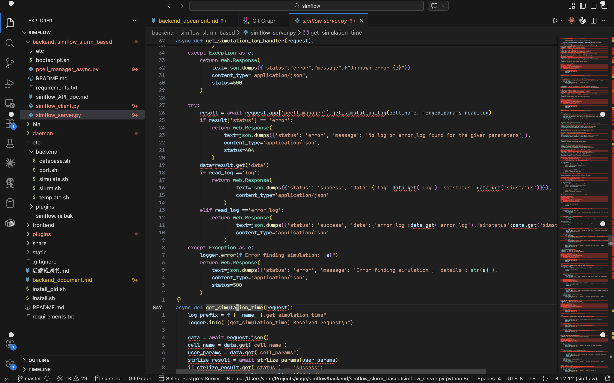
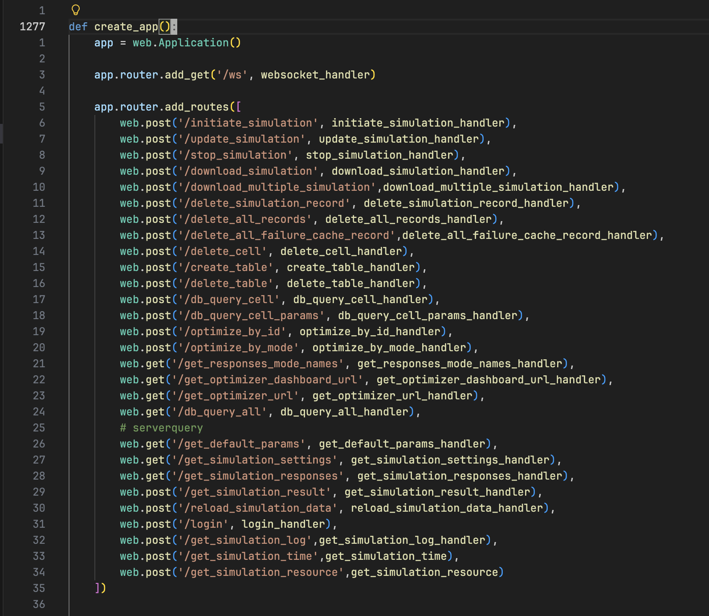
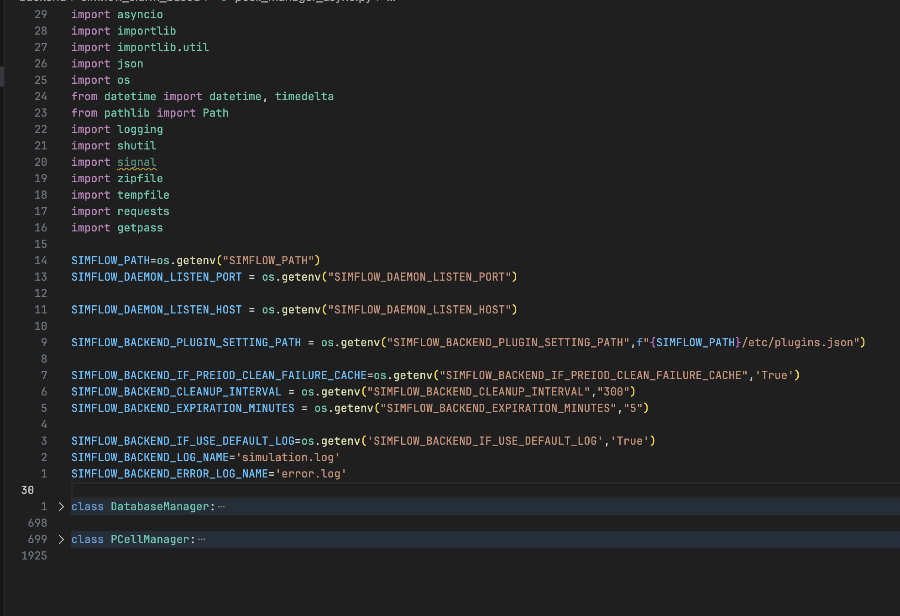
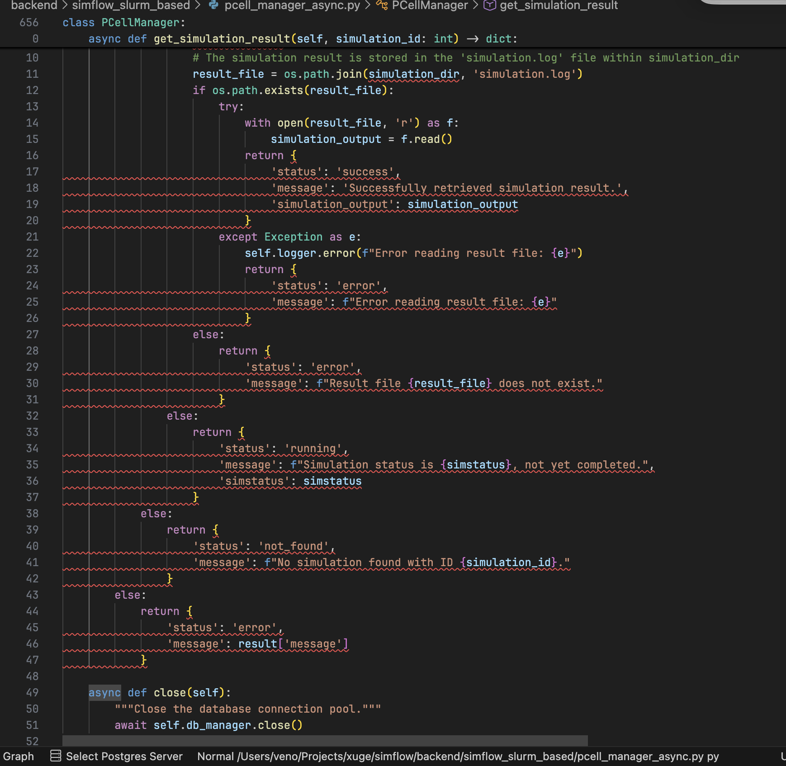
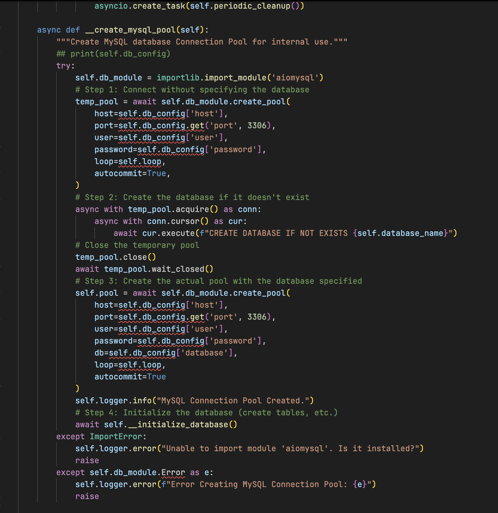

著名的程序员 V 说过：

> 错误的团队沟通导致错误的需求理解，错误的需求理解导致错误的技术选型。

Paramer 这个项目，总结一下，就是一个参数化计算任务的批量运行管理平台。用户可以自行使用 Paramer SDK 编写任意形式的计算任务脚本（称为 Template），只需要确认输入输出格式符合规范。支持对接外部的调度器进行分布式的任务调度，支持在后端管理不同的 Template 版本。

然而这个总结是我接触这个项目到现在一年了才能做出的精炼的总结。实际上当项目拿到手时，我看到的是古神低语。

在接触 Paramer 之前，我对于后端的了解仅限于用 go gin 写了几个简单到几乎是 hello world 的路由，但是稍微了解了一下项目大概会怎样启动，怎样划分模块。

## 黑历史 - Simflow 时期

这一段其实应当放在第 0 篇: [Paramer 开发记录 0 - 开端](https://v3n0.top/post/paramer/0-preface) 更为合适。但是当时比较匆忙，还没定好每篇大纲就 push 了，现在补一下，作为背景故事的补充。

最开始这个项目他们打算叫 SimFlow。我完全不知道 Sim 是什么， Flow 是什么。我只是从各种看不懂的术语中模糊地感知他们是搞硬件的，搞电磁领域的研究，只知道他们似乎想要结合物理和 AI，用于加快各种器件的研发。

先前他们已经尝试做了一个让人非常眼前一黑的原型，我时至今日都没办法一下子搞清楚这项目是怎么跑起来的。

他们分了一段时间给我先熟悉一下项目。

代码即视感如图：







以及启动时要管理几十个长成 SIMFLOW_XXXXX_XXX_XX_XXXXX_XXX 几乎要看起来一模一样这样的环境变量，几乎完全为 0 的文档，一百四十多行的 requirements.txt，后端无框架，直接 aiohttp 手搓，每一个路由函数都是一个巨大的面条代码，没有 ORM，没有迁移脚本，纯靠 `self.db_module = importlib.import_module('aiosqlite')`，然后手搓一切 SQL。

当我对于 simflow 完全感到束手无策时，我时常会注意到 `xfmr_6port` 这个字样，只知道似乎它和 simflow 密切相关，甚至直接耦合。我不理解 xfmr 是什么诡异的字母组合，6port 又是什么也看不懂。于是我提问，得到了一个非常简短的回答：

> xfmr 就是 Transformer。

哦，Transformer，这下知道跟啥有关了。不是说要搞物理 + AI 嘛，也许有希望能串起来了。但 6port 又是个啥。

于是我去了 xfmr_6port 的项目文件夹，看到了另一不可名状之物，比 simflow 更不可名状一点。

图就不放了，好奇的可以直接问我。大概描述一下就是，比 simflow 更没组织的少量 Python 脚本，大量的完全没法理解的 shell 脚本，非常大量的我见都没见过的后缀名的 VSCode 都不知道上哪下插件来显示语法，也不知道到底有没有用只能假设全都有用的文本文件。

但我必须得了解这个项目，想问，又不知道我**对于一个项目，真正需要了解什么**，真问了，发现回答的也不太听得懂。给人一种看上去他们好像自己也很忙很折磨，也没时间让我真的理解来龙去脉的感觉。一旦问到一些自己感到迷惑的地方，他们又会表示，这个地方你不用管，你只需要关心那一块就行了。

而且因为完全没明白对方想表达什么导致现在完全记不得问了什么，答复什么

问来问去，看来看去，看了一圈，也没看到有关 Transformer 的东西。于是，Veno 放弃了思考。

几天之后，我在某个 xml 文件里看到了个 pin 这个字样，一拍脑袋突然意识到：

**这 Transformer 他娘的是变压器**！一直说什么物理 AI，AI 物理的，敢情是到现在还没接过任何一个 AI 啊。

绝望的是我后来需要为这个项目多写几个 CURD 路由并且保证它不崩，好在它真跑成功了。

虽然我认为**真的很没必要了解 Simflow 的代码结构**，但如果你真的好奇当前的软件是个什么情况, AI 整理出来的代码结构图我会放在本文末尾。需要注意的是，我当时对 Backend Server 以外的区域一无所知，只知道是一个黑盒系统，我丢进去一个输出 X，有可能会得到一个 Y。

就这样我维护了 simflow 差不多一个月的时间。

## 完全重写 - Paramer V1

这样的代码不可能继续高效维护的，由于我们目前属于一个预研项目，没有很紧急的 DDL，大家决定重构一版。更准确地说，这是准备完全重做一个版本。

因为 Simflow 这个名字被注册过，所以使用了 Paramer 这个名字。

你可以直接认为，我现在正从零开始写一个项目。

在重写之前，作为团队中唯一的后端开发的我，仍然没有深刻理解 Paramer 这个产品到底想做成什么样子。

**对产品的理解偏差恰恰是一件非常危险的事**，并且直接导致后续各种路线错误，包括技术选型，后端架构，代码结构，开发周期预估等等。

## 如何理解产品

著名程序员 V 曾经说过：

> 构建产品的前提，是理解产品

究竟怎样才算理解产品呢？他提出了三大考虑维度：

1. 客户群体
2. 解决方案
3. 计费形式

然而，由于错误的团队沟通导致了错误的需求理解。以上的视角是一年之后，也就是写博客时的 Veno 的视角。一年之前的 Veno，**仅仅和团队沟通出了第二点的一半**。

经过几天的沟通和开会，当时的我总结出的旭哥提出的需求，差不多是这样的：我们需要一个分布式集群的，可拓展的，异步的，容器化的，仿真任务管理后端。并且允许通过“模板”来定义多种多样的仿真任务，由 Paramer 管理。

直到现在才知道，原来那个 xfmr_6port，他们是想把它做成一个示例用的任务模板，Paramer 会需要能管理各种各样的模板，比如 xfmr_4port, 8port 等等。

可惜的是当时的 Veno 并没有关注到真正应该关注的问题，也没有想着跟产品经理 battle，去砍掉一些不合理的需求。

于是得到了大概这样的关键词：分布式，容器化，模板化。

对比一下过去和现在关注到的重点：

| Then      | Now           |
| --------- | ------------- |
| 1. 分布式 | 1. 客户群体   |
| 2. 容器化 | 2. 解决方案   |
| 3. 模板化 | 3. 计费形式   |

记住这个对比，它是悲剧的开端。

## 错误的技术选型

我们回到当时的 Veno 的视角，看看他面对目前理解的需求，做出了怎样的技术选型。

首先，我们需要分布式，容器化，可拓展的高性能计算任务资源调度，显然会想到大概会是需要 Kubernetes。调研了一下，有没有适用于 Kubernetes 的 HPC 任务编排框架呢？搜了下还挺多，Kubeflow, Volcano, Kueue。到底选哪个？

思考这个问题时，必须注意到：EDA 和 AI 训练存在相当大的大区别，因此 EDA 的调度问题也绝不能直接照搬 AI 训练的经验。

1. EDA 是 IO 和 CPU 密集型的任务，AI 训练是 GPU 密集型任务。
2. EDA 是多阶段，多周期的任务，存在复杂的状态和织成网一样的流程，而 AI 训练的状态相对简单，是线性的。

此时不得不明确，在这一个层级，我们只希望使用到计算资源的调度分配，而不希望让它负责任务流的编排。因为在用户友好的前提下，它们很难满足条件。在资源调度上，似乎 Volcano 是最符合需求的。

那么，选择了云原生架构下的计算资源调度器 Volcano。

其次，我们需要让用户可以写自定义的任务脚本作为“模板”，那么就需要一个 SDK，用 Python 实现 SDK 是合适的。

其次因为还想着从 Simflow 重构，想着也许大概可能会想参考到一些 Simflow 的任务流逻辑等等的代码，加上之前自己写 Python 多一点，也许用 Python 的话说不定实现起来会快很多，并且我们的重点计算负载也不会在后端服务上，不会有很高的并发需求。于是准备继续用 Python 实现后端。在 Python 方面，框架用 FastAPI。ORM 会选择 SQLAlchemy，以及其他的微服务基建设施。

目前为止，一切看上去都非常合理，对不对？

## 换个视角，技术选型截然不同

我们回顾一下上面的 Then and Now:

| Then      | Now           |
| --------- | ------------- |
| 1. 分布式 | 1. 客户群体   |
| 2. 容器化 | 2. 解决方案   |
| 3. 模板化 | 3. 计费形式   |

一年之前，由于团队沟通上的失败，产品经验的缺乏，以及大家都是偏向技术思维，共同导致我们完完全全只注意到了产品理解三要点中，第二点的部分内容，**甚至没有排除掉不合理的技术需求**。

现在我们已经知道了我们到底要问清楚哪些事情，一条条来看，就会清楚上面的技术选型错在哪里。

### 客户群体

现在的 Veno 如果接手该项目，首先会尝试询问并了解这个项目的客户都是什么人。得知：我们会把产品卖给硬件公司，而硬件公司的那帮硬件工程师相当缺乏软件工程素养。他们在软件上是技术白痴，认为一旦出现了浏览器和网页就意味着需要联网，不知道 IP 是个什么东西，更不能指望他们写配置文件，系统服务等等。并且硬件工程师由于各种软件的缘故，他们必须在非常老旧的 Linux 发行版上完成大部分工作，例如 CentOS 7/8，RHEL 8。并且，用户大概率无法连接公网，只能在企业内网中工作，保密级别高。

### 解决方案

这是相对来讲很难沟通的一点，对产品经理的要求更高。产品经理需要有很强的明确产品需求的能力以及目标拆解的能力，这一点我打算放在后续的团队沟通章节里细讲，这里我直接非常粗略地讲一下。

可以这样考虑：现在的行业中产生了什么痛点，我们的产品可以怎样解决痛点。对于 Paramer 这个产品，真正的想法如下。

行业的痛点是这样的：EDA 软件各家独大，却又在整个仿真流程各个步骤中各自不可或缺。仿真的结果数据体积庞大（因为是 EDA 项目文件），许多仿真结果难以持久化，难以查询。整个仿真流程耗费相当算力，却又不得不经常对相同的输入完全重算。

我们提供的解决方案：通过 Template 这一概念，使得用户可以将复杂的仿真任务流程抽象为一个自定义的参数化的输入 X 输出 Y 的函数。任务脚本只需要定义一次便可使用多种多样的 X 进行计算，而自定义参数和格式的 X 和 Y 使得用户可以便捷地提取并记录庞大仿真结果文件中的关键数据，并对其进行处理。

用户仿真的目的是检验在某一 X 输入下能否得到理想目标中的 Y。由于参数化的特性，用户甚至可以对 Y 应用数学原理，使用各类优化算法，使用尽可能少的仿真次数，就能找到目标 Y 所对应的 X，这将大大降低人力成本。

### 计费方式

现在的 Veno 又继续沟通，得知了这一软件会是一个 B 端产品。To B / To C 产品的本质区别不太能直接简单说成面向组织/面向个人，或许应当单独放一个文章讲。总之，大概会有这样的特性：付费者，使用者，决策者相互分离，需要定制，生命周期长，收费是签合同，搞订阅。

对于 Paramer，软件是订阅制的，并且产品单价相当高，软件本体一份预估卖到至少二十万以上甚至更多，如果附加 Feature 则继续加价。

### 初始的技术选型，步步错

B 端产品，用户技术白痴，平台限制 Linux，系统老旧，无法联公网。那么我们不可能是一个 SaaS 产品，不可能云原生，更不可能指望客户运维 k8s。好了，volcano 以及一切的微服务相关技术栈被立刻排除。

系统老旧，部署越便捷越好。要么需要将软件容器化，虚拟机镜像，要么是在兼容老系统的容器中编译的 standalone 应用。

计费方式，由于软件的单价很高，破解的成本必须大于购买成本，License 的强度成为了重中之重。那么 Python 显然必须要被干掉，甚至说 License 的考虑优先级必须被排在首位，远高于运行效率等问题。

又因为我们是离线不联网的环境，所有的 License 工作不会存在网安，只会存在反逆向。那么实际上应当调研各个编程语言对应最强的加密手段如何，避免开发之后再亡羊补牢。事实上，由于我们没有在开发初期就考虑 License 问题，直接导致了后续的灾难。

讲到这里，之前的技术选型已经全部死完了。

## 总结

回头看这一段黑历史，最大的教训是，在没有搞清楚产品是什么之前，就开始做技术选型。

我想在这里再次回顾一下上面的 Then and Now:

| Then      | Now           |
| --------- | ------------- |
| 1. 分布式 | 1. 客户群体   |
| 2. 容器化 | 2. 解决方案   |
| 3. 模板化 | 3. 计费形式   |

当时的思考路径是这样的：

听到“分布式” → Kubernetes
听到“计算调度” → Volcano / Kubeflow
听到“模板” → Python SDK
想快速做出原型 → FastAPI + SQLAlchemy

这一整套推理链条没有逻辑错误，我甚至觉得是标准答案。重要的是，先前的关注点走在了错误的抽象层级上，直接跳跃到了技术实现阶段，这导致把一些技术方向和真实需求混为一谈。但在 To B 场景里，技术往往是最后才需要优化的东西。从来都不应该默认技术方向是需求的一部分。

技术并不是为技术本身服务的，是为需求服务的，而需求需要被质疑。

想要分布式，那后端本身真的需要分布式吗？需要容器化，客户真的能用吗？当这些问题没有被反问时，它们就会以理所当然的形式进入系统设计，然后变成架构的基石。一旦基石错了，后面所有设计都只能是在错误的毛坯上精装修。人话，堆屎山。

所以才会有这样的说法：一旦一个人太过沉迷技术，那么他就不适合做领导者。

错误的团队沟通导致错误的需求理解，错误的需求理解导致错误的技术选型。这一条因果链会逐渐放大上一个环节的错误，等你发现问题的时候，已经不是改一改能解决的了，必须推倒重来。

## AI 提供的 Simflow 代码结构（未经检查，仅供参考）

```
+-----------------------------------------------------------------------+
|                           USER BROWSER                                |
|                   http://host:3000 (static)                           |
+--------------------------------+--------------------------------------+
                                 | HTTP / WebSocket
                                 v
+------------------------------------------------------------------+------+
|                          FRONTEND                                |      |
|          React App (SimflowFrontend/SimflowDeploy/build)         |      |
|  +----------------+  +----------------+  +--------------------+  |      |
|  | Monitor.js     |  | Simdetails.js  |  | List.js            |  |      |
|  | (main view)    |  | (param config) |  | (table view)       |  |      |
|  +----------------+  +----------------+  +--------------------+  |      |
|  +----------------+  +----------------+                          |      |
|  | Redux Store    |  | axiosfun.js    |  (API calls)             |      |
|  +----------------+  +----------------+                          |      |
+--------------------------------+---------------------------------+      |
                                 |                                        |
                          HTTP / WebSocket                                |
+--------------------------------V-------------------------------------+  |
|                          BACKEND SERVER                              |  |
|               simflow_server.py  (aiohttp, IPv6)                     |  |
|  Port: SIMFLOW_PORT (8080)                                           |  |
|  +-------------------------------+-----------------------------------+  |
|  | REST API Routes               | WebSocket /ws                     |  |
|  |  POST /initiate_simulation    +-----------------------------------+  |
|  |  POST /update_simulation        handle_message()                  |  |
|  |  POST /stop_simulation          -> PCellManager                   |  |
|  |  POST /download_simulation                                        |  |
|  |  POST /delete_simulation_*                                        |  |
|  |  GET  /db_query_all                                               |  |
|  |  GET  /get_default_params   <- reads XML from SIMFLOW_XML_PATH    |  |
|  |  GET  /get_simulation_settings <- reads JSON                      |  |
|  +--------------------------------+----------------------------------+  |
|                                    |                                 |  |
|  +---------------------------------V---------------------------------+  |
|  |                    PCellManager (async)                           |  |
|  |  - initiate_simulation_workflow()                                 |  |
|  |  - update_simulation_workflow()                                   |  |
|  |  - stop_simulation()                                              |  |
|  |  - delete_simulation()                                            |  |
|  |  +------------------------+                                       |  |
|  |  | DatabaseManager        |  (SQLite or MySQL)                    |  |
|  |  | - templates table      |  columns: id, pcell, params,          |  |
|  |  | - failure_cache table  |    simstatus, path, request_id        |  |
|  |  +------------------------+                                       |  |
|  |                                    |                              |  |
|  |  +---------------------------------V----------------------------+ |  |
|  |  |              job_operation (plugin interface)                | |  |
|  |  |              submit() / wait() / cancel()                    | |  |
|  |  +--------------------------------|-----------------------------+ |  |
|  +-----------------------------------|--------------------------------+ |
|                                      |                                  |
+--------------------------------------|----------------------------------+
                                       | HTTP API
                     +-----------------+-----------------+
                     |   /plugins/list             [sync]
                     |   /api/{plugin_name}/...
                     v
+------------------------------------------------------------------------+
|                          SIMFLOW DAEMON                                |
|                daemon/main.py  (Flask)                                 |
|  Port: SIMFLOW_DAEMON_LISTEN_PORT (8079)                               |
|  +-------------------------------+---------------------------------+   |
|  | Plugins()                     | Daemon (docs)                   |   |
|  |  - Dynamically loads plugins  |  - /docs (all docs)             |   |
|  |    from $SIMFLOW_PLUGINS_PATH |  - /docs/{module}/{doc_name}    |   |
|  |  - Calls plugin.register()    |  - Markdown -> HTML via Jinja2  |   |
|  |  - Registers plugin routes    |                                 |   |
|  +-------------------------------+---------------------------------+   |
|                                  |                                     |
|  +-------------------------------V---------------------------------+   |
|  |                    SLURM Plugin (plugins/slurm/)                |   |
|  |  +---------------------+  +-----------------------+             |   |
|  |  | app.py              |  | operation.py          |             |   |
|  |  |  - SlurmInfo        |  |  - submit() -> sbatch |             |   |
|  |  |  - SlurmManager     |  |  - wait()  -> squeue  |             |   |
|  |  |  - SlurmAPIManager  |  |  - cancel() -> scancel|             |   |
|  |  |  - SlurmDocsManager |  +-----------------------+             |   |
|  |  +---------------------+                                        |   |
|  |  /api/slurm/health   /api/slurm/submit  /api/slurm/cancel       |   |
|  +-----------------------------------------------------------------+   |
+------------------------------------------------------------------------+
                                       |
                              sbatch / squeue / scancel
                                       |
+--------------------------------------v--------------------------------+
|                        SLURM CLUSTER                                  |
|  +----------------------+    +----------------------+                 |
|  | Compute Node(s)      |    | Job Scheduler        |                 |
|  |  runsim.sh executed  |    | (slurmctld)          |                 |
|  +----------------------+    +----------------------+                 |
+-----------------------------------------------------------------------+
                                       |
                                       v
+---------------------------------------------------------------------+--+
|                    xfmr_6port  (SIMFLOW_TEMPLATE_PATH)              |  |
|  +--------------------------------------------------------------+   |  |
|  | task/runsim.sh   [MAIN SIMULATION ORCHESTRATOR]              |   |  |
|  |  1. Load Cadence IC231 / EMX environment                     |   |  |
|  |  2. Export OA layout from PCELL (dbAccess)                   |   |  |
|  |  3. Export GDS (strmout)                                     |   |  |
|  |  4. Run EMX EM simulations (3 modes):                        |   |  |
|  |       emx_script.sh      (standard: port extraction)         |   |  |
|  |       emx_script_LR.sh   (inductance/resistance)             |   |  |
|  |       emx_script_CR.sh   (capacitance/resistance)            |   |  |
|  |  5. Parameter extraction via xfmr_6port_param_extract.py     |   |  |
|  |  6. Output: output.y, responses.json, simulation.log         |   |  |
|  +--------------------------------------------------------------+   |  |
|                                                                     |  |
|  +----------------+  +----------------+  +----------------+         |  |
|  | datadisplay/   |  | scalablemodel/ |  | pcelldev/      |         |  |
|  | (ADS viz)      |  | (L,Q,k extract)|  | (PCELL layouts)|         |  |
|  +----------------+  +----------------+  +----------------+         |  |
|                                                                     |  |
|  +--------------------------------------------------------------+   |  |
|  | etc/conf.d/    <- simflow reads KEY=VALUE for settings       |   |  |
|  | default_params/ <- XML: cell param defaults                  |   |  |
|  | default_settings/ <- JSON: sim settings (freq range, pins)   |   |  |
|  +--------------------------------------------------------------+   |  |
+------------------------------------------------------------------------+
```


