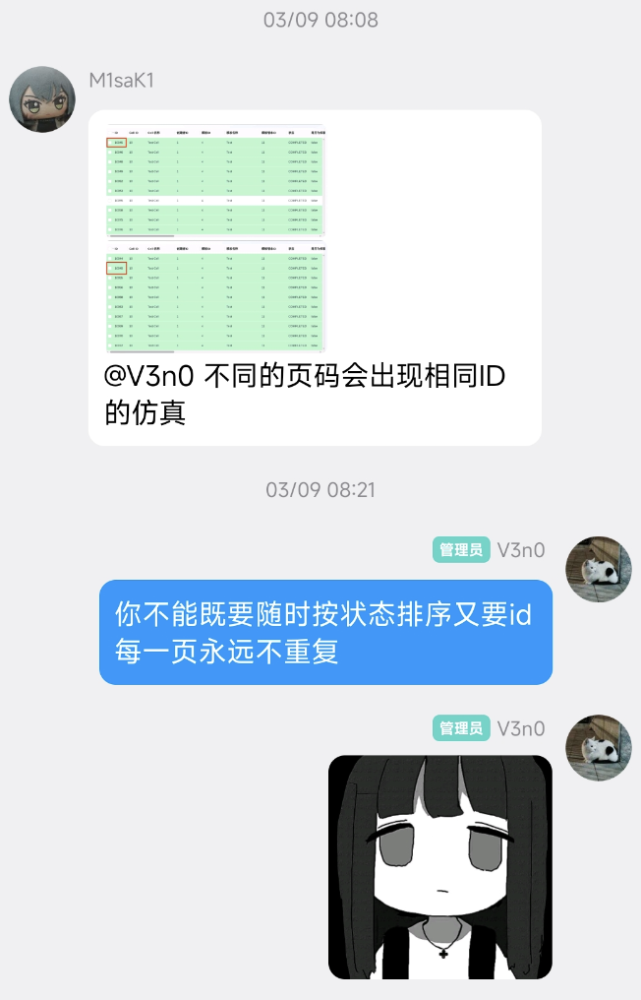
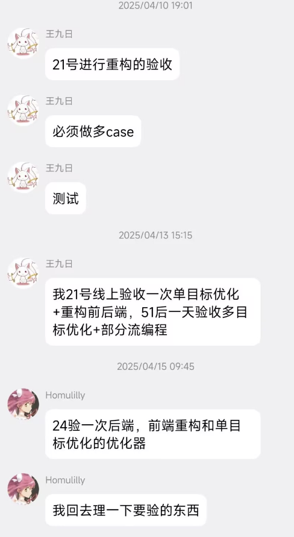
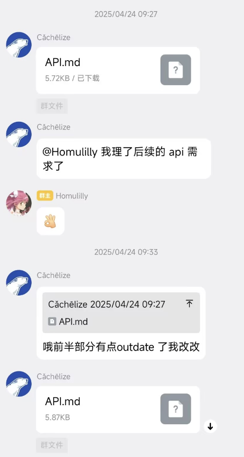

拖更两个月，惭愧，但这两个月也是积累了相当多的新思考。

第二篇原本在序言里主题被定为，开发踩坑。其实这个选题太莽撞。上篇技术选型问题也是开发踩坑问题。但是开发踩坑其实只是个表层的现象，我们要看到现象背后的本质。

我实际上在第一篇之后，紧接着就为开发踩坑这一主题写了一些大纲，发现我根本写不出来。写不出来说明思考不足，经历不足，这时我就不想再硬写了，那样的文章是不成熟的没价值的。后面一段时间把本篇的草稿直接当成了《人月神话》的读书摘录笔记了，这本书真是常看常新。

这一个多月我没有继续参与 Paramer 的开发工作。我先给自己差不多两周的时间自顾自放了个假，而后才回到团队。但仍然不是负责开发。由于我在项目里的参与时间足够久，项目理解足够，实际上充当了一个类似顾问的角色，因为产品经理和开发之间往往各自说着自己的语言，每天 @ 人然后失踪，然后进度停滞。我注意到这种情况时会尝试出来为双方明确各自观点，帮助同步各项任务进度，同步信息，提供项目建议。

在这个过程中，因为是传话筒，所以意识到了到底有哪些话要传，什么时候要传话，不断意识到了到底在什么地方的信息沟通是低效的阻塞的。而这些是作为开发人员时，无法在团队中感知的，所谓不识庐山真面目，只缘身在此山中。

开发踩坑是问题，问题背后的本质原因很多，在 Paramer 的开发经历中，团队沟通占相当大的一头。其实[上一篇](https://v3n0.top/post/paramer/1/)我已经提到过：

> 错误的团队沟通导致错误的需求理解，错误的需求理解导致错误的技术选型。

上一篇主要聚焦在了**需求理解**，它直接对于开发造成影响。这一篇继续深入讨论，谈谈**团队沟通**带来的问题。它会造成远不止需求理解的问题。

---

## 失败案例

上回说到从 SimFlow 原型重构的 Paramer V1 由于技术选型的失误已经误入歧途。下面看看 Paramer 在歧途中经历了怎样的灾难，开发人员经历了怎样的燃烧。

> “How does a project get to be a year late? ... One day at a time.”

千里之堤，溃于蚁穴。生病，应急任务，私人问题，客户的紧急会议，每件事只会把进度延后半天或一天，一天天的进度缓慢难以识别，难以防备。积累起来，结果就会是项目延期一年。

### 场景一：不稳定的需求

团队闲聊的时候我想问问大家有没有想写的素材，[月饼](blog.minblog.top)，我们的运维，说：

> 这样，你直接在聊天记录里搜索”不是说好”

确实是这样，太多次在进行功能开发的时候，做完了一个需求，结果要么是产品变卦，要么是客户变卦，又或者是在开会对进度时才提起一个被人遗忘在聊天记录里的需求，种种此类。比如要给客户适配的调度器临时变卦，比如功能开发完了才说不够还需要补上新的需求等等。

还有一种情况是由于产品经理虽然做过一些技术，但并未有过该产品对应技术栈的经验，这会导致错误的在表达产品需求的过程中提出很多本不必要的技术层面的要求。例如，硬件开发经历的产品经理指导后端开发，把应用需要长时间稳定运行这一需求描述为了需要在应用里做系统服务，等等。

这些情况在 Paramer 的开发历程中屡见不鲜。我举一个列表排序这种比较通用的需求案例，来讲讲当时的团队内是怎么做沟通的。

> Day 1
> 
> 开发燃烧两周之后，跑到线下开会，验收前后端实则是联调。
> 
> 由于接口没对好，前端出 bug 访问不到后端的 API，众人汗颜，产品表示第二天线上开会验收成果
> 
> Day 2
> 
> 产品经理因为并不只是产品经理，他有更重要的事情忙去了，表示验收改到明天。今日并未验收
> 
> 今日开发无事可做
> 
> Day 3
> 
> 开视频会议验收。产品口头表示，这个记录排序现在是按 ID 排的，记录有的绿有的黄有的红，不整齐。改成按状态排序。
> 
> 后端开发调整了 SQL
>
> Day 7
> 
> 团队内部使用人员说，这个排序顺序好像有点奇怪，状态优先级不应该是 Running 放最前面，是 Completed 放最前面。
> 
> 后端再次调整了 SQL
>
> Day N
> 
> 前端在群聊里问（没错这几乎是我们提 Issue 的方式）：
> 
> Day N+N
>
> 产品给客户试用了。产品经理说，客户还是喜欢按 ID 排序。
>
> 产品看了眼开发，发现他燃烧起来了。

光是这样可能看不出什么很大的问题，稍微改几行代码的事情。

实则不然。

笔者为了追溯这一个功能需求的反复变动，到底经历了什么呢：我把这个群几个月的每天起步几十一百条的聊天记录，翻过去找哪些截图和聊天和这个功能有关，又去翻仓库的 commit message，才追溯到的。

想象，这样的不稳定的变更，每天有不同的十个“有人@你”，散落在群聊消息里。有的压根没描述清楚你还要进一步问，但你@他发现他也没回，也许他也在燃烧；有的早就已经被提过了，你记得跟他说过为什么现在要做成这样，可你翻不到几个星期之前的聊天记录了；而你同时在赶着现在说要加急开发的功能的 DDL。那就变成地狱了

### 场景二：进度灾难

**_（本节引用段中的内容均来自《人月神话》原文）_**

《人月神话》里这样讲到过：

> 不为系统测试安排足够的时间简直就是一场灾难。因为延迟发生在项目快完成的时候。直到项目的发布日期，才有人发现进度上的问题。因此，坏消息没有任何预兆，很晚才出现在客户和项目经理面前。

这本书真的是常看常新，回过头来看 Paramer 的初期开发基本是踩遍了五十多年前人们就踩过的坑。

作为一个比较天真的后端开发，看到已经有跑通了的 Simflow 原型，认为两星期一个月差不多就能完成代码的初步开发。

这犯了第一宗罪：编程人员常有的，认为“一切都将运作良好”

> 所以系统编程的进度安排背后的第一个假设是：一切都将运作良好，每一项任务仅花费它所"应该"花费的时间。对这种弥漫在编程人员中的乐观主义，理应受到慎重的分析

在经过了两周多的 Paramer 开发之后，进度自然明显赶不上了。此前，完全没有做好 Paramer 的需求明确，每天的 Paramer 开发时常要被 Simflow 的 bugfix 和运维任务打断，并且这并不仅仅是一项重构任务，因为我们在重构的基础上，贪婪的为这个版本加上了一些原有功能以外的新功能需求。我们还忽略了测试的时间，直接把开发的时间当做了整个工程时间。

那么进度延后之后，有哪些选择呢？从项目经理的角度来说，直觉上会出现三个选择：增添人手，删减任务，重新安排进度。

根据 Brooks 法则，向进度落后的项目中增加人手，只会使进度更加落后。

> 在现实情况中，一旦开发团队观察到进度的偏差，总是倾向于对任务进行削减。当项目延期所导致的后续成本非常高时，这常常是唯一可行的方法。

而由于初入团队，仍然身为学生的编程人员自然不敢对于自己预先预估出的已有的验收日期提出修改。而团队的项目经理当时又是一个完全缺失的状态，毫无进度监督可言。

> None love the bearer of bad news.

这犯了第二宗罪：

本应当是随时可见的项目进度，在老板那里会变成隔十几天才能看到一次进展。最后会演变成一种更加糟糕的情况：不仅删减任务，还重新安排进度。

插一句，实际上就连验收时间都是一个没被统一的量：



然而最终是 21 号验收了一次。

需要注意的是，本篇我更希望关注的并不是进度为什么估算错了，而是：

**为什么没人知道进度已经错了**？

这两个问题完全不一样。前者是关于项目进度监督、风险暴露机制以及项目经理在其中应承担的职责，我会在后续专门讨论。

本篇我更想讨论的问题是，本应当是随时可见的项目进度，在老板那里会变成隔十几天才能看到一次进展。项目延期并不可怕，甚至对我们这种预研性质初期项目，不痛不痒，可怕的是项目已经延期两周了，而负责推进的人还不知道。

有趣的是，无论是需求变更，还是进度失控。它们最终都指向同一个问题：信息没有被正确地传递。随着团队人数增长，这个问题变得越来越严重。

### 场景三：信息只存在于人的脑子里

再举个接口交接的案例。谷子哥，Cachelize，是我们当时的一个前端。为了做参数优化的图形化显示，他需要优化器后端提供一些新的接口，给一份接口文档。但他催接口催了十天。




在 Paramer 的团队中，我之前一直以为我们缺少的是人手。但后来发现，很多时候缺少的不是人，而是信息。

代码在仓库里不等于别人知道怎么调用，配置在服务器里不等于别人知道怎么部署，知识在脑子里不等于团队拥有知识。重要信息如果只存在于人的脑子里，那么组织就无法交接。

真正的问题并不是这个接口文档需要按什么时间给，真正的问题是整个团队默认了一种工作方式：信息保存在人身上，而不是保存在组织。于是所有的问题都会变成，等某人有空之后尽快回复我。

## 再多的群聊装不下膨胀的消息

随着组织规模扩大到十几人，每天的群聊消息达到了几百条甚至上千条，于是提议按工作组分群聊天。

可以从群头像看到大家美丽的精神状态


但是分群真的能解决问题吗？

其实稍微多想一层都不会认为这是个可拓展的模式。现在觉得消息太多，于是分了个这些群。那逐渐扩张，是否还会再从某一个群继续分裂，需求讨论群，测试群，临时问题群，On Call 群。。。

似乎每一次遇到沟通问题，第一反应都是，再建一个群。

于是现在甚至连需求都做不到同步了。EDA 群在用 Paramer 的时候，发现了问题，在 EDA 群里提了个可能的需求。Paramer 的开发人员在 Paramer 群里讨论了实现方案，运维在运维群里等着部署环境，此刻算法群里沉浸式讨论数学。

到最后，需求改没改，接口定没定，环境配没配，谁也不知道。因为信息已经散落在不同群聊里。

分群什么都没做到，我们只是把一个信息黑洞，拆成了四个信息黑洞。

## 异步的团队，同步的沟通

再回头看看上面这三个失败案例，实际上应当这样总结：

- 场景一：需求信息丢失
- 场景二：进度信息丢失
- 场景三：知识信息丢失

开篇说到一个多月我没有继续参与 Paramer 的开发工作。最终我看到这样的一个事情：一个用于确定需求的只需要十分钟的三个人参与就行的线上会议，三天没开下来。期间不是 A 不在线就是 B 不在线，等到终于看到消息，或者我终于想起来 @ 两边问问他们开没开过会，已经是第二天。


这次之后，我把团队里从上到下全拉出来批斗了一番。但其实也只是指出了哪些地方很明显不对劲，还没有找到问题本质。

先前我也参与过协作节奏控制的非常好的一个西安的团队，看上去各种项目的推进速度一点都不慢，工作强度感觉却比 Paramer 这个项目轻不少。有朋友说，他们的工作模式已经非常大厂了。但效率高，又真的是因为大家坐在同一个办公室里吗？

如果是这样，只不过是把我们的群聊，变成了人腿从一个工位跑到另一个工位，变成了语音频道交流。确实保证两边都在线了，效率又到底能提高多少呢？要知道，音频是极其低效的信息传递信道。

问题到底出在哪里，这得从我们的团队形式说起。

我们团队的主要成员都是学生，同一时间，有人能有空，有人得上课，有人作息不在一个时区。天然不可能朝九晚五。就算再怎么要求 On Call，考试，签到，实验课验收，体育课，总不能不去吧。

从组织形态上来说，我们早就已经是一个异步团队了。然而我们的沟通方式，却是一个同步的形式。

接触到的这个西安团队协作模式，在我经历了 Paramer 的磨难之后，给了我非常大的震撼，深深感叹他们工作流的规范程度。但当时仅仅停留在他们文档做的多，飞书用的多，任务面板维护的多，PR 写的细，等等的现象上面，没有思考过这些行为的本质。现在这番对比，才意识到，真正的区别在于信息传递的同步还是异步。

什么是同步和异步？

并不能因为这个词从编程到了团队管理就变得不认识。从编程的角度看，其实就是两种调用模型。同步沟通很像阻塞调用：

```text
发起请求 → 等对方返回 → 才能继续下一步
```

而异步沟通更像消息队列 + 回调 + 事件驱动：

```text
发起请求 → 把信息写入任务队列 → 自己继续做别的事
```

上面主要体现的是一个是否阻塞的问题。另一个问题是，同步沟通往往伴随着缺乏各种信息的单一事实来源。

比如同一个需求，在没有单一事实来源的情况下会变成这样：

- A 说：“这个接口是按状态排序”
- B 在群里补一句：“其实客户更想按 ID”
- C 过两天口头确认：“先按 Running 在前吧”
- D 写代码的时候看到的是：“按 Completed 优先”

最终结果是，没有一个地方记录最终到底是什么，只有一堆彼此冲突的局部记忆。

而在有单一事实来源的情况下，信息查询的唯一入口：Issue / PRD / 文档

任何人，甚至不是人而是 Agent，随时都可以看到最新版本是什么，而不是：“你记得我们上次怎么说的吗？”

同样的问题可以发生在其他的地方，比如进度管理等，不再赘述。

然而，在同步沟通的环境下，大家明知道沟通非常累，却反而更加不愿意维护这样的单一事实来源，这并不是做不到这件事。

在群聊 + 临时会议的模式下，@ 一个人，改一句话比改文档快，于是信息会不断回流到看起来更省事的群聊，而不是维护到文档，或是任务面板。同步沟通系统默认奖励快速响应，惩罚结构化沉淀，最终形成恶性的螺旋。

## 异步协作

当我意识到真正的问题在于缺乏异步沟通协作之后，去网上搜索，才认识到原来已有不少早就规模化应用异步协作的大型团队。

我特别喜欢 GitLab 这个例子。他们的员工遍布全球 60 多个时区，却能在同一个团队里协作。他们维护了 [The GitLab Handbook](https://handbook.gitlab.com/handbook/)。

具体的异步协作好处，以及具体落实的方式，我已无心赘述，各种先例远比我在博客里说的要多要全。如果你完全没了解过，希望初步了解关于异步协作的部分，直接看这一章节：[How to embrace asynchronous communication for remote work](https://handbook.gitlab.com/handbook/company/culture/all-remote/asynchronous/)

不过，我最喜欢的还是那一句话：

> The easiest way to take on an asynchronous mindset is to ask this question: “How would I deliver this message, present this work, or move this project forward right now if no one else on my team (or in my company) were awake?"
