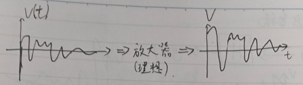
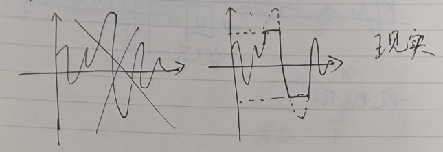
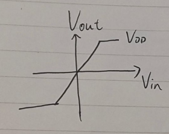
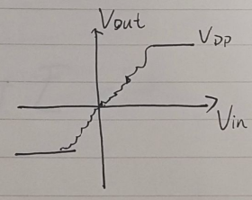
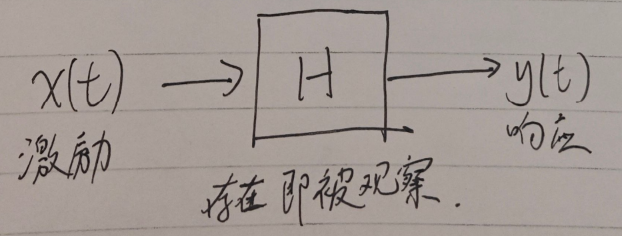

## 什么是信号与系统?

什么是信号, 什么是系统?

见到 3.5mm 的耳机线, 你可能知道它实际上是在传递一个模拟信号. 换言之, 我们可以把它表示为一个随时间变化的电压函数.

耳机可以连功放, 功率放大器, 它实际上做的事情是放大电压, 你会发现音量变大了.

我们假设耳机输出的信号是 $v(t)$, 理想情况下放大器做的事情是, 它让 $v(t)$ 经过了放大器就可以**缩放它的幅值**, 即:

$$ v(t) \to \boxed{放大器} \to Av(t) $$

或者说, **放大器是一个对 $v(t)$ 进行操作的一个函数**:

$$ F_{放大器}(v(t)) = Av(t) $$

但是事实上, 现实中的功放不会这样完美. 比方说, 放大器会有最大输出电压( 你可能见过它被叫做 $V_{dd}$ ). 直观感受为, 声音太大就爆音了.

此时 $F_{放大器}$ 不再是一个等比例函数, 而变成了一个分段函数:

$$
F_{放大器}(V_{input}) =
\begin{cases}
A \cdot V_{in}, & \text{if } |A \cdot V_{in}| < V_{dd} \newline
V_{dd}, & \text{if } A \cdot V_{in} \ge V_{dd} \newline
-V_{dd}, & \text{if } A \cdot V_{in} \le -V_{dd}
\end{cases}
$$

更难受一点, 现实中可能这个放大器对不同的电压可能有着奇奇怪怪的不稳定的影响, 那中间这一段甚至也不是等比例函数了, 可以是七扭八歪的任何函数.

但不管怎样, 我们都可以这样看待一个放大器: 我们丢进去一个信号, 得到另一个信号. 我们丢进去一个函数, 得到另一个函数.

这其实就是我们感性上认识放大器的方式. 我们不知道放大器到底是个什么, 我们现在认为它就是个黑盒子, 可以对信号进行操作. 它的存在即它被观察.

这个对信号进行操作的黑盒, 就是**系统**. 系统做的事情, 就是对信号进行操作.

我们的输入信号 $x(t)$ 被叫做**激励**, 输出信号 $y(t)$ 被叫做**响应**. 而系统习惯上用 $H$ 来表示, 我也不知道为什么, 因为它是黑盒吧, H 首字母.

考题里会见到**线性**和**时不变**, 这是什么意思.

### 线性 (Linear)

想象一下之前的放大器：

- 输入音乐 A，它输出放大的 A；

- 输入音乐 B，它输出放大的 B；

如果你同时播放音乐 A 和 B (即 A+B)，线性系统输出的应该是“放大的 A”加上“放大的 B”，而不是别的什么奇怪的噪音。

输入 $x_1(t)$ 产生 $y_1(t)$ , 输入 $x_2(t)$ 产生 $y_2(t)$, 那么:

$$
H(a \cdot x_1(t) + b \cdot x_2(t)) = a \cdot y_1(t) + b \cdot y_2(t)
$$

### 时不变 (Time-Invariant)

时不变意味着系统的性质不随时间改变。 举个反例：你的电脑刚开机时运行很快，玩了半小时 3A 大作后显卡过热降频了。这就不是时不变系统，因为系统本身的参数随时间变了。

我们需要的是：如果你今天给系统输入 $x(t)$ 得到 $y(t)$，那么你明天（时间延迟 $t0$ ）输入同样的 $x(t−t_0)$，应该得到同样的、仅仅是延迟了的输出 $y(t−t_0)$.

$$
x(t - t_0) \xrightarrow{H} y(t - t_0)
$$

---

## 微分方程

我们刚刚已经知道了系统是什么. 这时其实会发现, 系统 $H$ 实际上在做什么?

实际上 $H$ 应当可以被看作一个对于函数进行操作的函数.

我们可以方便地测量输入和输出, 却不能直接测量这个系统本身. 我们必须扔进去一个东西, 观察它的结果, 借此才能感知这个系统. 研究这样的问题的数学工具是**微分方程**.

对于线性时不变系统:

$$
a_n \frac{d^n y}{dt^n} + \dots + a_1 \frac{dy}{dt} + a_0 y(t) = b_m \frac{d^m x}{dt^m} + \dots + b_0 x(t)
$$

---

**TODO**: 写不完了, 以下写的很粗略

---

### 为什么非要是微分方程

泰勒展开, 去除非线性, 并且推广线性到微分, 微分也是线性的.

$$
\frac{d}{dt}(ay_1 + by_2) = a\frac{dy_1}{dt} + b\frac{dy_2}{dt}
$$

### 零输入响应 - 齐次二阶常微分方程

我们现在想找到一个函数 $y(t)$，满足：它自己，加上它的导数，加上它的二阶导数，经过简单的缩放后，加起来等于 0. 它求导之后，性质不变，最好只是多了一个系数。

$$
\frac{d}{dt} e^{st} = s \cdot e^{st}
$$

$$
\frac{d^2}{dt^2} e^{st} = s^2 \cdot e^{st}
$$

$$
A(s^2 e^{st}) + B(s e^{st}) + C(e^{st}) = 0
$$

$$
e^{st} (As^2 + Bs + C) = 0
$$

$$
As^2 + Bs + C = 0
$$

这就是特征方程.

$$
y(t) = a e^{s_1 t} + b e^{s_2 t}
$$

这就是通解

发现 $s$ 其实会需要是复数. 为什么, 因为 $s$ 可能有虚根. 分情况讨论, $B^2-4AC$ 小于零, 如果 $ a = b $ 就还是实数特解, 但实际 $a \neq b$, 这里就引出欧拉公式.

## 欧拉公式

### 意义: 简化计算

### 证明

## 初见拉普拉斯变换

### 零状态, 有输入的二阶常微分方程

暂时只把它看成是封装了一个运算, 我们用这个运算可以直接得到特征方程.

$$
H(s) = \frac{Y(s)}{X(s)} = \frac { Ds^2 + Es + F } { As^2 + Bs + C }
$$

我们发现 $H(s)$ 其实直接包含了这个系统的完全信息. 我们**把系统的特征作用于输入的特征**, 得到了输出的特征:

$$
Y(s) = H(s) X(s)
$$

发现 $H(s)$ 也可以用来描述一个系统.

---

思考问题:

1. 想要一个最简的输入, 在时域显示所有系统的所有特征信息. 因为不能直接观测频域, 而时域的时间和幅值是易于测量的.
2. 想要泛化问题, 对于每一个系统, 这样的最简输入都适用, 让它成为一个统一的度量标准.

换言之, 要找到统一的激励函数.

## 冲激函数

$$
\int_{-\infty}^{\infty} \delta(t) \, dt = 1
$$

### 为什么想到这样构造

### 证明: 冲激函数激发了所有模态

什么叫“激发所有模态”？
